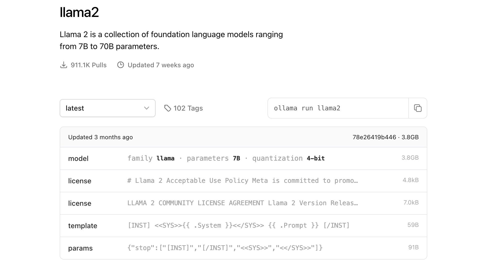

# WEEK053 - 开源大模型 Llama 实战

去年 2 月 24 号，Facebook 的母公司 [Meta AI 推出 Llama 语言模型](https://ai.meta.com/blog/large-language-model-llama-meta-ai/)，该模型完全使用公开可用的数据集进行训练，拥有 70 亿到 650 亿个参数，包括 `7B`、`13B`、`30B` 和 `65B` 四个版本，可以进行本地部署和微调训练，非常适合个人和中小型企业。

值得注意的是，Llama 以非商业授权的形式发布，主要用于学术研究，[官方仓库](https://github.com/facebookresearch/llama) 里只给出了加载模型的示例代码，想要获取核心模型权重，还需要填写一份表单进行申请。尽管如此，Llama 模型的发布也具有划时代的意义，由于 OpenAI 对于 GPT-2 之后的模型就不再开源，这个时候 Meta 推出的 Llama 补上了这个缺口，掀起了开源大模型的发展浪潮。

3 月 13 日，斯坦福大学发布了指令精调模型 [Alpaca 7B](https://github.com/tatsu-lab/stanford_alpaca)，它通过 OpenAI 的 `text-davinci-003` 模型生成了 5.2 万由指令数据，然后对 Llama 7B 进行精调而得。

3 月 16 日，[Guanaco](https://guanaco-model.github.io/) 问世，它在 Alpaca 基础上补充了多语种语料和指令任务。

3 月 23 日，中文小羊驼 [Chinese-Vicuna](https://github.com/Facico/Chinese-Vicuna) 面世，它基于 Llama 模型和 LoRA 方案，可按需投喂数据进行个性化指令精调。

3 月 24 日，[Databricks 发布 Dolly 模型](https://www.databricks.com/blog/2023/03/24/hello-dolly-democratizing-magic-chatgpt-open-models.html)，它本质是 Alpaca 的开源克隆，基于 GPT-J-6B 精调，旨在证明精调指令数据比底座模型更为重要。

3 月 25 日，来自华中师范大学和商汤的几位伙伴发起中文大语言模型开源项目 [骆驼（Luotuo）](https://github.com/LC1332/Luotuo-Chinese-LLM)，包含了一系列大语言模型、数据、管线和应用。

3 月 28 日，[中文 LLaMA & Alpaca](https://github.com/ymcui/Chinese-LLaMA-Alpaca) 大模型发布，包括了中文 Llama 模型和指令精调的 Alpaca 模型；中文 Llama 模型在原版 Llama 的基础上扩充了中文词表并使用了中文数据进行二次预训练，进一步提升了中文基础语义理解能力；同时，中文 Alpaca 模型进一步使用了中文指令数据进行精调，显著提升了模型对指令的理解和执行能力。

3 月 30 日，来自加州大学伯克利分校、卡内基梅隆大学、斯坦福大学、加州大学圣地亚哥分校的几位计算机博士成立 [LMSYS 组织](https://lmsys.org/)，并发布了 [Vicuna-13B](https://lmsys.org/blog/2023-03-30-vicuna/)，它基于 ShareGPT 收集的对话对 Llama 进行精调，仅需 300 美元即完成训练，号称达到了 ChatGPT 90% 的能力。

同月，智谱 AI 开源了 [ChatGLM-6B](https://github.com/THUDM/ChatGLM-6B) 模型，这是一个开源的、支持中英双语的对话语言模型，基于 GLM 架构，具有 62 亿参数，使用了和 ChatGPT 相似的技术，针对中文问答和对话进行了优化。

6 月 7 日，上海 AI 实验室发布了开源多语言大型语言模型 [InternLM-7B](https://github.com/InternLM/InternLM)，中文名书生·浦语，在 1.6 万亿标记的大型语料库上进行预训练，采用多阶段渐进式的过程，然后进行了微调以与人类偏好对齐。

6 月 15 日，百川智能发布了开源可商用的大规模预训练语言模型 [Baichuan-7B](https://github.com/baichuan-inc/Baichuan-7B)，基于 Transformer 结构，在大约 1.2 万亿 tokens 上训练的 70 亿参数模型，支持中英双语。

开源大模型如雨后春笋般冒了出来，层出不穷，到了 7 月，Meta AI 联合 Microsoft [又推出了 Llama 2 模型](https://ai.meta.com/blog/llama-2/)，将预训练语料库的大小增加了 40%，将模型的上下文长度增加了一倍，并采用了分组查询注意力，参数范围从 70 亿到 700 亿，包括 `7B`、`13B` 和 `70B` 三个版本。同时还发布了 Llama 2 的微调版本 Llama 2-Chat，专门针对聊天场景进行了优化。

## 模型下载

想要体验 Llama 模型，我们首先得把模型给下载下来，这里总结几种不同的下载方法。

### 官方版本下载

[根据官方仓库的说明](https://github.com/facebookresearch/llama)，我们需要填写一份表单进行申请：

* [Llama 申请](https://forms.gle/jk851eBVbX1m5TAv5)
* [Llama 2 申请](https://llama.meta.com/llama-downloads/)

当申请通过后，你会收到一份带有下载链接的邮件。然后下载 Llama 仓库的源码，执行其中的 `download.sh` 脚本：

```
$ git clone https://github.com/meta-llama/llama.git
$ cd llama
$ ./download.sh 
Enter the URL from email:
```

按提示输入邮件中的下载链接即可。

值得注意的是，这个下载脚本依赖于 `wget` 和 `md5sum` 命令，确保你的系统上已经安装了下面这两个工具：

```
$ brew install wget md5sha1sum
```

### 泄露版本下载

如果嫌从官方下载太麻烦，网上也有一些泄露的模型版本可以直接下载。

[这里](https://ipfs.io/ipfs/Qmb9y5GCkTG7ZzbBWMu2BXwMkzyCKcUjtEKPpgdZ7GEFKm/) 应该是最早泄漏的版本，可以使用 [IPFS 客户端](https://docs.ipfs.tech/install/ipfs-desktop/) 进行下载。

社区里也有人制作了种子，可以使用 BitTorrent 下载，磁链地址为 `magnet:?xt=urn:btih:ZXXDAUWYLRUXXBHUYEMS6Q5CE5WA3LVA&dn=LLaMA`。

### 使用 `pyllama` 下载

另一种下载 Llama 模型的方法是使用 [pyllama](https://github.com/juncongmoo/pyllama) 库。首先，通过 pip 安装它：

```
$ pip3 install transformers pyllama -U
```

然后通过下面的命令下载 Llama `7B` 模型（根据需要你也可以下载 `13B`、`30B` 和 `65B`，如果不指定 `--model_size` 则下载所有）：

```
$ python3 -m llama.download --model_size 7B
```

在 Mac M2 下可能会遇到下面这样的报错：

```
ImportError: dlopen(/Library/Python/3.9/site-packages/_itree.cpython-39-darwin.so, 0x0002): 
    tried: '/Library/Python/3.9/site-packages/_itree.cpython-39-darwin.so' 
    (mach-o file, but is an incompatible architecture (have 'x86_64', need 'arm64')), 
    '/System/Volumes/Preboot/Cryptexes/OS/Library/Python/3.9/site-packages/_itree.cpython-39-darwin.so' 
    (no such file), 
    '/Library/Python/3.9/site-packages/_itree.cpython-39-darwin.so' 
    (mach-o file, but is an incompatible architecture (have 'x86_64', need 'arm64'))
```

根据 [itree 的官方文档](https://github.com/juncongmoo/itree#build-from-source-with-cmake)，这个库我们需要自己手动构建：

```
$ brew install cmake
$ pip3 install https://github.com/juncongmoo/itree/archive/refs/tags/v0.0.18.tar.gz
```

安装完成后，再次下载，这次虽然没有报错，但是模型的下载目录 pyllama_data 却是空的，根据 [这里](https://github.com/juncongmoo/pyllama/issues/47) 的解决方案，我们使用源码重新安装 pyllama：

```
$ pip3 uninstall pyllama
$ git clone https://github.com/juncongmoo/pyllama
$ pip3 install -e pyllama
```

然后再次下载即可，7B 模型文件大约 13G，下载速度取决于你的网速，成功后输出如下：

```
$ python3 -m llama.download --model_size 7B
❤️  Resume download is supported. You can ctrl-c and rerun the program to resume the downloading

Downloading tokenizer...
✅ pyllama_data/tokenizer.model
✅ pyllama_data/tokenizer_checklist.chk
tokenizer.model: OK

Downloading 7B

downloading file to pyllama_data/7B/consolidated.00.pth ...please wait for a few minutes ...
✅ pyllama_data/7B/consolidated.00.pth
✅ pyllama_data/7B/params.json
✅ pyllama_data/7B/checklist.chk

Checking checksums for the 7B model
consolidated.00.pth: OK
params.json: OK
```

一共有 5 个文件：

```
$ tree pyllama_data
pyllama_data
|-- 7B
|   |-- checklist.chk
|   |-- consolidated.00.pth
|   `-- params.json
|-- tokenizer.model
`-- tokenizer_checklist.chk

2 directories, 5 files
```

## 模型推理

从下载文件 `consolidated.00.pth` 的后缀可以看出这是一个 [PyTorch](https://pytorch.org/) 中用于保存模型权重的文件，该文件包含了模型在训练过程中学到的权重参数，我们可以通过 PyTorch 提供的加载机制重新装载到相同或者相似结构的模型中，从而继续训练或者进行推理。

官方已经提供了这样的示例代码，可以对模型进行测试，我们先下载代码：

```
$ git clone https://github.com/meta-llama/llama.git
$ cd llama
$ git checkout llama_v1
```

注意切换到 `llama_v1` 分支，因为我们下的是 Llama 1 模型。然后安装所需依赖：

```
$ pip3 install -r requirements.txt
```

然后安装 Llama：

```
$ pip3 install -e .
```

最后运行下面的命令测试模型：

```
$ torchrun --nproc_per_node 1 example.py --ckpt_dir ../pyllama_data/7B --tokenizer_path ../pyllama_data/tokenizer.model
```

运行这个命令需要具备 NVIDIA 卡并且需要安装 CUDA，否则很可能会报下面这样的错：

```
Traceback (most recent call last):
  File "/Users/aneasystone/Codes/github/llama/example.py", line 119, in <module>
    fire.Fire(main)
  File "/Library/Python/3.9/site-packages/fire/core.py", line 141, in Fire
    component_trace = _Fire(component, args, parsed_flag_args, context, name)
  File "/Library/Python/3.9/site-packages/fire/core.py", line 475, in _Fire
    component, remaining_args = _CallAndUpdateTrace(
  File "/Library/Python/3.9/site-packages/fire/core.py", line 691, in _CallAndUpdateTrace
    component = fn(*varargs, **kwargs)
  File "/Users/aneasystone/Codes/github/llama/example.py", line 74, in main
    local_rank, world_size = setup_model_parallel()
  File "/Users/aneasystone/Codes/github/llama/example.py", line 23, in setup_model_parallel
    torch.distributed.init_process_group("nccl")
  File "/Library/Python/3.9/site-packages/torch/distributed/c10d_logger.py", line 86, in wrapper
    func_return = func(*args, **kwargs)
  File "/Library/Python/3.9/site-packages/torch/distributed/distributed_c10d.py", line 1184, in init_process_group
    default_pg, _ = _new_process_group_helper(
  File "/Library/Python/3.9/site-packages/torch/distributed/distributed_c10d.py", line 1302, in _new_process_group_helper
    raise RuntimeError("Distributed package doesn't have NCCL built in")
RuntimeError: Distributed package doesn't have NCCL built in
```

在深度学习的训练和推理过程中，我们常常会遇到单机多卡或多机多卡的情况，这就会涉及到各个卡或节点之间的通信，这种通信被称为 **集合通信（Collective Communication
）**，而 [NCCL](https://developer.nvidia.com/nccl) 就是这样的一个集合通信库，它是英伟达基于自家 NVIDIA GPU 定制开发的一套开源集合通信库，可以通过 PCIe 和 NVLink 等高速互联从而实现高带宽和低延迟。除了 NCCL，还有一些其他的库可以选择，比如 [MPI](https://www.mpi-forum.org/) 接口的开源实现 [Open MPI](https://www.open-mpi.org/) 、Facebook 的 [Gloo](https://github.com/facebookincubator/gloo) 等。

为了让代码能在我的 Mac 上跑起来，我参考了 [这里](https://github.com/meta-llama/llama/issues/50) 和 [这里](https://github.com/meta-llama/llama/issues/112) 的方法，将代码中和 CUDA 有关的内容都删掉，虽然可以运行，模型也显示加载成功了，但是却一直没有运行结果。最后，参考网友 [b0kch01 的实现](https://github.com/b0kch01/llama-cpu)，还需要对参数做一些修改，然后将代码改成一次只处理一个提示词，再将机器上所有程序全部关闭，终于把 Llama 模型运行起来了：

```
$ torchrun --nproc_per_node 1 example.py --ckpt_dir ../pyllama_data/7B --tokenizer_path ../pyllama_data/tokenizer.model
Locating checkpoints
Found MP=1 checkpoints
Creating checkpoint instance...
Grabbing params...
Loading model arguments...
Creating tokenizer...
Creating transformer...

-- Creating embedding
-- Creating transformer blocks (32)
-- Adding output layers 
-- Precomputing frequencies

Loading checkpoint to model...done in 57.88 seconds
Creating LLaMA generator...done in 0.01 seconds
Loaded in 89.92 seconds
Enter prompt: 
```

等了 90 秒，模型加载成功，接着我们手动输入示例中的第一个提示词：

```
Enter prompt: I believe the meaning of life is
Starting generation with prompt: I believe the meaning of life is
Forwarding 38 times
responded in 472.85 seconds
I believe the meaning of life is to fulfill your purpose in life, and once you’ve done that, you live to serve others and to love others.
My goal is

==================================

Enter next prompt:
```

又等了将近 8 分钟，模型才慢吞吞地输出 150 个左右的字符。

## 模型量化

可以看到，就算是最小的 7B 模型，在一般的个人电脑上跑起来也是相当费劲。一般来说，基础模型都是 16 位浮点精度的，或称为 FP16 模型，也就是说，模型的每个参数都需要一个 16 位浮点数（2 字节）来保存，所以模型权重的体积和推理所需的显存大小约为模型参数量的两倍，比如运行 Llama 7B 大约需要 14GB 的显存。

目前有很多方法在研究如何减少大模型的资源占用，例如 [llama.cpp](https://github.com/ggerganov/llama.cpp)，号称可以在树莓派上进行推理，最低只需要 4G 内存。这种技术也被称为 **量化（Quantization）**，通过降低权重的精度，可以很大程度上降低显存要求，加快推理速度，同时保持大部分模型的性能。以 4 Bit 量化为例，它将原本的 16 位浮点精度压缩为 4 位整数精度，使模型权重的体积减小到原本的 1/4，推理所需显存也大幅减少，意味着约 4GB 左右的显存就可以对 7B 模型进行推理。

常见的量化技术有：NF4、GPTQ 和 GGML 等，对量化原理感兴趣的同学可以参考 [Introduction to Weight Quantization](https://towardsdatascience.com/introduction-to-weight-quantization-2494701b9c0c) 这篇文章。

### 使用 `llama.cpp` 量化并运行 Llama 模型

想要在个人电脑上玩转大模型，首推 `llama.cpp` 项目，它使用 C/C++ 重写了 Llama 的推理代码，不仅避免了 PyTorch 引入的复杂依赖，而且对各类硬件和库提供了广泛的支持，比如支持纯 CPU 推理，支持 Apple Silicon 芯片，支持不同的操作系统，包括 Mac OS、Linux、Windows、Docker、FreeBSD 等，还支持大量的开源大模型，包括 Meta 的 Llama、Google 的 Gemma、Mistral AI 的 Mistral 系列、阿里的 Qwen 系列、零一万物的 Yi 系列等。

首先我们下载 `llama.cpp` 的源码：

```
$ git clone https://github.com/ggerganov/llama.cpp
$ cd llama.cpp
```

官方提供了很多种不同的编译方法，包括 `make`、`CMake` 和 `Zig` 等，你可以根据你的喜好进行选择。另外，它还支持苹果的 [Metal 框架](https://developer.apple.com/metal/)、不同的消息传递接口 [MPI](https://en.wikipedia.org/wiki/Message_Passing_Interface) 实现，比如 [MPICH](https://www.mpich.org/) 和 [Open MPI](https://www.open-mpi.org/) 以及大量的 [BLAS](https://en.wikipedia.org/wiki/Basic_Linear_Algebra_Subprograms) 库，具体的编译选项可以 [参考官方文档](https://github.com/ggerganov/llama.cpp?tab=readme-ov-file#build)。我们这里直接使用 `make` 命令编译：

```
$ make
```

在 Mac 上编译无需额外参数，`llama.cpp` 已经对 [Arm Neon](https://www.arm.com/technologies/neon) 做了优化，会自动启动 BLAS，在 M 系列芯片上，还会自动使用 Metal 框架，显著提升 GPU 推理速度。

编译完成后会在当前目录生成一些可执行文件，比如：

* `main` - 用于模型推理的主程序
* `quantize` - 用于模型量化
* `server` - 以服务器模式运行

不过此时我们还无法直接运行推理程序，`llama.cpp` 不支持 PyTorch 格式的模型文件，我们需要将其转换为 [GGUF 格式](https://github.com/ggerganov/ggml/blob/master/docs/gguf.md)，在之前的版本中叫做 [GGML 格式](https://github.com/ggerganov/ggml)，它是由 Georgi Gerganov 创建的一种独特的二进制格式，用来分发语言模型文件，`GG` 就是他名字的缩写，同时他也是 `llama.cpp` 的作者。

将模型转换成这种格式非常简单，在 `llama.cpp` 的源码里已经内置了 `convert.py` 脚本，直接执行该脚本即可：

```
$ pip3 install -r requirements.txt
$ python3 convert.py ../pyllama_data/7B
```

转换完成后，模型目录下会多一个 `ggml-model-f16.gguf` 文件：

```
$ ls -lh ../pyllama_data/7B 
total 52679296
-rw-r--r--@ 1 aneasystone  staff   100B Mar  5  2023 checklist.chk
-rw-r--r--@ 1 aneasystone  staff    13G Mar  5  2023 consolidated.00.pth
-rw-r--r--@ 1 aneasystone  staff    13G Mar 24 15:33 ggml-model-f16.gguf
-rw-r--r--@ 1 aneasystone  staff   101B Mar  5  2023 params.json
```

这个文件和之前的模型文件一样，还是很大，接着我们使用 `quantize` 程序对模型文件进行量化，量化的尺寸可以选择 8 Bit、4 Bit 或 2 Bit 等，不同的尺寸在效果和资源占用上存在差异。我们这里选择的是 `Q4_K_M`，这是一种既能保留大部分模型的性能又能节约内存的量化类型。运行命令如下：

```
$ ./quantize ../pyllama_data/7B/ggml-model-f16.gguf ../pyllama_data/7B/ggml-model-Q4_K_M.gguf Q4_K_M
```

除此之外，下面是该命令支持的所有量化类型：

```
Allowed quantization types:
   2  or  Q4_0    :  3.56G, +0.2166 ppl @ LLaMA-v1-7B
   3  or  Q4_1    :  3.90G, +0.1585 ppl @ LLaMA-v1-7B
   8  or  Q5_0    :  4.33G, +0.0683 ppl @ LLaMA-v1-7B
   9  or  Q5_1    :  4.70G, +0.0349 ppl @ LLaMA-v1-7B
  19  or  IQ2_XXS :  2.06 bpw quantization
  20  or  IQ2_XS  :  2.31 bpw quantization
  28  or  IQ2_S   :  2.5  bpw quantization
  29  or  IQ2_M   :  2.7  bpw quantization
  24  or  IQ1_S   :  1.56 bpw quantization
  10  or  Q2_K    :  2.63G, +0.6717 ppl @ LLaMA-v1-7B
  21  or  Q2_K_S  :  2.16G, +9.0634 ppl @ LLaMA-v1-7B
  23  or  IQ3_XXS :  3.06 bpw quantization
  26  or  IQ3_S   :  3.44 bpw quantization
  27  or  IQ3_M   :  3.66 bpw quantization mix
  12  or  Q3_K    : alias for Q3_K_M
  22  or  IQ3_XS  :  3.3 bpw quantization
  11  or  Q3_K_S  :  2.75G, +0.5551 ppl @ LLaMA-v1-7B
  12  or  Q3_K_M  :  3.07G, +0.2496 ppl @ LLaMA-v1-7B
  13  or  Q3_K_L  :  3.35G, +0.1764 ppl @ LLaMA-v1-7B
  25  or  IQ4_NL  :  4.50 bpw non-linear quantization
  30  or  IQ4_XS  :  4.25 bpw non-linear quantization
  15  or  Q4_K    : alias for Q4_K_M
  14  or  Q4_K_S  :  3.59G, +0.0992 ppl @ LLaMA-v1-7B
  15  or  Q4_K_M  :  3.80G, +0.0532 ppl @ LLaMA-v1-7B
  17  or  Q5_K    : alias for Q5_K_M
  16  or  Q5_K_S  :  4.33G, +0.0400 ppl @ LLaMA-v1-7B
  17  or  Q5_K_M  :  4.45G, +0.0122 ppl @ LLaMA-v1-7B
  18  or  Q6_K    :  5.15G, +0.0008 ppl @ LLaMA-v1-7B
   7  or  Q8_0    :  6.70G, +0.0004 ppl @ LLaMA-v1-7B
   1  or  F16     : 13.00G              @ 7B
   0  or  F32     : 26.00G              @ 7B
          COPY    : only copy tensors, no quantizing
```

这时，模型目录下应该会生成一个 `ggml-model-Q4_K_M.gguf` 文件：

```
$ ls -lh ../pyllama_data/7B 
total 60674720
-rw-r--r--@ 1 aneasystone  staff   100B Mar  5  2023 checklist.chk
-rw-r--r--@ 1 aneasystone  staff    13G Mar  5  2023 consolidated.00.pth
-rw-r--r--@ 1 aneasystone  staff   3.8G Mar 24 15:38 ggml-model-Q4_K_M.gguf
-rw-r--r--@ 1 aneasystone  staff    13G Mar 24 15:33 ggml-model-f16.gguf
-rw-r--r--@ 1 aneasystone  staff   101B Mar  5  2023 params.json
```

> 为了节约时间，我们也可以从 [TheBloke](https://huggingface.co/TheBloke) 这里下载已经量化好的模型直接使用。

相比于原文件，这个模型文件减小了很多，只有 3.8G，接下来就可以使用 `main` 对其进行推理了：

```
$ ./main -m ../pyllama_data/7B/ggml-model-Q4_K_M.gguf -n 128 -p "I believe the meaning of life is"
Log start
main: build = 2518 (ddf65685)
main: built with Apple clang version 15.0.0 (clang-1500.0.40.1) for arm64-apple-darwin22.6.0
main: seed  = 1711266065
llama_model_loader: loaded meta data with 17 key-value pairs and 291 tensors from ../pyllama_data/7B/ggml-model-Q4_K_M.gguf (version GGUF V3 (latest))
llama_model_loader: Dumping metadata keys/values. Note: KV overrides do not apply in this output.
llama_model_loader: - kv   0:                       general.architecture str              = llama
llama_model_loader: - kv   1:                               general.name str              = pyllama_data
llama_model_loader: - kv   2:                           llama.vocab_size u32              = 32000
llama_model_loader: - kv   3:                       llama.context_length u32              = 2048
llama_model_loader: - kv   4:                     llama.embedding_length u32              = 4096
llama_model_loader: - kv   5:                          llama.block_count u32              = 32
llama_model_loader: - kv   6:                  llama.feed_forward_length u32              = 11008
llama_model_loader: - kv   7:                 llama.rope.dimension_count u32              = 128
llama_model_loader: - kv   8:                 llama.attention.head_count u32              = 32
llama_model_loader: - kv   9:              llama.attention.head_count_kv u32              = 32
llama_model_loader: - kv  10:     llama.attention.layer_norm_rms_epsilon f32              = 0.000001
llama_model_loader: - kv  11:                          general.file_type u32              = 15
llama_model_loader: - kv  12:                       tokenizer.ggml.model str              = llama
llama_model_loader: - kv  13:                      tokenizer.ggml.tokens arr[str,32000]   = ["<unk>", "<s>", "</s>", "<0x00>", "<...
llama_model_loader: - kv  14:                      tokenizer.ggml.scores arr[f32,32000]   = [0.000000, 0.000000, 0.000000, 0.0000...
llama_model_loader: - kv  15:                  tokenizer.ggml.token_type arr[i32,32000]   = [2, 3, 3, 6, 6, 6, 6, 6, 6, 6, 6, 6, ...
llama_model_loader: - kv  16:               general.quantization_version u32              = 2
llama_model_loader: - type  f32:   65 tensors
llama_model_loader: - type q4_K:  193 tensors
llama_model_loader: - type q6_K:   33 tensors
llm_load_vocab: special tokens definition check successful ( 259/32000 ).
llm_load_print_meta: format           = GGUF V3 (latest)
llm_load_print_meta: arch             = llama
llm_load_print_meta: vocab type       = SPM
llm_load_print_meta: n_vocab          = 32000
llm_load_print_meta: n_merges         = 0
llm_load_print_meta: n_ctx_train      = 2048
llm_load_print_meta: n_embd           = 4096
llm_load_print_meta: n_head           = 32
llm_load_print_meta: n_head_kv        = 32
llm_load_print_meta: n_layer          = 32
llm_load_print_meta: n_rot            = 128
llm_load_print_meta: n_embd_head_k    = 128
llm_load_print_meta: n_embd_head_v    = 128
llm_load_print_meta: n_gqa            = 1
llm_load_print_meta: n_embd_k_gqa     = 4096
llm_load_print_meta: n_embd_v_gqa     = 4096
llm_load_print_meta: f_norm_eps       = 0.0e+00
llm_load_print_meta: f_norm_rms_eps   = 1.0e-06
llm_load_print_meta: f_clamp_kqv      = 0.0e+00
llm_load_print_meta: f_max_alibi_bias = 0.0e+00
llm_load_print_meta: f_logit_scale    = 0.0e+00
llm_load_print_meta: n_ff             = 11008
llm_load_print_meta: n_expert         = 0
llm_load_print_meta: n_expert_used    = 0
llm_load_print_meta: causal attn      = 1
llm_load_print_meta: pooling type     = 0
llm_load_print_meta: rope type        = 0
llm_load_print_meta: rope scaling     = linear
llm_load_print_meta: freq_base_train  = 10000.0
llm_load_print_meta: freq_scale_train = 1
llm_load_print_meta: n_yarn_orig_ctx  = 2048
llm_load_print_meta: rope_finetuned   = unknown
llm_load_print_meta: ssm_d_conv       = 0
llm_load_print_meta: ssm_d_inner      = 0
llm_load_print_meta: ssm_d_state      = 0
llm_load_print_meta: ssm_dt_rank      = 0
llm_load_print_meta: model type       = 7B
llm_load_print_meta: model ftype      = Q4_K - Medium
llm_load_print_meta: model params     = 6.74 B
llm_load_print_meta: model size       = 3.80 GiB (4.84 BPW) 
llm_load_print_meta: general.name     = pyllama_data
llm_load_print_meta: BOS token        = 1 '<s>'
llm_load_print_meta: EOS token        = 2 '</s>'
llm_load_print_meta: UNK token        = 0 '<unk>'
llm_load_print_meta: LF token         = 13 '<0x0A>'
llm_load_tensors: ggml ctx size =    0.22 MiB
ggml_backend_metal_buffer_from_ptr: allocated buffer, size =  3820.94 MiB, ( 3821.00 / 10922.67)
llm_load_tensors: offloading 32 repeating layers to GPU
llm_load_tensors: offloading non-repeating layers to GPU
llm_load_tensors: offloaded 33/33 layers to GPU
llm_load_tensors:      Metal buffer size =  3820.93 MiB
llm_load_tensors:        CPU buffer size =    70.31 MiB
..................................................................................................
llama_new_context_with_model: n_ctx      = 512
llama_new_context_with_model: n_batch    = 512
llama_new_context_with_model: n_ubatch   = 512
llama_new_context_with_model: freq_base  = 10000.0
llama_new_context_with_model: freq_scale = 1
ggml_metal_init: allocating
ggml_metal_init: found device: Apple M2
ggml_metal_init: picking default device: Apple M2
ggml_metal_init: default.metallib not found, loading from source
ggml_metal_init: GGML_METAL_PATH_RESOURCES = nil
ggml_metal_init: loading '/Users/zhangchangzhi/Codes/github/llama.cpp/ggml-metal.metal'
ggml_metal_init: GPU name:   Apple M2
ggml_metal_init: GPU family: MTLGPUFamilyApple8  (1008)
ggml_metal_init: GPU family: MTLGPUFamilyCommon3 (3003)
ggml_metal_init: GPU family: MTLGPUFamilyMetal3  (5001)
ggml_metal_init: simdgroup reduction support   = true
ggml_metal_init: simdgroup matrix mul. support = true
ggml_metal_init: hasUnifiedMemory              = true
ggml_metal_init: recommendedMaxWorkingSetSize  = 11453.25 MB
ggml_backend_metal_buffer_type_alloc_buffer: allocated buffer, size =   256.00 MiB, ( 4078.00 / 10922.67)
llama_kv_cache_init:      Metal KV buffer size =   256.00 MiB
llama_new_context_with_model: KV self size  =  256.00 MiB, K (f16):  128.00 MiB, V (f16):  128.00 MiB
llama_new_context_with_model:        CPU  output buffer size =    62.50 MiB
ggml_backend_metal_buffer_type_alloc_buffer: allocated buffer, size =    70.50 MiB, ( 4148.50 / 10922.67)
llama_new_context_with_model:      Metal compute buffer size =    70.50 MiB
llama_new_context_with_model:        CPU compute buffer size =     9.00 MiB
llama_new_context_with_model: graph nodes  = 1060
llama_new_context_with_model: graph splits = 2

system_info: n_threads = 4 / 8 | AVX = 0 | AVX_VNNI = 0 | AVX2 = 0 | AVX512 = 0 | AVX512_VBMI = 0 | AVX512_VNNI = 0 | FMA = 0 | 
NEON = 1 | ARM_FMA = 1 | F16C = 0 | FP16_VA = 1 | WASM_SIMD = 0 | BLAS = 1 | SSE3 = 0 | SSSE3 = 0 | VSX = 0 | MATMUL_INT8 = 0 | 
sampling: 
        repeat_last_n = 64, repeat_penalty = 1.000, frequency_penalty = 0.000, presence_penalty = 0.000
        top_k = 40, tfs_z = 1.000, top_p = 0.950, min_p = 0.050, typical_p = 1.000, temp = 0.800
        mirostat = 0, mirostat_lr = 0.100, mirostat_ent = 5.000
sampling order: 
CFG -> Penalties -> top_k -> tfs_z -> typical_p -> top_p -> min_p -> temperature 
generate: n_ctx = 512, n_batch = 2048, n_predict = 128, n_keep = 1


I believe the meaning of life is to serve others. As a doctor, I want to help those in need and make a difference in their lives. 
I am honored to be able to do just that in my community.
I love meeting new people and developing relationships with them. My goal is to provide high-quality care in a relaxed and comfortable environment. 
I take the time to listen to each patient and get to know them on a personal level.
I believe that a healthy life starts with prevent
llama_print_timings:        load time =    1040.38 ms
llama_print_timings:      sample time =       2.49 ms /   128 runs   (    0.02 ms per token, 51384.99 tokens per second)
llama_print_timings: prompt eval time =     231.36 ms /     8 tokens (   28.92 ms per token,    34.58 tokens per second)
llama_print_timings:        eval time =    6948.32 ms /   127 runs   (   54.71 ms per token,    18.28 tokens per second)
llama_print_timings:       total time =    7196.03 ms /   135 tokens
ggml_metal_free: deallocating
Log end
```

和之前比起来，推理速度有了质的提升，而且生成效果也还可以。我们也可以使用 `-i` 选项，以交互形式和大模型对话：

```
$ ./main -m ../pyllama_data/7B/ggml-model-Q4_K_M.gguf -n 128 --repeat_penalty 1.0 --color -i -r "User:" -f prompts/chat-with-bob.txt
...
== Running in interactive mode. ==
 - Press Ctrl+C to interject at any time.
 - Press Return to return control to LLaMa.
 - To return control without starting a new line, end your input with '/'.
 - If you want to submit another line, end your input with '\'.

 Transcript of a dialog, where the User interacts with an Assistant named Bob. 
 Bob is helpful, kind, honest, good at writing, and never fails to answer the User's requests immediately and with precision.

User: Hello, Bob.
Bob: Hello. How may I help you today?
User: Please tell me the largest city in Europe.
Bob: Sure. The largest city in Europe is Moscow, the capital of Russia.
User: What;s your name?
Bob: My name is Bob.
User: What can you do?
Bob: I am very good at writing.
User: Tell me a joke
Bob: Knock knock. Who's there?
```

其中 `-n` 表示限定生成的 token 数量；`--repeat_penalty` 有助于防止模型生成重复或单调的文本，较高的值会更严厉地惩罚重复，而较低的值则更宽容；`--color` 表示使用彩色输出区分提示词、用户输入和生成的文本；关于 `main` 程序的其他可用参数可以参考 [这篇文档](https://github.com/ggerganov/llama.cpp/blob/master/examples/main/README.md)。

除了以命令行形式运行大模型，`llama.cpp` 也提供了服务器模式运行模型，我们运行 `server` 程序：

```
$ ./server -m ../pyllama_data/7B/ggml-model-Q4_K_M.gguf -c 1024
...
{"tid":"0x1fd44a080","timestamp":1711270965,"level":"INFO","function":"init","line":702,"msg":"initializing slots","n_slots":1}
{"tid":"0x1fd44a080","timestamp":1711270965,"level":"INFO","function":"init","line":714,"msg":"new slot","id_slot":0,"n_ctx_slot":1024}
{"tid":"0x1fd44a080","timestamp":1711270965,"level":"INFO","function":"main","line":2881,"msg":"model loaded"}
{"tid":"0x1fd44a080","timestamp":1711270965,"level":"INFO","function":"main","line":2906,"msg":"chat template","chat_example":"<|im_start|>system\nYou are a helpful assistant<|im_end|>\n<|im_start|>user\nHello<|im_end|>\n<|im_start|>assistant\nHi there<|im_end|>\n<|im_start|>user\nHow are you?<|im_end|>\n<|im_start|>assistant\n","built_in":true}
{"tid":"0x1fd44a080","timestamp":1711270965,"level":"INFO","function":"main","line":3524,"msg":"HTTP server listening","port":"8080","n_threads_http":"7","hostname":"127.0.0.1"}
```

服务启动成功后，我们就能通过 `http://localhost:8080` 来访问它，下面是使用 `curl` 调用该接口的例子：

```
$ curl --request POST \
    --url http://localhost:8080/completion \
    --header "Content-Type: application/json" \
    --data '{"prompt": "Building a website can be done in 10 simple steps:","n_predict": 128}'
```

[这篇文档](https://github.com/ggerganov/llama.cpp/blob/master/examples/server/README.md) 对服务器模式的其他接口和参数做了详细说明。

### 使用 Ollama 运行 Llama 模型

上一节我们学习了如何使用 `llama.cpp` 量化和运行 Llama 大模型，整个过程虽然不复杂，但是对于普通用户来说，无论是获取模型文件，还是编译和构建源码，抑或是以命令行形式运行推理程序，还是有一定门槛的。所以，很长一段时间里，在本地运行大模型都只局限于少数的极客和研究人员，直到 [Ollama](https://ollama.com) 项目的问世，才真正将大模型带入千万用户的个人电脑，让更多的普通小白也可以方便地在自己电脑上玩转大模型了。

Ollama 基于 `llama.cpp` 实现，它的安装非常简单，直接进入 [官方下载页面](https://ollama.com/download)，找到适合自己系统的版本下载运行即可，支持 Mac OS、Linux 和 Windows 系统。

打开终端，输入 `ollama --version` 命令，如果能成功查询到版本号，表示 Ollama 已经安装好了：

```
$ ollama --version
ollama version is 0.1.29
```

接下来，我们就可以用 `ollama pull` 命令来下载模型文件：

```
$ ollama pull llama2
```

熟悉 Docker 的同学应该对这个命令感到很亲切，Ollama 参考了 Docker 的设计理念，类似于 `docker pull` 可以从镜像仓库下载镜像，`ollama pull` 可以从 [模型仓库](https://ollama.com/library) 下载模型。在不指定 tag 的情况下，我们下载的是 `llama2:latest` 模型，从 [模型详情页](https://ollama.com/library/llama2:latest) 可以看出这是 Llama 2 7B 模型的 4 Bit 量化版本（实际上是 Llama 2-Chat 模型，Llama 2 模型对应的 tag 是 `llama2:text`）：



接下来使用 `ollama run` 命令运行大模型：

```
$ ollama run llama2
>>> 
```

这样就可以和大模型进行对话了：

```
>>> Hello
Hello! It's nice to meet you. Is there something I can help you with or would you like to chat?

>>> Who are you?
Hello! I am LLaMA, an AI assistant developed by Meta AI that can understand and respond to human input 
in a conversational manner. I'm here to help you with any questions 
or topics you'd like to discuss. Is there something specific you'd like to talk about?

>>> 用中文回答
你好！我是LLaMA，一个由Meta AI开发的人工智能助手。我可以理解和回应人类输入的语言，让您与我互动。您有什么问题或话题想聊？

>>> /bye
```

此外，Ollama 也支持以服务器模式启动：

```
$ ollama serve
```

这样我们就可以通过接口形式来调用：

```
$ curl -X POST http://localhost:11434/api/generate -d '{
  "model": "llama2",
  "prompt":"Why is the sky blue?"
 }'
```

更多关于 Ollama 的接口细节，可以参考官方的 [API 文档](https://github.com/ollama/ollama/blob/main/docs/api.md)。

除了 `ollama pull` 和 `ollama run`，Ollama 还支持一些其他的命令选项，比如：

* `ollama list` - 显示所有本地已安装的模型
* `ollama rm` - 删除已安装的模型
* `ollama show` - 显示模型的详细信息
* `ollama create` - 通过 `Modelfile` 创建模型文件
* `ollama push` - 将创建的模型文件推送到远程仓库

因为 Ollama 是基于 `llama.cpp` 实现的，所以它也支持大量的开源大模型，比如 Gemma、Mistral、Qwen、Yi 这些基础大模型，还有 Code Llama、DeepSeek Coder、StarCoder 这些代码大模型，还有 LLaVA 和 BakLLaVA 这些多模态大模型，等等，可以在 [模型仓库](https://ollama.com/library) 页面找到所有 Ollama 支持的模型。

https://github.com/ollama/ollama?tab=readme-ov-file#customize-a-model

## 实现类似 ChatGPT 的聊天应用

https://github.com/oobabooga/text-generation-webui

https://github.com/alexrozanski/LlamaChat

https://github.com/nomic-ai/gpt4all

## 参考

* [NCCL、OpenMPI、Gloo对比](https://blog.csdn.net/taoqick/article/details/126449935)
* [如何评价 LLaMA 模型泄露？](https://www.zhihu.com/question/587479829)
* [Run LLMs locally](https://python.langchain.com/docs/guides/local_llms)
* [本地部署开源大模型的完整教程：LangChain + Streamlit+ Llama](https://zhuanlan.zhihu.com/p/639565332)
* [AI 时代，重识羊驼](https://sspai.com/post/79443)
* [用 Ollama 轻松玩转本地大模型](https://sspai.com/post/85193)
* [Mac 上 LLAMA2 大语言模型安装到使用](https://my.oschina.net/qyhstech/blog/11046186)
* [用筆電就能跑 LLaMA 2! llama.cpp 教學](https://medium.com/@cch.chichieh/%E7%94%A8%E6%89%8B%E6%A9%9F%E5%B0%B1%E8%83%BD%E8%B7%91-llama-2-llama-cpp-%E6%95%99%E5%AD%B8-2451807f8ba5)
* [Beyond LLaMA: The Power of Open LLMs](https://cameronrwolfe.substack.com/p/beyond-llama-the-power-of-open-llms)
* [Efficiently Run Your Fine-Tuned LLM Locally Using Llama.cpp](https://medium.com/vendi-ai/efficiently-run-your-fine-tuned-llm-locally-using-llama-cpp-66e2a7c51300)
* [How is LLaMa.cpp possible?](https://finbarr.ca/how-is-llama-cpp-possible/)
* [Quantize Llama models with GGUF and llama.cpp](https://towardsdatascience.com/quantize-llama-models-with-ggml-and-llama-cpp-3612dfbcc172)
* [Introduction to Weight Quantization](https://towardsdatascience.com/introduction-to-weight-quantization-2494701b9c0c)
* [每个大模型开发者都应该知道的数字](https://github.com/NascentCore/llm-numbers-cn)

## 更多

### 大模型部署

* [本地运行“李开复”的零一万物 34B 大模型](https://soulteary.com/2023/11/26/locally-run-the-yi-34b-large-model-of-kai-fu-lee.html)
* [手把手教大家从搭建环境开始实现本地部署ChatGLM2 6B 大模型](https://zhuanlan.zhihu.com/p/668773349)
* [如何真正“不花一分钱”部署一个属于你的大模型](https://www.cnblogs.com/rude3knife/p/llm-free-deploy.html)
* [本地化大模型部署：LocalGPT应用指南](https://www.51cto.com/article/778996.html)

### 大模型量化

* [juncongmoo/pyllama](https://github.com/juncongmoo/pyllama)
* [qwopqwop200/GPTQ-for-LLaMa](https://github.com/qwopqwop200/GPTQ-for-LLaMa)
* [AutoGPTQ](https://github.com/AutoGPTQ/AutoGPTQ)

### 大模型微调

Meta 最初发布的 Llama 模型并没有进行指令微调，于是斯坦福马上公布了 Alpaca 模型，该模型是由 Llama 7B 利用 52k 的指令微调出来的。

* [Stanford Alpaca: An Instruction-following LLaMA Model](https://github.com/tatsu-lab/stanford_alpaca)
* [Alpaca-LoRA](https://github.com/tloen/alpaca-lora)
* [中文 LLaMA & Alpaca 大语言模型](https://github.com/ymcui/Chinese-LLaMA-Alpaca)
* [Llama Recipes: Examples to get started using the Llama models from Meta](https://github.com/facebookresearch/llama-recipes/)
* [Fine-tuning LLaMA to follow Instructions within 1 Hour and 1.2M Parameters](https://github.com/OpenGVLab/LLaMA-Adapter)
* [从头预训练 + SFT 一个小参数量的中文 LLaMa2](https://github.com/DLLXW/baby-llama2-chinese)
