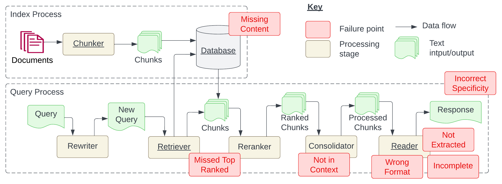
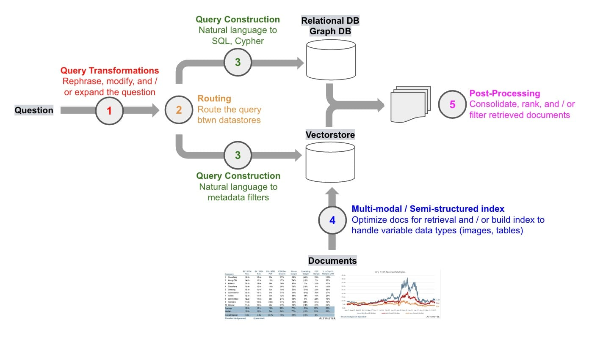

# WEEK054 - 高级 RAG 技术学习笔记

随着大模型技术的发展，基于大模型开发的应用也越来越多，比如类似 ChatGPT 的对话服务，将搜索引擎与大模型相结合的问答服务，等等。但在这些应用中，我们也面临着大量的问题，包括缺乏领域知识、无法获取实时信息以及生成虚假内容。**检索增强生成（Retrieval-Augmented Generation，简称 RAG）** 通过引入外部信息源，为这些问题提供了一种有效的缓解策略。

RAG 在生成式人工智能应用中被广泛采用，演变成了一门类似 **提示工程** 的学科，可以说它是 2023 年最受欢迎的基于大模型的开发架构。它的流行甚至推动了向量搜索领域的炒作，像 [Chroma](https://www.trychroma.com/)、[Weavaite](https://weaviate.io/) 和 [Pinecone](https://www.pinecone.io/) 这样的向量数据库初创公司都因此火了一把。

RAG 之所以如此流行，原因有几个：

1. 它利用了大模型的上下文学习的能力（In-Context Learning，ICL），增强了上下文理解，有助于减少幻觉；
2. 它提供了一种非梯度方法（Non-Gradient Approach，所谓梯度方法就是微调或训练等方法），允许自定义 Prompt 而无需对模型进行微调，这种方法也能更好地适应不同的模型；
3. 它提供了很好的可观察性和可检查性，可以对用户输入、检索的上下文和模型生成的回复进行比对，而微调过程是不透明的；
4. 它更容易维护，对知识库持续更新的过程比较简单，而不需要专业人员；

我们在之前的笔记中已经学习过不少和 RAG 相关的内容，比如在 [week042-doc-qa-using-embedding](../week042-doc-qa-using-embedding/README.md) 这篇笔记中，我们学习了如何打造一个针对本地文档的问答系统，在 [week047-structured-data-qa](../week047-structured-data-qa/README.md) 这篇笔记中，我们继续探索了如何针对结构化的数据进行问答。不过这些内容都比较简单，只是对 RAG 原理的入门级讲解，本篇博客将对 RAG 的高级技巧进行深入学习，并结合 LangChain 和 LlamaIndex 对各个技巧一一进行实战。

## RAG 概述

RAG 的本质是搜索 + LLM 提示（Search + LLM prompting），根据用户的问题，通过一定的搜索算法找到相关的信息，将其注入到大模型的提示中，然后令大模型基于上下文来回答用户的问题。其工作流程如下图所示：


在这里，用户向大模型提出了一个近期新闻相关的问题，由于大模型依赖于预训练数据，无法提供最新的信息。RAG 通过从外部数据库中获取和整合知识来弥补这一信息差，它收集与用户查询相关的新闻文章，这些文章与原始问题结合起来，形成一个全面的提示，使大模型能够生成一个见解丰富的答案。

图中展示了 RAG 框架的四个基本组成部分：

* **输入（Input）**：即用户输入的问题，如果不使用 RAG，问题直接由大模型回答；
* **索引（Indexing）**：系统首先将相关的文档切分成段落，计算每个段落的 Embedding 向量并保存到向量库中；在进行查询时，用户问题也会以相似的方式计算 Embedding 向量；
* **检索（Retrieval）**：从向量库中找到和用户问题最相关的段落；
* **生成（Generation）**：将找到的文档段落与原始问题合并，作为大模型的上下文，令大模型生成回复，从而回答用户的问题；

### RAG 范式的演变和发展

RAG 近年来发展迅速，随着对 RAG 的研究不断深入，各种 RAG 技术被开发出来。Yunfan Gao 等人在 [Retrieval-Augmented Generation for Large Language Models: A Survey](https://arxiv.org/abs/2312.10997) 这篇论文中详细考察了 RAG 范式的演变和发展，将其分成三个阶段：朴素 RAG、高级 RAG 和模块化 RAG：


其中朴素 RAG 最早出现，在 ChatGPT 爆火后不久就开始受到关注，它包括索引、检索和生成三部分，参考上一节所介绍的基本流程。朴素 RAG 简单易懂，但是也面临着不少问题：

* 首先，在检索阶段，精确性和召回率往往是一个难题，既要避免选择无关片段，又要避免错过关键信息；
* 其次，如何将检索到的信息整合在一起也是一个挑战，面对复杂问题，单个检索可能不足以获取足够的上下文信息；对检索的结果，我们要确定段落的重要性和相关性，对段落进行排序，并对冗余段落进行处理；
* 最后，在生成回复时，模型可能会面临幻觉问题，即产生与检索到的上下文不符的内容；此外，模型可能会过度依赖上下文信息，导致只生成检索到的内容，而缺乏自己的见解；同时我们又要尽量避免模型输出不相关、有毒或有偏见的信息。

为了解决朴素 RAG 遗留的问题，高级 RAG 引入了一些改进措施，增加了 **预检索过程（Pre-Retrieval Process）** 和 **后检索过程（Post-Retrieval Process）** 两个阶段，提高检索质量：

* 在预检索过程这个阶段，主要关注的是 **索引优化（index optimization）** 和 **查询优化（query optimization）**；索引优化的目标是提高被索引内容的质量，常见的方法有：*提高数据粒度（enhancing data granularity）*、*优化索引结构（optimizing index structures）*、*添加元数据（adding metadata）*、*对齐优化（alignment optimization）* 和 *混合检索（mixed retrieval）*；而查询优化的目标是使用户的原始问题更清晰、更适合检索任务，常见的方法有：*查询重写（query rewriting）*、*查询转换（query transformation）*、*查询扩展（query expansion）* 等技术；
* 后检索过程关注的是，如何将检索到的上下文有效地与查询整合起来。直接将所有相关文档输入大模型可能会导致信息过载，使关键细节与无关内容混淆，为了减轻这种情况，后检索过程引入的方法包括：*重新排序块（rerank chunks）* 和 *上下文压缩（context compressing）* 等；

可以看出，尽管高级 RAG 在检索前和检索后提出了多种优化策略，但是它仍然遵循着和朴素 RAG 一样的链式结构，架构的灵活性仍然收到限制。模块化 RAG 的架构超越了前两种 RAG 范式，增强了其适应性和功能性，可以灵活地引入特定功能模块或替换现有模块，整个过程不仅限于顺序检索和生成，还包括迭代和自适应检索等方法。

关于这些 RAG 技术的细节，推荐研读 Yunfan Gao 等人的 [论文](https://arxiv.org/abs/2312.10997)，写的非常详细。

### 开发 RAG 系统面临的 12 个问题

上一节我们学习了 RAG 范式的发展，并介绍了 RAG 系统中可能会面临的问题，Scott Barnett 等人在 [Seven Failure Points When Engineering a Retrieval Augmented Generation System](https://arxiv.org/abs/2401.05856) 这篇论文中对此做了进一步的梳理，整理了 7 个常见的问题：



1. 缺失内容（Missing Content）

当用户的问题无法从文档库中检索到时，可能会导致大模型的幻觉现象。理想情况下，RAG 系统可以简单地回复一句 “抱歉，我不知道”，然而，如果用户问题能检索到文档，但是文档内容和用户问题无关时，大模型还是可能会被误导。

2. 错过超出排名范围的文档（Missed Top Ranked）

由于大模型的上下文长度限制，我们从文档库中检索时，一般只返回排名靠前的 K 个段落，如果问题答案所在的段落超出了排名范围，就会出现问题。

3. 不在上下文中（Not In Context）

包含答案的文档已经成功检索出来，但却没有包含在大模型所使用的上下文中。当从数据库中检索到多个文档，并且使用合并过程提取答案时，就会出现这种情况。

4. 未提取（Not Extracted）

答案在提供的上下文中，但是大模型未能准确地提取出来，这通常发生在上下文中存在过多的噪音或冲突信息时。

5. 错误的格式（Wrong Format）

问题要求以特定格式提取信息，例如表格或列表，然而大模型忽略了这个指示。

6. 不正确的具体性（Incorrect Specificity）

尽管大模型正常回答了用户的提问，但不够具体或者过于具体，都不能满足用户的需求。不正确的具体性也可能发生在用户不确定如何提问，或提问过于笼统时。

7. 不完整的回答（Incomplete Answers）

考虑一个问题，“文件 A、B、C 包含哪些关键点？”，直接使用这个问题检索得到的可能只是每个文件的部分信息，导致大模型的回答不完整。一个更有效的方法是分别针对每个文件提出这些问题，以确保全面覆盖。

Wenqi Glantz 在他的博客 [12 RAG Pain Points and Proposed Solutions](https://towardsdatascience.com/12-rag-pain-points-and-proposed-solutions-43709939a28c) 中又扩充了另 5 个问题：

8. 数据摄入的可扩展性问题（Data Ingestion Scalability）

当数据规模增大时，系统可能会面临如数据摄入时间过长、系统过载、数据质量下降以及可用性受限等问题，这可能导致性能瓶颈甚至系统故障。

9. 结构化数据的问答（Structured Data QA）

根据用户的问题准确检索出所需的结构化数据是一项挑战，尤其是当用户的问题比较复杂或比较模糊时。这是由于文本到 SQL 的转换不够灵活，当前大模型在处理这类任务上仍然存在一定的局限性。

10. 从复杂 PDF 文档提取数据（Data Extraction from Complex PDFs）

复杂的 PDF 文档中可能包含有表格、图片等嵌入内容，在对这种文档进行问答时，传统的检索方法往往无法达到很好的效果。我们需要一个更高效的方法来处理这种复杂的 PDF 数据提取需求。

11. 备用模型（Fallback Model(s)）

在使用单一大模型时，我们可能会担心模型遇到问题，比如遇到 OpenAI 模型的访问频率限制错误。这时候，我们需要一个或多个模型作为备用，以防主模型出现故障。

12. 大语言模型的安全性（LLM Security）

如何有效地防止恶意输入、确保输出安全、保护敏感信息不被泄露等问题，都是我们需要面对的重要挑战。

在 Wenqi Glantz 的博客中，他不仅整理了这些问题，而且还对每个问题给出了对应的解决方案，整个 RAG 系统的蓝图如下：


## LlamaIndex 实战

通过上面的学习，我们了解了 RAG 的基本原理和发展历史，以及开发 RAG 系统时可能遇到的一些问题。这一节我们将学习 [LlamaIndex](https://github.com/run-llama/llama_index) 框架，这是一个和 [LangChain](https://python.langchain.com/docs/get_started/introduction) 齐名的基于大模型的应用开发框架，我们将使用它快速实现一个简单的 RAG 程序。

### LlamaIndex 快速入门

LlamaIndex 是一个由 [Jerry Liu](https://jerryjliu.github.io/) 创建的 Python 库，用于开发基于大模型的应用程序，类似于 LangChain，但它更偏向于 RAG 系统的开发。使用 LlamaIndex，开发人员可以很方便地摄取、结构化和访问私有或领域特定数据，以便将这些数据安全可靠地注入大模型中，从而实现更准确的文本生成。

正如 LlamaIndex 的名字所暗示的，**索引（Index）** 是 RAG 系统中的核心概念，它是大模型和用户数据之间的桥梁，无论是数据库类的结构化数据，还是文档类的非结构化数据，抑或是程序类的 API 数据，都是通过索引来查询的，查询出来的内容作为上下文和用户的问题一起发送给大模型，得到响应：


LlamaIndex 将 RAG 分为五个关键阶段：

* **加载（Loading）**：用于导入各种用户数据，无论是文本文件、PDF、另一个网站、数据库还是 API；[LlamaHub](https://llamahub.ai/) 提供了数百个的加载器；
* **索引（Indexing）**：可以是 Embedding 向量，也可以是其他元数据策略，方便我们准确地找到上下文相关的数据；
* **存储（Storing）**：对索引持久化存储，以免重复索引；
* **查询（Querying）**：对给定的索引策略进行查询，包括子查询、多步查询和混合策略；
* **评估（Evaluation）**：提供客观的度量标准，用于衡量查询响应的准确性、忠实度和速度；

可以看到这些阶段几乎都和索引有关，为了对这些阶段有个更感性的认识，我们参考 LlamaIndex 官方文档中的 [Starter Tutorial](https://docs.llamaindex.ai/en/stable/getting_started/starter_example/) 来快速入门。

首先，我们使用 pip 安装 LlamaIndex：

```
$ pip3 install llama-index
```

通过 LlamaIndex 提供的高级 API，初学者只需 5 行代码即可实现一个简单的 RAG 程序：

```
from llama_index.core import VectorStoreIndex, SimpleDirectoryReader
documents = SimpleDirectoryReader("data").load_data()
index = VectorStoreIndex.from_documents(documents)
query_engine = index.as_query_engine()
response = query_engine.query("What did the author do growing up?")
```

示例中使用了保罗·格雷厄姆的文章 [What I Worked On](http://paulgraham.com/worked.html) 作为测试数据，我们将其下载并保存到 data 目录，运行程序，得到下面的输出：

```
The author worked on writing and programming before college.
```

### LlamaIndex 核心概念

上面的代码中展示了 `加载` -> `索引` -> `查询` 这几个阶段，其中有几个概念需要特别说明下：

* [Documents and Nodes](https://docs.llamaindex.ai/en/stable/module_guides/loading/documents_and_nodes/)
    * **Documents** 对应任何数据源的容器，比如 PDF 文档，API 接口的输出，或从数据库中检索数据；
    * 我们可以手动构造 Document 对象，也可以使用所谓的 [数据连接器（Data Connectors）](https://docs.llamaindex.ai/en/stable/module_guides/loading/connector/) 来加载数据，示例中使用的 `SimpleDirectoryReader` 就是一个数据连接器；
    * 由于加载的数据可能很大，Document 通常不直接使用，在 LlamaIndex 中，会将 Document 切分成很多很多的小块，这些文档的分块被称为 **Node**，它是 LlamaIndex 中数据的原子单位；Node 中包含一些元数据，比如属于哪个文档，和其他 Node 的关联等；
    * 将 Document 切分成 Nodes 是由 [Node Parser 或 Text Splitters](https://docs.llamaindex.ai/en/stable/module_guides/loading/node_parsers/) 完成的，示例代码中并没有明确指定，用的默认的 `SentenceSplitter`，可以通过 `Settings.text_splitter` 来修改；
* [Indexes](https://docs.llamaindex.ai/en/stable/module_guides/indexing/)
    * 一旦完成了数据的读取，LlamaIndex 就可以帮我们对数据进行索引，便于快速检索用户查询的相关上下文；**Index** 是一种数据结构，它是 LlamaIndex 打造 RAG 的核心基础；
    * LlamaIndex 内置了几种不同的 Index 实现，如 **Summary Index**，**Vector Store Index**、**Tree Index** 和 **Keyword Table Index**，[How Each Index Works](https://docs.llamaindex.ai/en/stable/module_guides/indexing/index_guide/) 这篇文档介绍了不同 Index 的实现原理；
    * 可以看到示例代码中使用了 [VectorStoreIndex](https://docs.llamaindex.ai/en/stable/module_guides/indexing/vector_store_index/)，这也是目前最常用的 Index；默认情况下 `VectorStoreIndex` 将 Index 数据保存到内存中，可以通过 `StorageContext` 的 `persist()` 方法将 Index 持久化到本地磁盘，或指定 [Vector Store](https://docs.llamaindex.ai/en/stable/module_guides/storing/vector_stores/) 将 Index 保存到向量数据库中，LlamaIndex [集成了大量的 Vector Store 实现](https://docs.llamaindex.ai/en/stable/community/integrations/vector_stores/)；
    * LlamaIndex 有一套完善的存储体系，除了 Vector Store，还支持 **Document Store**、**Index Store**、**Graph Store** 和 **Chat Store** 等，具体内容可以参考 [官方文档](https://docs.llamaindex.ai/en/stable/module_guides/storing/)；
    * 此外，在使用 `VectorStoreIndex` 生成向量索引时，会使用 [Embeddings](https://docs.llamaindex.ai/en/stable/module_guides/models/embeddings/) 模型，它使用复杂的向量来表示文档内容，通过向量的距离来表示文本的语义相似性，默认的 Embedding 模型为 `OpenAIEmbedding`，可以通过 `Settings.embed_model` 来修改；
* [Query Engines](https://docs.llamaindex.ai/en/stable/module_guides/deploying/query_engine/)
    * 加载完文档，构造完索引，我们就来到 RAG 中最重要的一环：[Querying](https://docs.llamaindex.ai/en/stable/understanding/querying/querying/)；根据用户的问题，或者是一个总结请求，或者一个更复杂的指令，检索出相关文档从而实现对数据的问答和聊天；
    * **查询引擎（Query Engines）** 是最基础也是最常见的检索方式，通过 Index 的 `as_query_engine()` 方法可以构建查询引擎，查询引擎是无状态的，不能跟踪历史对话，如果要实现类似 ChatGPT 的对话场景，可以通过 `as_chat_engine()` 方法构建 [聊天引擎（Chat Engines）](https://docs.llamaindex.ai/en/stable/module_guides/deploying/chat_engines/)；
    * LlamaIndex 将查询分为三个步骤：第一步 [Retrieval](https://docs.llamaindex.ai/en/stable/module_guides/querying/retriever/) 是指从 Index 中找到并返回与用户查询最相关的文档；第二步 [Node Postprocessing](https://docs.llamaindex.ai/en/stable/module_guides/querying/node_postprocessors/) 表示后处理，这是在检索到结果后对其进行重排序、转换或过滤的过程；第三步 [Response Synthesis](https://docs.llamaindex.ai/en/stable/module_guides/querying/response_synthesizers/) 是指将用户查询、最相关的文档片段以及提示组合在一起发送到大模型以生成响应；查询的每个步骤 LlamaIndex 都内置了多种不同的策略，也可以完全由用户定制；
    * LlamaIndex 还支持多种不同的查询结合使用，它通过 [路由器（Routers）](https://docs.llamaindex.ai/en/stable/module_guides/querying/router/) 来做选择，确定要使用哪个查询，从而满足更多的应用场景。

通过上面的学习，我们对 LlamaIndex 中的各个组件的概念已经有了一个大致的了解，可以结合官网的 [Learn](https://docs.llamaindex.ai/en/stable/understanding/)、[Use Cases](https://docs.llamaindex.ai/en/stable/use_cases/) 和 [Component Guides](https://docs.llamaindex.ai/en/stable/module_guides/) 等文档学习 LlamaIndex 的更多功能。

## 高级 RAG 技巧

基于 LlamaIndex，我们只用了 5 行代码就实现了一个简单的 RAG 系统，可以看出，这是朴素 RAG 的基本思路。这一节我们将继续学习高级 RAG 技巧，争取对每一种技巧都进行实战验证，带大家一窥 RAG 的技术全貌。

下图展示了高级 RAG 涉及的核心步骤和算法：



LangChain 的 [这篇博客](https://blog.langchain.dev/deconstructing-rag/) 对这些步骤进行详细的讨论。

### 查询转换（Query Transformations）

RAG 系统面临的第一个问题就是如何处理用户输入，我们知道，RAG 的基本思路是根据用户输入检索出最相关的内容，但是用户输入是不可控的，可能存在冗余、模糊或歧义等情况，如果直接拿着用户输入去检索，效果可能不理想。

**查询转换（Query Transformations）** 是一组旨在修改用户输入以改善检索的方法，使检索对用户输入的变化具有鲁棒性。

* [Query Transformations | LlamaIndex](https://docs.llamaindex.ai/en/stable/optimizing/advanced_retrieval/query_transformations/)
    * [Query Transform Cookbook](https://docs.llamaindex.ai/en/stable/examples/query_transformations/query_transform_cookbook/)
    * [Multi-Step Query Engine](https://docs.llamaindex.ai/en/stable/examples/query_transformations/SimpleIndexDemo-multistep/)
    * [HyDE Query Transform](https://docs.llamaindex.ai/en/stable/examples/query_transformations/HyDEQueryTransformDemo/)
    * [Sub Question Query Engine](https://docs.llamaindex.ai/en/stable/examples/query_engine/sub_question_query_engine/)

#### 查询扩展（Query Expansion）

假设你的知识库中包含了各个公司的基本信息，考虑这样的用户输入：*微软和苹果哪一个成立时间更早？* 要获得更好的检索效果，我们可以将其拆解成两个用户输入：*微软的成立时间* 和 *苹果的成立时间*，这种将用户输入分解为多个子问题的方法被称为 **查询扩展（Query Expansion）**。

再考虑另一个用户输入：*哪个国家赢得了 2023 年的女子世界杯？该国的 GDP 是多少？*，和上面的例子一样，我们也需要通过查询扩展将其拆分成两个子问题，只不过这两个子问题是有依赖关系的，我们需要先查出第一个子问题的答案，然后才能查第二个子问题。也就是说，上面的例子中我们可以并行查询，而这个例子需要串行查询。

查询扩展有多种不同的实现，比如：

##### 多查询检索器（Multi Query Retriever）

[`MultiQueryRetriever`](https://python.langchain.com/docs/modules/data_connection/retrievers/MultiQueryRetriever/) 是 LangChain 中的一个类，可根据用户输入生成子问题，然后依次进行检索，最后将检索到的文档合并返回。

`MultiQueryRetriever` 不仅可以从原始问题中拆解出子问题，还可以对同一问题生成多个视角的提问，比如用户输入：*What are the approaches to Task Decomposition?*，大模型可以对这个问题生成多个角度的提问，比如：

1. How can Task Decomposition be approached?
2. What are the different methods for Task Decomposition?
3. What are the various approaches to decomposing tasks?

`MultiQueryRetriever` 默认使用的 Prompt 如下：

```
You are an AI language model assistant. Your task is 
to generate 3 different versions of the given user 
question to retrieve relevant documents from a vector  database. 
By generating multiple perspectives on the user question, 
your goal is to help the user overcome some of the limitations 
of distance-based similarity search. Provide these alternative 
questions separated by newlines. Original question: {question}
```

我们可以在此基础上稍作修改，就可以实现子问题拆解：

```
你是一个 AI 语言助手，你的任务是将用户的问题拆解成多个子问题便于检索，多个子问题以换行分割，保证每行一个。
用户的原始问题为：{question}
```

##### RAG 融合（RAG Fusion）

* [RAG Fusion](https://github.com/Raudaschl/rag-fusion) 和 `MultiQueryRetriever` 基于同样的思路，生成子问题并检索，它对检索结果执行 **倒数排名融合（Reciprocal Rank Fusion，RRF）** 算法，使得检索效果更好。

[这里](https://github.com/langchain-ai/langchain/blob/master/cookbook/rag_fusion.ipynb) 是实现 RAG Fusion 的代码示例。

##### 回退提示（Step-back prompting）

[回退提示](https://arxiv.org/abs/2310.06117) 是另一种查询扩展的方法，它基于用户的原始问题生成一个回退问题，回退问题相比原始问题具有更高级别的概念或原则，从而提高解决复杂问题的效果，例如一个关于物理学的问题可以回退为一个关于该问题背后的物理原理的问题，然后对原始问题和回退问题进行检索。

[这里](https://github.com/langchain-ai/langchain/blob/master/cookbook/stepback-qa.ipynb) 是基于回退提示实现 RAG 问答的一个示例，其中生成回退问题的 Prompt 如下：

```
You are an expert of world knowledge. I am going to ask you a question. \
Your response should be comprehensive and not contradicted with the following \
context if they are relevant. Otherwise, ignore them if they are not relevant.

{normal_context}
{step_back_context}

Original Question: {question}
Answer:
```

#### 查询重写（Query Rewriting）

用户输入可能表达不清晰或措辞不当，一个典型的例子是用户输入中包含大量冗余的信息，看下面这个例子：

```
hi there! I want to know the answer to a question. is that okay? 
lets assume it is. my name is harrison, the ceo of langchain. 
i like llms and openai. who is maisie peters?
```

我们想要回答的真正问题是 “who is maisie peters?”，但用户输入中有很多分散注意力的文本，如果直接拿着原始文本去检索，可能检索出很多无关的内容。为解决这个问题，我们可以不使用原始输入，而是从用户输入生成搜索查询。Xinbei Ma 等人提出了一种 **Rewrite-Retrieve-Read** 的方法，对用户的输入进行改写，以改善检索效果，[这里是论文地址](https://arxiv.org/abs/2305.14283)，实现方法其实很简单，通过下面的 Prompt 让大模型基于用户的输入给出一个更好的查询：

```
template = """Provide a better search query for \
web search engine to answer the given question, end \
the queries with ’**’. Question: \
{x} Answer:"""
rewrite_prompt = ChatPromptTemplate.from_template(template)
```

具体实现可以参考 [LangChain 的这个 cookbook](https://github.com/langchain-ai/langchain/blob/master/cookbook/rewrite.ipynb)。

除了处理表达不清的用户输入，查询重写还经常用于处理聊天场景中的后续问题（Follow Up Questions）。比如用户首先问 “合肥有哪些好玩的地方？”，接着用户又问 “那里有什么好吃的？”，如果直接用最后一句话进行嵌入和检索，就会丢失 “合肥” 这样的重要信息，这时，我们就可以用大模型来做问题重写来解决这个问题。

在开源网页搜索助手 [WebLangChain](https://blog.langchain.dev/weblangchain/) 中，使用了如下的 Prompt 来实现问题重写：

```
Given the following conversation and a follow up question, rephrase the follow up \
question to be a standalone question.

Chat History:
{chat_history}
Follow Up Input: {question}
Standalone Question:
```

#### 查询压缩（Query Compression）

在一些 RAG 应用程序中，用户可能是以聊天对话的形式与系统交互的，为了正确回答用户的问题，我们需要考虑完整的对话上下文，为了解决这个问题，可以将聊天历史压缩成最终问题以便检索，可以 [参考这个 Prompt](https://smith.langchain.com/hub/langchain-ai/weblangchain-search-query)。

### 查询路由（Routing）

在经过第一步查询转换后，我们已经将用户问题转换成易于检索的形式，接下来我们就要开始检索了。但是从哪里检索呢？有很多 RAG 示例都是从向量数据库中检索，但是在真正的生产环境中通常情况会比这复杂的多，数据可能存储在多个不同的库中，比如，向量数据库，关系型数据库，图数据库，甚至是 API 接口。这时我们需要对传入的查询进行动态路由，根据不同的用户问题检索不同的库。

* [Routers | LlamaIndex](https://docs.llamaindex.ai/en/stable/module_guides/querying/router/)
    * [Router Query Engine](https://docs.llamaindex.ai/en/stable/examples/query_engine/RouterQueryEngine/)
* [Dynamically route logic based on input](https://python.langchain.com/docs/expression_language/how_to/routing/)

### 查询构造（Query Construction）

我们面临的第三个问题是：使用什么语法来检索数据？在上一步中，我们知道数据可能存储在关系型数据库或图数据库中，要从这些库中检索数据，必须使用特定的语法，而用户问题通常都是用自然语言提出的，所以我们需要将自然语言转换为特定的查询语法。

* [Query Construction](https://blog.langchain.dev/query-construction/)

#### Text-to-SQL

将自然语言翻译成 SQL 是一个非常热门的话题，已经有不少人对此展开了研究。通过向 LLM 提供一个自然语言问题以及相关的数据库表信息，可以轻松地完成文本到 SQL 的转换。

* [Q&A over SQL + CSV](https://python.langchain.com/docs/use_cases/sql/)

在关系型数据库中，混合类型数据存储变得越来越普遍，这种数据被称为 **半结构化数据（semi-structured data）**，也就是说既有结构化数据，也有非结构化数据。比如使用 PostgreSQL 的 [pgvector 扩展](https://github.com/pgvector/pgvector) 可以在表中增加嵌入式文档列，这让我们可以使用自然语言与这些半结构化数据进行交互，将 SQL 的表达能力与语义搜索相结合。

* [Incoporating semantic similarity in tabular databases](https://github.com/langchain-ai/langchain/blob/master/cookbook/retrieval_in_sql.ipynb)

#### Text-to-Cypher

向量数据库可以轻松处理非结构化数据，但它们无法理解向量之间的关系；SQL 数据库可以建模表之间的关系，但是却不擅长建模数据之间的关系，特别是多对多关系或难以在表格形式中表示的层次结构的数据；图数据库可以通过建模数据之间的关系并扩展关系类型来解决这些挑战。

和 SQL 一样，Cypher 是一种对图数据库进行查询的结构化查询语言，我们可以使用类似的方法将自然语言翻译成 Cypher 语言。

* [Using a Knowledge Graph to implement a DevOps RAG application](https://blog.langchain.dev/using-a-knowledge-graph-to-implement-a-devops-rag-application/)

#### Text-to-metadata filters

通过元数据过滤功能，向量数据库也可以实现结构化查询，这和关系型数据库的半结构化数据很像。通过 LLM 我们可以将自然语言翻译为带有元数据过滤器的查询语法。

* [Self-querying](https://python.langchain.com/docs/modules/data_connection/retrievers/self_query/)
* [Filtering by metadata | Chroma](https://docs.trychroma.com/usage-guide#filtering-by-metadata)

### 索引（Indexing）

上面三步都是关于检索的，包括从哪里检索以及如何检索。第四个要考虑的问题是怎么存储我的数据？怎么设计我的索引？通过上面的学习我们知道，可以将数据存储到向量数据库、SQL 数据库或者图数据库中，针对这些不同的存储方式，我们又可以使用不同的索引策略。

#### 分块策略

文档分块是索引构建中的关键步骤，在尝试不同的分块策略和大小时，要特别注意检查文档在拆分时是否会出现语义相关内容被不自然地拆分的情况。无论是 LangChain 和 LlamaIndex 都提供了大量的文档分块的方法。

* [Node Parser Usage Pattern | LlamaIndex](https://docs.llamaindex.ai/en/stable/module_guides/loading/node_parsers/)
* [Node Parser Modules | LlamaIndex](https://docs.llamaindex.ai/en/stable/module_guides/loading/node_parsers/modules/)
* [Semantic Chunker | LlamaIndex](https://docs.llamaindex.ai/en/stable/examples/node_parsers/semantic_chunking/)
* [Text Splitters | LangChain](https://python.langchain.com/docs/modules/data_connection/document_transformers/)
* [Chunking Strategies for LLM Applications](https://www.pinecone.io/learn/chunking-strategies/)
* [The 5 Levels Of Text Splitting For Retrieval](https://www.youtube.com/watch?v=8OJC21T2SL4)
    * [Notebook](https://github.com/FullStackRetrieval-com/RetrievalTutorials/blob/main/tutorials/LevelsOfTextSplitting/5_Levels_Of_Text_Splitting.ipynb)

由于分块大小直接决定了我们加载到大模型上下文窗口中的信息量，因此通过尝试调整不同的分块大小，可以得到不同的性能表现。

* [Chunk Size Matters](https://www.mattambrogi.com/posts/chunk-size-matters/)

#### 嵌入策略

对于同一份文档，我们可以有多种嵌入方式，也就是为同一份文档生成几种不同的嵌入向量，这在很多情况下可以提高检索效果，这被称为 [多向量检索器（Multi-Vector Retriever）](https://python.langchain.com/v0.1/docs/modules/data_connection/retrievers/multi_vector/)。为同一份文档生成不同的嵌入向量有很多策略可供选择。

当我们对文档进行分块的时候，我们可能希望每个分块不要太长，因为只有当文本长度合适，嵌入才可以最准确地反映它们的含义，太长的文本嵌入可能会失去意义；但是在将检索内容送往大模型时，我们又希望有足够长的文本，以保留完整的上下文。为了实现二者的平衡，我们可以在检索过程中，首先获取小的分块，然后查找这些小分块的父文档，并返回较大的父文档，这里的父文档指的是小分块的来源文档，可以是整个原始文档，也可以是一个更大的分块。LangChain 提供的 [父文档检索器（Parent Document Retriever）](https://python.langchain.com/docs/modules/data_connection/retrievers/parent_document_retriever/) 就是使用了这种策略；这种将嵌入的内容（用于检索）和送往大模型的内容（用于答案生成）分离的做法是索引设计中最简单且最有用的想法之一。

当我们处理一段包含大量冗余细节的文本时，我们可以对其分块，对每个分块进行嵌入，也可以对其进行摘要，对摘要进行嵌入，然后对多个嵌入进行检索，然后将检索内容传给大模型以生成答案，这也是多向量检索器的一个例子。

另外，我们还可以通过大模型为每个文档生成假设性问题，然后生成这些问题和原文档的嵌入向量。

多向量检索器对包含文本和表格的半结构化文档也能很好地工作，在这种情况下，可以提取每个表格，为表格生成适合检索的摘要，但生成答案时将原始表格送给大模型。有些文档不仅包含文本和表格，还可能包含图片，随着多模态大模型的出现，我们可以为图像生成摘要和嵌入。

* [Multi-Vector Retriever for RAG on tables, text, and images](https://blog.langchain.dev/semi-structured-multi-modal-rag/)
    * [Semi-structured RAG](https://github.com/langchain-ai/langchain/blob/master/cookbook/Semi_Structured_RAG.ipynb)
    * [Semi-structured and Multi-modal RAG](https://github.com/langchain-ai/langchain/blob/master/cookbook/Semi_structured_and_multi_modal_RAG.ipynb)
    * [Private Semi-structured and Multi-modal RAG w/ LLaMA2 and LLaVA](https://github.com/langchain-ai/langchain/blob/master/cookbook/Semi_structured_multi_modal_RAG_LLaMA2.ipynb)
    * [Multi-modal RAG](https://github.com/langchain-ai/langchain/blob/master/cookbook/Multi_modal_RAG.ipynb)
    * [Chroma multi-modal RAG](https://github.com/langchain-ai/langchain/blob/master/cookbook/multi_modal_RAG_chroma.ipynb)

#### 检索策略

* [Retriever Modules | LlamaIndex](https://docs.llamaindex.ai/en/stable/module_guides/querying/retriever/retrievers/)
    * [Auto Merging Retriever](https://docs.llamaindex.ai/en/stable/examples/retrievers/auto_merging_retriever/)
* [Retriever Modes | LlamaIndex](https://docs.llamaindex.ai/en/stable/module_guides/querying/retriever/retriever_modes/)
* [Retrievers | LangChain](https://python.langchain.com/docs/modules/data_connection/retrievers/)

### 后处理

这是打造 RAG 系统的最后一个问题，如何将检索出来的信息丢给大模型？检索出来的信息可能过长，或者存在冗余（比如从多个来源进行检索），我们可以在后处理步骤中对其进行压缩、排序、去重等。

* [Node Postprocessor Modules | LlamaIndex](https://docs.llamaindex.ai/en/stable/module_guides/querying/node_postprocessors/node_postprocessors/)
    * [Metadata Replacement + Node Sentence Window](https://docs.llamaindex.ai/en/stable/examples/node_postprocessor/MetadataReplacementDemo/)

#### 重排序

当检索结果太多时，与查询相关性最高的信息可能被埋在大量的无关文档中，如果将所有这些文档都传递到大模型，可能导致更昂贵的调用费用，生成的响应也更差。

可以使用 [Cohere 的 Rerank API](https://docs.cohere.com/docs/reranking) 来对文档进行相关性重排，过滤不相干的内容从而达到压缩的效果。

上文中提到的 [RAG Fusion](https://github.com/Raudaschl/rag-fusion) 利用 **倒数排名融合（Reciprocal Rank Fusion，RRF）** 算法对检索结果进行排序，也是一种重排技术。

* [Contextual compression](https://python.langchain.com/v0.1/docs/modules/data_connection/retrievers/contextual_compression/)
* [Cohere reranker](https://python.langchain.com/v0.1/docs/integrations/retrievers/cohere-reranker/)
* [Forget RAG, the Future is RAG-Fusion](https://towardsdatascience.com/forget-rag-the-future-is-rag-fusion-1147298d8ad1)
* [RAG Fusion](https://github.com/langchain-ai/langchain/blob/master/cookbook/rag_fusion.ipynb)

#### 引用来源

一个基于 RAG 的应用不仅要提供答案，还要提供答案的引用来源，这样做有两个好处，首先，用户可以打开引用来源对大模型的回复进行验证，其次，方便用户对特定主体进行进一步的深入研究。

这里是 [Perplexity 泄露出来的 Prompt](https://twitter.com/jmilldotdev/status/1600624362394091523) 可供参考，这里是 [WebLangChain 对其修改后的实现](https://smith.langchain.com/hub/hwchase17/weblangchain-generation)。在这个 Prompt 中，要求大模型在生成内容时使用 `[N]` 格式表示来源，然后在客户端解析它并将其呈现为超链接。

### Agentic RAG

* [Agentic RAG With LlamaIndex](https://www.llamaindex.ai/blog/agentic-rag-with-llamaindex-2721b8a49ff6)
* [Agentic strategies](https://docs.llamaindex.ai/en/stable/optimizing/agentic_strategies/agentic_strategies/)
* [Multi-Document Agents](https://docs.llamaindex.ai/en/stable/examples/agent/multi_document_agents/)
* [Unlocking the Power of Multi-Document Agents with LlamaIndex](https://ai.gopubby.com/unlocking-the-power-of-multi-document-agents-with-llamaindex-d09e4d7dfe0e)

## 参考

* [Retrieval-Augmented Generation for Large Language Models: A Survey](https://arxiv.org/abs/2312.10997)
* [Large Language Models for Information Retrieval: A Survey](https://arxiv.org/abs/2308.07107)
* [Advanced RAG Techniques: an Illustrated Overview](https://pub.towardsai.net/advanced-rag-techniques-an-illustrated-overview-04d193d8fec6) - [中文翻译](https://baoyu.io/translations/rag/advanced-rag-techniques-an-illustrated-overview)
* [12 RAG Pain Points and Proposed Solutions](https://towardsdatascience.com/12-rag-pain-points-and-proposed-solutions-43709939a28c) - [中文翻译](https://baoyu.io/translations/rag/12-rag-pain-points-and-proposed-solutions)
* [Challenges In Adopting Retrieval-Augmented Generation Solutions](https://cobusgreyling.medium.com/challenges-in-adopting-retrieval-augmented-generation-solutions-eb30c07db398)
* [Deconstructing RAG | LangChain](https://blog.langchain.dev/deconstructing-rag/)
* [Query Transformations | LangChain](https://blog.langchain.dev/query-transformations/)
* [Applying OpenAI's RAG Strategies | LangChain](https://blog.langchain.dev/applying-openai-rag/)
* [Building (and Breaking) WebLangChain | LangChain](https://blog.langchain.dev/weblangchain/)
* [Chatting With Your Data Ultimate Guide](https://medium.com/aimonks/chatting-with-your-data-ultimate-guide-a4e909591436)
* [Chat With Your Data Ultimate Guide | Part 2](https://medium.com/aimonks/chat-with-your-data-ultimate-guide-part-2-f72ab6dfa147)
* [LlamaIndex Documents](https://docs.llamaindex.ai/en/stable/)
* [Q&A with RAG](https://python.langchain.com/docs/use_cases/question_answering/)
* [Self-Reflective RAG with LangGraph](https://blog.langchain.dev/agentic-rag-with-langgraph/)
* [LLM 之 RAG 理论](https://mp.weixin.qq.com/mp/appmsgalbum?__biz=Mzg3NDIyMzI0Mw==&action=getalbum&album_id=3377843493502664707)
* [LLM 之 RAG 实战](https://mp.weixin.qq.com/mp/appmsgalbum?__biz=Mzg3NDIyMzI0Mw==&action=getalbum&album_id=3377833073308024836)
* [从 RAG 到 Self-RAG —— LLM 的知识增强](https://zhuanlan.zhihu.com/p/661465330)
* [大语言模型的检索增强生成 (RAG) 方法](https://www.promptingguide.ai/zh/research/rag)
* [RAG-Survey](https://github.com/Tongji-KGLLM/RAG-Survey)

### Advanced RAG Learning Series | Akash Mathur

* [Advanced RAG: Optimizing Retrieval with Additional Context & MetaData using LlamaIndex](https://akash-mathur.medium.com/advanced-rag-optimizing-retrieval-with-additional-context-metadata-using-llamaindex-aeaa32d7aa2f)
* [Advanced RAG: Enhancing Retrieval Efficiency through Rerankers using LlamaIndex](https://akash-mathur.medium.com/advanced-rag-enhancing-retrieval-efficiency-through-evaluating-reranker-models-using-llamaindex-3f104f24607e)
* [Advanced RAG: Query Augmentation for Next-Level Search using LlamaIndex](https://akash-mathur.medium.com/advanced-rag-query-augmentation-for-next-level-search-using-llamaindex-d362fed7ecc3)
* [Data Management in LlamaIndex: Smart Tracking and Debugging of Document Changes](https://akash-mathur.medium.com/data-management-in-llamaindex-smart-tracking-and-debugging-of-document-changes-7b81c304382b)

### Self-RAG | Florian June

* [Advanced RAG 01: Problems of Naive RAG](https://ai.plainenglish.io/advanced-rag-part-01-problems-of-naive-rag-7e5f8ebb68d5)
* [Advanced RAG 02: Unveiling PDF Parsing](https://pub.towardsai.net/advanced-rag-02-unveiling-pdf-parsing-b84ae866344e)
* [Advanced RAG 03: Using RAGAs + LlamaIndex for RAG evaluation](https://ai.plainenglish.io/advanced-rag-03-using-ragas-llamaindex-for-rag-evaluation-84756b82dca7)
* [Advanced RAG 04: Re-ranking](https://pub.towardsai.net/advanced-rag-04-re-ranking-85f6ae8170b1)
* [Advanced RAG 05: Exploring Semantic Chunking](https://pub.towardsai.net/advanced-rag-05-exploring-semantic-chunking-97c12af20a4d)
* [Advanced RAG 06: Exploring Query Rewriting](https://medium.com/@florian_algo/advanced-rag-06-exploring-query-rewriting-23997297f2d1)
* [Advanced RAG 07: Exploring RAG for Tables](https://ai.plainenglish.io/advanced-rag-07-exploring-rag-for-tables-5c3fc0de7af6)
* [Advanced RAG 08: Self-RAG](https://ai.gopubby.com/advanced-rag-08-self-rag-c0c5b5952e0e)
* [Advanced RAG 09: Prompt Compression](https://ai.gopubby.com/advanced-rag-09-prompt-compression-95a589f7b554)
* [Advanced RAG 10: Corrective Retrieval Augmented Generation (CRAG)](https://ai.gopubby.com/advanced-rag-10-corrective-retrieval-augmented-generation-crag-3f5a140796f9)
