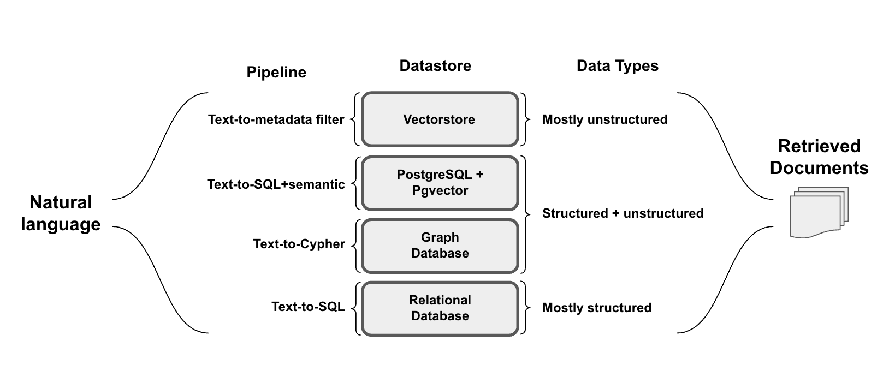

# WEEK054 - 高级 RAG 技术学习笔记

随着大模型技术的发展，基于大模型开发的应用也越来越多，比如类似 ChatGPT 的对话服务，将搜索引擎与大模型相结合的问答服务，等等。但在这些应用中，我们也面临着大量的问题，包括缺乏领域知识、无法获取实时信息以及生成虚假内容。**检索增强生成（Retrieval-Augmented Generation，简称 RAG）** 通过引入外部信息源，为这些问题提供了一种有效的缓解策略。

RAG 在生成式人工智能应用中被广泛采用，演变成了一门类似 **提示工程** 的学科，可以说它是 2023 年最受欢迎的基于大模型的开发架构。它的流行甚至推动了向量搜索领域的炒作，像 [Chroma](https://www.trychroma.com/)、[Weavaite](https://weaviate.io/) 和 [Pinecone](https://www.pinecone.io/) 这样的向量数据库初创公司都因此火了一把。

RAG 之所以如此流行，原因有几个：

1. 它利用了大模型的上下文学习的能力（In-Context Learning，ICL），增强了上下文理解，有助于减少幻觉；
2. 它提供了一种非梯度方法（Non-Gradient Approach，所谓梯度方法就是微调或训练等方法），允许自定义 Prompt 而无需对模型进行微调，这种方法也能更好地适应不同的模型；
3. 它提供了很好的可观察性和可检查性，可以对用户输入、检索的上下文和模型生成的回复进行比对，而微调过程是不透明的；
4. 它更容易维护，对知识库持续更新的过程比较简单，而不需要专业人员；

我们在之前的笔记中已经学习过不少和 RAG 相关的内容，比如在 [week042-doc-qa-using-embedding](../week042-doc-qa-using-embedding/README.md) 这篇笔记中，我们学习了如何打造一个针对本地文档的问答系统，在 [week047-structured-data-qa](../week047-structured-data-qa/README.md) 这篇笔记中，我们继续探索了如何针对结构化的数据进行问答。不过这些内容都比较简单，只是对 RAG 原理的入门级讲解，本篇博客将对 RAG 的高级技巧进行深入学习，并结合 LangChain 和 LlamaIndex 对各个技巧一一进行实战。

## RAG 概述

RAG 的本质是搜索 + LLM 提示（Search + LLM prompting），根据用户的问题，通过一定的搜索算法找到相关的信息，将其注入到大模型的提示中，然后令大模型基于上下文来回答用户的问题。其工作流程如下图所示：


在这里，用户向大模型提出了一个近期新闻相关的问题，由于大模型依赖于预训练数据，无法提供最新的信息。RAG 通过从外部数据库中获取和整合知识来弥补这一信息差，它收集与用户查询相关的新闻文章，这些文章与原始问题结合起来，形成一个全面的提示，使大模型能够生成一个见解丰富的答案。

图中展示了 RAG 框架的四个基本组成部分：

* **输入（Input）**：即用户输入的问题，如果不使用 RAG，问题直接由大模型回答；
* **索引（Indexing）**：系统首先将相关的文档切分成段落，计算每个段落的 Embedding 向量并保存到向量库中；在进行查询时，用户问题也会以相似的方式计算 Embedding 向量；
* **检索（Retrieval）**：从向量库中找到和用户问题最相关的段落；
* **生成（Generation）**：将找到的文档段落与原始问题合并，作为大模型的上下文，令大模型生成回复，从而回答用户的问题；

### RAG 范式的演变和发展

RAG 近年来发展迅速，随着对 RAG 的研究不断深入，各种 RAG 技术被开发出来。Yunfan Gao 等人在 [Retrieval-Augmented Generation for Large Language Models: A Survey](https://arxiv.org/abs/2312.10997) 这篇论文中详细考察了 RAG 范式的演变和发展，将其分成三个阶段：朴素 RAG、高级 RAG 和模块化 RAG：


其中朴素 RAG 最早出现，在 ChatGPT 爆火后不久就开始受到关注，它包括索引、检索和生成三部分，参考上一节所介绍的基本流程。朴素 RAG 简单易懂，但是也面临着不少问题：

* 首先，在检索阶段，精确性和召回率往往是一个难题，既要避免选择无关片段，又要避免错过关键信息；
* 其次，如何将检索到的信息整合在一起也是一个挑战，面对复杂问题，单个检索可能不足以获取足够的上下文信息；对检索的结果，我们要确定段落的重要性和相关性，对段落进行排序，并对冗余段落进行处理；
* 最后，在生成回复时，模型可能会面临幻觉问题，即产生与检索到的上下文不符的内容；此外，模型可能会过度依赖上下文信息，导致只生成检索到的内容，而缺乏自己的见解；同时我们又要尽量避免模型输出不相关、有毒或有偏见的信息。

为了解决朴素 RAG 遗留的问题，高级 RAG 引入了一些改进措施，增加了 **预检索过程（Pre-Retrieval Process）** 和 **后检索过程（Post-Retrieval Process）** 两个阶段，提高检索质量：

* 在预检索过程这个阶段，主要关注的是 **索引优化（index optimization）** 和 **查询优化（query optimization）**；索引优化的目标是提高被索引内容的质量，常见的方法有：*提高数据粒度（enhancing data granularity）*、*优化索引结构（optimizing index structures）*、*添加元数据（adding metadata）*、*对齐优化（alignment optimization）* 和 *混合检索（mixed retrieval）*；而查询优化的目标是使用户的原始问题更清晰、更适合检索任务，常见的方法有：*查询重写（query rewriting）*、*查询转换（query transformation）*、*查询扩展（query expansion）* 等技术；
* 后检索过程关注的是，如何将检索到的上下文有效地与查询整合起来。直接将所有相关文档输入大模型可能会导致信息过载，使关键细节与无关内容混淆，为了减轻这种情况，后检索过程引入的方法包括：*重新排序块（rerank chunks）* 和 *上下文压缩（context compressing）* 等；

可以看出，尽管高级 RAG 在检索前和检索后提出了多种优化策略，但是它仍然遵循着和朴素 RAG 一样的链式结构，架构的灵活性仍然收到限制。模块化 RAG 的架构超越了前两种 RAG 范式，增强了其适应性和功能性，可以灵活地引入特定功能模块或替换现有模块，整个过程不仅限于顺序检索和生成，还包括迭代和自适应检索等方法。

关于这些 RAG 技术的细节，推荐研读 Yunfan Gao 等人的 [论文](https://arxiv.org/abs/2312.10997)，写的非常详细。

### 开发 RAG 系统面临的 12 个问题

上一节我们学习了 RAG 范式的发展，并介绍了 RAG 系统中可能会面临的问题，Scott Barnett 等人在 [Seven Failure Points When Engineering a Retrieval Augmented Generation System](https://arxiv.org/abs/2401.05856) 这篇论文中对此做了进一步的梳理，整理了 7 个常见的问题：


1. 缺失内容（Missing Content）

当用户的问题无法从文档库中检索到时，可能会导致大模型的幻觉现象。理想情况下，RAG 系统可以简单地回复一句 “抱歉，我不知道”，然而，如果用户问题能检索到文档，但是文档内容和用户问题无关时，大模型还是可能会被误导。

2. 错过超出排名范围的文档（Missed Top Ranked）

由于大模型的上下文长度限制，我们从文档库中检索时，一般只返回排名靠前的 K 个段落，如果问题答案所在的段落超出了排名范围，就会出现问题。

3. 不在上下文中（Not In Context）

包含答案的文档已经成功检索出来，但却没有包含在大模型所使用的上下文中。当从数据库中检索到多个文档，并且使用合并过程提取答案时，就会出现这种情况。

4. 未提取（Not Extracted）

答案在提供的上下文中，但是大模型未能准确地提取出来，这通常发生在上下文中存在过多的噪音或冲突信息时。

5. 错误的格式（Wrong Format）

问题要求以特定格式提取信息，例如表格或列表，然而大模型忽略了这个指示。

6. 不正确的具体性（Incorrect Specificity）

尽管大模型正常回答了用户的提问，但不够具体或者过于具体，都不能满足用户的需求。不正确的具体性也可能发生在用户不确定如何提问，或提问过于笼统时。

7. 不完整的回答（Incomplete Answers）

考虑一个问题，“文件 A、B、C 包含哪些关键点？”，直接使用这个问题检索得到的可能只是每个文件的部分信息，导致大模型的回答不完整。一个更有效的方法是分别针对每个文件提出这些问题，以确保全面覆盖。

Wenqi Glantz 在他的博客 [12 RAG Pain Points and Proposed Solutions](https://towardsdatascience.com/12-rag-pain-points-and-proposed-solutions-43709939a28c) 中又扩充了另 5 个问题：

8. 数据摄入的可扩展性问题（Data Ingestion Scalability）

当数据规模增大时，系统可能会面临如数据摄入时间过长、系统过载、数据质量下降以及可用性受限等问题，这可能导致性能瓶颈甚至系统故障。

9. 结构化数据的问答（Structured Data QA）

根据用户的问题准确检索出所需的结构化数据是一项挑战，尤其是当用户的问题比较复杂或比较模糊时。这是由于文本到 SQL 的转换不够灵活，当前大模型在处理这类任务上仍然存在一定的局限性。

10. 从复杂 PDF 文档提取数据（Data Extraction from Complex PDFs）

复杂的 PDF 文档中可能包含有表格、图片等嵌入内容，在对这种文档进行问答时，传统的检索方法往往无法达到很好的效果。我们需要一个更高效的方法来处理这种复杂的 PDF 数据提取需求。

11. 备用模型（Fallback Model(s)）

在使用单一大模型时，我们可能会担心模型遇到问题，比如遇到 OpenAI 模型的访问频率限制错误。这时候，我们需要一个或多个模型作为备用，以防主模型出现故障。

12. 大语言模型的安全性（LLM Security）

如何有效地防止恶意输入、确保输出安全、保护敏感信息不被泄露等问题，都是我们需要面对的重要挑战。

在 Wenqi Glantz 的博客中，他不仅整理了这些问题，而且还对每个问题给出了对应的解决方案，整个 RAG 系统的蓝图如下：


## LlamaIndex 实战

通过上面的学习，我们了解了 RAG 的基本原理和发展历史，以及开发 RAG 系统时可能遇到的一些问题。这一节我们将学习 [LlamaIndex](https://github.com/run-llama/llama_index) 框架，这是一个和 [LangChain](https://python.langchain.com/docs/get_started/introduction) 齐名的基于大模型的应用开发框架，我们将使用它快速实现一个简单的 RAG 程序。

### LlamaIndex 快速入门

LlamaIndex 是一个由 [Jerry Liu](https://jerryjliu.github.io/) 创建的 Python 库，用于开发基于大模型的应用程序，类似于 LangChain，但它更偏向于 RAG 系统的开发。使用 LlamaIndex，开发人员可以很方便地摄取、结构化和访问私有或领域特定数据，以便将这些数据安全可靠地注入大模型中，从而实现更准确的文本生成。

正如 LlamaIndex 的名字所暗示的，**索引（Index）** 是 RAG 系统中的核心概念，它是大模型和用户数据之间的桥梁，无论是数据库类的结构化数据，还是文档类的非结构化数据，抑或是程序类的 API 数据，都是通过索引来查询的，查询出来的内容作为上下文和用户的问题一起发送给大模型，得到响应：


LlamaIndex 将 RAG 分为五个关键阶段：

* **加载（Loading）**：用于导入各种用户数据，无论是文本文件、PDF、另一个网站、数据库还是 API；[LlamaHub](https://llamahub.ai/) 提供了数百个的加载器；
* **索引（Indexing）**：可以是 Embedding 向量，也可以是其他元数据策略，方便我们准确地找到上下文相关的数据；
* **存储（Storing）**：对索引持久化存储，以免重复索引；
* **查询（Querying）**：对给定的索引策略进行查询，包括子查询、多步查询和混合策略；
* **评估（Evaluation）**：提供客观的度量标准，用于衡量查询响应的准确性、忠实度和速度；

可以看到这些阶段几乎都和索引有关，为了对这些阶段有个更感性的认识，我们参考 LlamaIndex 官方文档中的 [Starter Tutorial](https://docs.llamaindex.ai/en/stable/getting_started/starter_example/) 来快速入门。

首先，我们使用 pip 安装 LlamaIndex：

```
$ pip3 install llama-index
```

通过 LlamaIndex 提供的高级 API，初学者只需 5 行代码即可实现一个简单的 RAG 程序：

```
from llama_index.core import VectorStoreIndex, SimpleDirectoryReader
documents = SimpleDirectoryReader("data").load_data()
index = VectorStoreIndex.from_documents(documents)
query_engine = index.as_query_engine()
response = query_engine.query("What did the author do growing up?")
```

示例中使用了保罗·格雷厄姆的文章 [What I Worked On](http://paulgraham.com/worked.html) 作为测试数据，我们将其下载并保存到 data 目录，运行程序，得到下面的输出：

```
The author worked on writing and programming before college.
```

### LlamaIndex 核心概念

上面的代码中展示了 `加载` -> `索引` -> `查询` 这几个阶段，其中有几个概念需要特别说明下：

* [Documents and Nodes](https://docs.llamaindex.ai/en/stable/module_guides/loading/documents_and_nodes/)
    * **Documents** 对应任何数据源的容器，比如 PDF 文档，API 接口的输出，或从数据库中检索数据；
    * 我们可以手动构造 Document 对象，也可以使用所谓的 [数据连接器（Data Connectors）](https://docs.llamaindex.ai/en/stable/module_guides/loading/connector/) 来加载数据，示例中使用的 `SimpleDirectoryReader` 就是一个数据连接器；
    * 由于加载的数据可能很大，Document 通常不直接使用，在 LlamaIndex 中，会将 Document 切分成很多很多的小块，这些文档的分块被称为 **Node**，它是 LlamaIndex 中数据的原子单位；Node 中包含一些元数据，比如属于哪个文档，和其他 Node 的关联等；
    * 将 Document 切分成 Nodes 是由 [Node Parser 或 Text Splitters](https://docs.llamaindex.ai/en/stable/module_guides/loading/node_parsers/) 完成的，示例代码中并没有明确指定，用的默认的 `SentenceSplitter`，可以通过 `Settings.text_splitter` 来修改；
* [Indexes](https://docs.llamaindex.ai/en/stable/module_guides/indexing/)
    * 一旦完成了数据的读取，LlamaIndex 就可以帮我们对数据进行索引，便于快速检索用户查询的相关上下文；**Index** 是一种数据结构，它是 LlamaIndex 打造 RAG 的核心基础；
    * LlamaIndex 内置了几种不同的 Index 实现，如 **Summary Index**，**Vector Store Index**、**Tree Index** 和 **Keyword Table Index**，[How Each Index Works](https://docs.llamaindex.ai/en/stable/module_guides/indexing/index_guide/) 这篇文档介绍了不同 Index 的实现原理；
    * 可以看到示例代码中使用了 [VectorStoreIndex](https://docs.llamaindex.ai/en/stable/module_guides/indexing/vector_store_index/)，这也是目前最常用的 Index；默认情况下 `VectorStoreIndex` 将 Index 数据保存到内存中，可以通过 `StorageContext` 的 `persist()` 方法将 Index 持久化到本地磁盘，或指定 [Vector Store](https://docs.llamaindex.ai/en/stable/module_guides/storing/vector_stores/) 将 Index 保存到向量数据库中，LlamaIndex [集成了大量的 Vector Store 实现](https://docs.llamaindex.ai/en/stable/community/integrations/vector_stores/)；
    * LlamaIndex 有一套完善的存储体系，除了 Vector Store，还支持 **Document Store**、**Index Store**、**Graph Store** 和 **Chat Store** 等，具体内容可以参考 [官方文档](https://docs.llamaindex.ai/en/stable/module_guides/storing/)；
    * 此外，在使用 `VectorStoreIndex` 生成向量索引时，会使用 [Embeddings](https://docs.llamaindex.ai/en/stable/module_guides/models/embeddings/) 模型，它使用复杂的向量来表示文档内容，通过向量的距离来表示文本的语义相似性，默认的 Embedding 模型为 `OpenAIEmbedding`，可以通过 `Settings.embed_model` 来修改；
* [Query Engines](https://docs.llamaindex.ai/en/stable/module_guides/deploying/query_engine/)
    * 加载完文档，构造完索引，我们就来到 RAG 中最重要的一环：[Querying](https://docs.llamaindex.ai/en/stable/understanding/querying/querying/)；根据用户的问题，或者是一个总结请求，或者一个更复杂的指令，检索出相关文档从而实现对数据的问答和聊天；
    * **查询引擎（Query Engines）** 是最基础也是最常见的检索方式，通过 Index 的 `as_query_engine()` 方法可以构建查询引擎，查询引擎是无状态的，不能跟踪历史对话，如果要实现类似 ChatGPT 的对话场景，可以通过 `as_chat_engine()` 方法构建 [聊天引擎（Chat Engines）](https://docs.llamaindex.ai/en/stable/module_guides/deploying/chat_engines/)；
    * LlamaIndex 将查询分为三个步骤：第一步 [Retrieval](https://docs.llamaindex.ai/en/stable/module_guides/querying/retriever/) 是指从 Index 中找到并返回与用户查询最相关的文档；第二步 [Node Postprocessing](https://docs.llamaindex.ai/en/stable/module_guides/querying/node_postprocessors/) 表示后处理，这是在检索到结果后对其进行重排序、转换或过滤的过程；第三步 [Response Synthesis](https://docs.llamaindex.ai/en/stable/module_guides/querying/response_synthesizers/) 是指将用户查询、最相关的文档片段以及提示组合在一起发送到大模型以生成响应；查询的每个步骤 LlamaIndex 都内置了多种不同的策略，也可以完全由用户定制；
    * LlamaIndex 还支持多种不同的查询结合使用，它通过 [路由器（Routers）](https://docs.llamaindex.ai/en/stable/module_guides/querying/router/) 来做选择，确定要使用哪个查询，从而满足更多的应用场景。

通过上面的学习，我们对 LlamaIndex 中的各个组件的概念已经有了一个大致的了解，可以结合官网的 [Learn](https://docs.llamaindex.ai/en/stable/understanding/)、[Use Cases](https://docs.llamaindex.ai/en/stable/use_cases/) 和 [Component Guides](https://docs.llamaindex.ai/en/stable/module_guides/) 等文档学习 LlamaIndex 的更多功能。

## 高级 RAG 技巧

基于 LlamaIndex，我们只用了 5 行代码就实现了一个简单的 RAG 系统，可以看出，这是朴素 RAG 的基本思路。这一节我们将继续学习高级 RAG 技巧，争取对每一种技巧都进行实战验证，带大家一窥 RAG 的技术全貌。

下图展示了高级 RAG 涉及的核心步骤和算法：


LangChain 的 [这篇博客](https://blog.langchain.dev/deconstructing-rag/) 对这些步骤进行详细的讨论。

### 查询转换（Query Transformations）

RAG 系统面临的第一个问题就是如何处理用户输入，我们知道，RAG 的基本思路是根据用户输入检索出最相关的内容，但是用户输入是不可控的，可能存在冗余、模糊或歧义等情况，如果直接拿着用户输入去检索，效果可能不理想。

**查询转换（Query Transformations）** 是一组旨在修改用户输入以改善检索的方法，使检索对用户输入的变化具有鲁棒性。

* [Query Transformations | LlamaIndex](https://docs.llamaindex.ai/en/stable/optimizing/advanced_retrieval/query_transformations/)
    * [Query Transform Cookbook](https://docs.llamaindex.ai/en/stable/examples/query_transformations/query_transform_cookbook/)
    * [Multi-Step Query Engine](https://docs.llamaindex.ai/en/stable/examples/query_transformations/SimpleIndexDemo-multistep/)
    * [Sub Question Query Engine](https://docs.llamaindex.ai/en/stable/examples/query_engine/sub_question_query_engine/)

#### 查询扩展（Query Expansion）

假设你的知识库中包含了各个公司的基本信息，考虑这样的用户输入：*微软和苹果哪一个成立时间更早？* 要获得更好的检索效果，我们可以将其拆解成两个用户输入：*微软的成立时间* 和 *苹果的成立时间*，这种将用户输入分解为多个子问题的方法被称为 **查询扩展（Query Expansion）**。

再考虑另一个用户输入：*哪个国家赢得了 2023 年的女子世界杯？该国的 GDP 是多少？*，和上面的例子一样，我们也需要通过查询扩展将其拆分成两个子问题，只不过这两个子问题是有依赖关系的，我们需要先查出第一个子问题的答案，然后才能查第二个子问题。也就是说，上面的例子中我们可以并行查询，而这个例子需要串行查询。

查询扩展有多种不同的实现，比如：

##### 多查询检索器（Multi Query Retriever）

[`MultiQueryRetriever`](https://python.langchain.com/docs/modules/data_connection/retrievers/MultiQueryRetriever/) 是 LangChain 中的一个类，可根据用户输入生成子问题，然后依次进行检索，最后将检索到的文档合并返回。

`MultiQueryRetriever` 不仅可以从原始问题中拆解出子问题，还可以对同一问题生成多个视角的提问，比如用户输入：*What are the approaches to Task Decomposition?*，大模型可以对这个问题生成多个角度的提问，比如：

1. How can Task Decomposition be approached?
2. What are the different methods for Task Decomposition?
3. What are the various approaches to decomposing tasks?

`MultiQueryRetriever` 默认使用的 Prompt 如下：

```
You are an AI language model assistant. Your task is 
to generate 3 different versions of the given user 
question to retrieve relevant documents from a vector  database. 
By generating multiple perspectives on the user question, 
your goal is to help the user overcome some of the limitations 
of distance-based similarity search. Provide these alternative 
questions separated by newlines. Original question: {question}
```

我们可以在此基础上稍作修改，就可以实现子问题拆解：

```
你是一个 AI 语言助手，你的任务是将用户的问题拆解成多个子问题便于检索，多个子问题以换行分割，保证每行一个。
用户的原始问题为：{question}
```

##### RAG 融合（RAG Fusion）

`RAG Fusion` 和 `MultiQueryRetriever` 基于同样的思路，生成子问题并检索，它对检索结果执行 **倒数排名融合（Reciprocal Rank Fusion，RRF）** 算法，使得检索效果更好。它的大致流程如下：


可以分为四个步骤：

* 首先，通过大模型将用户的问题转换为相似但不同的问题，例如，“气候变化的影响” 生成的问题可能包括 “气候变化的经济后果”、“气候变化和公共卫生” 等角度；
* 其次，对原始问题和新生成的问题执行并发的向量搜索；
* 接着，使用 RRF 算法聚合和细化所有结果；
* 最后，将所有的问题和重新排序的结果丢给大模型，引导大模型进行有针对性的输出。

其中生成问题的逻辑和 `MultiQueryRetriever` 别无二致，聚合和重排序的逻辑我们在后处理部分再做讨论。

[这里](https://github.com/Raudaschl/rag-fusion) 是 RAG Fusion 原作者的基本实现，[这里](https://github.com/langchain-ai/langchain/blob/master/cookbook/rag_fusion.ipynb) 是基于 LangChain 的实现。

##### 后退提示（Step-Back Prompting）

**后退提示（Step-Back Prompting）** 是 Google DeepMind 团队在论文 [Take a Step Back: Evoking Reasoning via Abstraction in Large Language Models](https://arxiv.org/abs/2310.06117) 中提出的一种新的提示技术，我在 [之前的笔记中](../week051-prompt-engineering-notes/README.md) 已经介绍过后退提示的基本原理。总的来说，它基于用户的原始问题生成一个后退问题，后退问题相比原始问题具有更高级别的概念或原则，从而提高解决复杂问题的效果，例如一个关于物理学的问题可以后退为一个关于该问题背后的物理原理的问题，然后对原始问题和后退问题进行检索。

很显然，后退提示也可以在 RAG 中作为一种查询扩展的方法，[这里](https://github.com/langchain-ai/langchain/blob/master/cookbook/stepback-qa.ipynb) 是基于后退提示实现 RAG 问答的一个示例，其中生成后退问题的 Prompt 如下：

```
You are an expert of world knowledge. I am going to ask you a question. \
Your response should be comprehensive and not contradicted with the following \
context if they are relevant. Otherwise, ignore them if they are not relevant.

{normal_context}
{step_back_context}

Original Question: {question}
Answer:
```

##### 假设性文档嵌入（Hypothetical Document Embeddings，HyDE）

当我们使用基于相似性的向量检索时，在原始问题上进行检索可能效果不佳，因为它们的嵌入可能与相关文档的嵌入不太相似，但是，如果让大模型生成一个假设的相关文档，然后使用它来执行相似性检索可能会得到意想不到的结果。这就是 **假设性文档嵌入（Hypothetical Document Embeddings，HyDE）** 背后的关键思想。

HyDE 是 Luyu Gao 在 [Precise Zero-Shot Dense Retrieval without Relevance Labels](https://arxiv.org/abs/2212.10496) 这篇论文中提出的一种方法，它的思路非常有意思，首先通过大模型为用户问题生成答案，不管答案是否正确，然后计算生成的答案的嵌入，并进行向量检索，生成的答案虽然可能是错误的，但是通过它却可能比原问题更好地检索出正确的答案片段。

[这里](https://python.langchain.com/v0.1/docs/use_cases/query_analysis/techniques/hyde/) 是 LangChain 通过 HyDE 生成假设性文档的示例。

LlamaIndex 也提供了一个类 `HyDEQueryTransform` 来实现 HyDE，[这里](https://docs.llamaindex.ai/en/stable/examples/query_transformations/HyDEQueryTransformDemo/) 是示例代码，同时文档也提到了使用 HyDE 可能出现的两个失败场景：

1. 在没有上下文的情况下，HyDE 可能会对原始问题产出误解，导致检索出误导性的文档；比如用户问题是 “What is Bel?”，由于大模型缺乏上下文，并不知道 Bel 指的是 Paul Graham 论文中提到的一种编程语言，因此生成的内容和论文完全没有关系，导致检索出和用户问题没有关系的文档；
2. 对开放式的问题，HyDE 可能产生偏见；比如用户问题是 “What would the author say about art vs. engineering?”，这时大模型会随意发挥，生成的内容可能带有偏见，从而导致检索的结果也带有偏见；

---

通过查询扩展不仅可以将用户冗余的问题拆解成多个子问题，便于更精确的检索；而且可以基于用户的问题生成更多角度的提问，这意味着对用户问题进行全方位分析，加大了搜索范围，所以会检索出更多优质内容。

但是查询扩展的最大缺点是太慢，而且费钱，因为需要大模型来生成子问题，这属于时间换效果，而且生成多个问题容易产生漂移，导致大模型输出的内容过于详细甚至偏题。

#### 查询重写（Query Rewriting）

用户输入可能表达不清晰或措辞不当，一个典型的例子是用户输入中包含大量冗余的信息，看下面这个例子：

```
hi there! I want to know the answer to a question. is that okay? 
lets assume it is. my name is harrison, the ceo of langchain. 
i like llms and openai. who is maisie peters?
```

我们想要回答的真正问题是 “who is maisie peters?”，但用户输入中有很多分散注意力的文本，如果直接拿着原始文本去检索，可能检索出很多无关的内容。为解决这个问题，我们可以不使用原始输入，而是从用户输入生成搜索查询。Xinbei Ma 等人提出了一种 **Rewrite-Retrieve-Read** 的方法，对用户的输入进行改写，以改善检索效果，[这里是论文地址](https://arxiv.org/abs/2305.14283)，实现方法其实很简单，通过下面的 Prompt 让大模型基于用户的输入给出一个更好的查询：

```
template = """Provide a better search query for \
web search engine to answer the given question, end \
the queries with ’**’. Question: \
{x} Answer:"""
rewrite_prompt = ChatPromptTemplate.from_template(template)
```

具体实现可以参考 [LangChain 的这个 cookbook](https://github.com/langchain-ai/langchain/blob/master/cookbook/rewrite.ipynb)。

除了处理表达不清的用户输入，查询重写还经常用于处理聊天场景中的 **后续问题（Follow Up Questions）**。比如用户首先问 “合肥有哪些好玩的地方？”，接着用户又问 “那里有什么好吃的？”，如果直接用最后一句话进行嵌入和检索，就会丢失 “合肥” 这样的重要信息，这时，我们就可以用大模型来做问题重写来解决这个问题。

在开源网页搜索助手 [WebLangChain](https://blog.langchain.dev/weblangchain/) 中，使用了如下的 Prompt 来实现问题重写：

```
Given the following conversation and a follow up question, rephrase the follow up \
question to be a standalone question.

Chat History:
{chat_history}
Follow Up Input: {question}
Standalone Question:
```

#### 查询压缩（Query Compression）

在一些 RAG 应用程序中，用户可能是以聊天对话的形式与系统交互的，为了正确回答用户的问题，我们需要考虑完整的对话上下文，为了解决这个问题，可以将聊天历史压缩成最终问题以便检索，可以 [参考这个 Prompt](https://smith.langchain.com/hub/langchain-ai/weblangchain-search-query)。

### 查询路由（Routing）

在经过第一步查询转换后，我们已经将用户问题转换成易于检索的形式，接下来我们就要开始检索了。但是从哪里检索呢？有很多 RAG 示例都是从单一数据存储中检索。但是为了更好的组织数据，我们通常会将不同的数据存储在不同的库中；在真正的生产环境中，情况可能会更复杂，数据甚至可能存储在多个不同种类的库中，比如，向量数据库，关系型数据库，图数据库，甚至是 API 接口。这时我们需要对传入的用户问题进行动态路由，根据不同的用户问题检索不同的库。

[这篇教程](https://python.langchain.com/docs/expression_language/how_to/routing/) 介绍了 LangChain 中实现路由的两种方式，第一种方式是使用大模型将用户问题路由到一组自定义的子链，这些子链可以是不同的大模型，也可以是不同的向量存储，LangChain 提供了 `RunnableLambda` 和 `RunnableBranch` 两个类帮助我们快速实现这个功能，其中 `RunnableLambda` 是推荐的做法，用户可以在 `route` 方法中自定义路由逻辑：

```
def route(info):
    if "anthropic" in info["topic"].lower():
        return anthropic_chain
    elif "langchain" in info["topic"].lower():
        return langchain_chain
    else:
        return general_chain

from langchain_core.runnables import RunnableLambda

full_chain = {"topic": chain, "question": lambda x: x["question"]} | RunnableLambda(
    route
)
print(full_chain.invoke({"question": "how do I use Anthropic?"}))
```

另一种方法是计算用户问题和子链 Prompt 的嵌入向量，将最相似的子链作为下一步路由：

```
def prompt_router(input):
    query_embedding = embeddings.embed_query(input["query"])
    similarity = cosine_similarity([query_embedding], prompt_embeddings)[0]
    most_similar = prompt_templates[similarity.argmax()]
    print("Using MATH" if most_similar == math_template else "Using PHYSICS")
    return PromptTemplate.from_template(most_similar)
```

可以看到 LangChain 的路由功能非常地原始，连路由的 Prompt 都需要用户自己定义。相比来说，[LlamaIndex 的路由器](https://docs.llamaindex.ai/en/stable/module_guides/querying/router/) 显得就要高级得多，它可以根据用户的输入从一堆带有元数据的选项中动态地选择一个或多个。

LlamaIndex 将动态选择的过程抽象为选择器，并且内置了一些选择器，比如 `LLMSingleSelector` 和 `LLMMultiSelector` 通过 Prompt 让大模型返回一个或多个选项，`PydanticSingleSelector` 和 `PydanticMultiSelector` 则是通过 Function Call 功能来实现的。这里选择的选项可以是 **查询引擎（Query Engines）** 或 **检索器（Retrievers）**，甚至是任何用户自定义的东西，下面的代码演示了如何使用 LlamaIndex 的 [RouterQueryEngine](https://docs.llamaindex.ai/en/stable/examples/query_engine/RouterQueryEngine/) 实现根据用户的输入在多个查询引擎中动态选择其中一个：

```
# convert query engines to tools
list_tool = QueryEngineTool.from_defaults(
    query_engine=list_query_engine,
    description="Useful for summarization questions related to Paul Graham eassy on What I Worked On.",
)

vector_tool = QueryEngineTool.from_defaults(
    query_engine=vector_query_engine,
    description="Useful for retrieving specific context from Paul Graham essay on What I Worked On.",
)

# routing engine tools with a selector
query_engine = RouterQueryEngine(
    selector=PydanticSingleSelector.from_defaults(),
    query_engine_tools=[
        list_tool,
        vector_tool,
    ],
)

response = query_engine.query("What is the summary of the document?")
```

和 RouterQueryEngine 类似，使用 [RouterRetriever](https://docs.llamaindex.ai/en/stable/examples/retrievers/router_retriever/) 可以根据用户的输入动态路由到不同的检索器。此外，LlamaIndex 官方还有一些路由器的其他示例，比如 [SQL Router Query Engine](https://docs.llamaindex.ai/en/stable/examples/query_engine/SQLRouterQueryEngine/) 这个示例演示了自定义路由器来路由到 SQL 数据库或向量数据库；[Retriever Router Query Engine](https://docs.llamaindex.ai/en/stable/examples/query_engine/RetrieverRouterQueryEngine/) 这个示例演示了使用 `ToolRetrieverRouterQueryEngine` 来解决选项过多可能导致超出大模型 token 限制的问题。

### 查询构造（Query Construction）

我们面临的第三个问题是：使用什么语法来检索数据？在上一步中，我们知道数据可能存储在关系型数据库或图数据库中，根据数据的类型，我们将其分为结构化、半结构化和非结构化三大类：

* **结构化数据**：主要存储在 SQL 或图数据库中，结构化数据的特点是具有预定义的模式，并且以表格或关系的形式组织，使其适合进行精确的查询操作；
* **半结构化数据**：半结构化数据将结构化元素（例如文档中的表格或关系数据库）与非结构化元素（例如文本或关系数据库中的嵌入列）相结合；
* **非结构化数据**：通常存储在向量数据库中，非结构化数据由没有预定义模型的信息组成，通常伴随着结构化元数据，以便进行过滤。

将自然语言与各种类型的数据无缝连接是一件极具挑战的事情。要从这些库中检索数据，必须使用特定的语法，而用户问题通常都是用自然语言提出的，所以我们需要将自然语言转换为特定的查询语法。这个过程被称为 **查询构造（Query Construction）**。

根据数据存储和数据类型的不同，查询构造可以分为以下几种常见的场景：



#### Text-to-SQL

将自然语言翻译成 SQL 是一个非常热门的话题，已经有不少人对此展开了研究。通过向 LLM 提供一个自然语言问题以及相关的数据库表信息，可以轻松地完成文本到 SQL 的转换。

这个过程虽然简单，不过也有不少值得注意的问题和小技巧：

* 大模型擅长写 SQL，但是写出来的 SQL 往往出现表名或字段名对应不上的情况；

解决方法是将你的数据库信息详细地告诉大模型，包括数据表的描述信息，有哪些字段，字段类型分别是什么，表中有什么样的数据，等等。Nitarshan Rajkumar 等人在 [Evaluating the Text-to-SQL Capabilities of Large Language Models](https://arxiv.org/abs/2204.00498) 这篇论文中发现，对于 OpenAI Codex 模型来说，使用 `CREATE TABLE` 语句来描述数据库表信息可以得到最佳性能，此外，在 `CREATE TABLE` 语句后通过一条 `SELECT` 语句附加 3 行表中的数据样本，可以进一步改善大模型生成 SQL 的效果。

LangChain 提供的 `SQLDatabase` 类可以方便地得到这些信息：

```
db = SQLDatabase.from_uri(
	"sqlite:///Chinook.db",
	include_tables=['Track'],
	sample_rows_in_table_info=3
)
print(db.table_info)
```

输出结果如下：

```
CREATE TABLE "Track" (
  "TrackId" INTEGER NOT NULL,
  "Name" NVARCHAR(200) NOT NULL,
  "AlbumId" INTEGER,
  "MediaTypeId" INTEGER NOT NULL,
  "GenreId" INTEGER,
  "Composer" NVARCHAR(220),
  "Milliseconds" INTEGER NOT NULL,
  "Bytes" INTEGER,
  "UnitPrice" NUMERIC(10, 2) NOT NULL,
  PRIMARY KEY ("TrackId"),
  FOREIGN KEY("MediaTypeId") REFERENCES "MediaType" ("MediaTypeId"),
  FOREIGN KEY("GenreId") REFERENCES "Genre" ("GenreId"),
  FOREIGN KEY("AlbumId") REFERENCES "Album" ("AlbumId")
)
SELECT * FROM 'Track' LIMIT 3;
TrackId	Name	AlbumId	MediaTypeId	GenreId	Composer	Milliseconds	Bytes	UnitPrice
1	For Those About To Rock (We Salute You)	1	1	1	Angus Young, Malcolm Young, Brian Johnson	343719	11170334	0.99
2	Balls to the Wall	2	2	1	None	342562	5510424	0.99
3	Fast As a Shark	3	2	1	F. Baltes, S. Kaufman, U. Dirkscneider & W. Hoffman	230619	3990994	0.99
```

有时候，前 3 行数据不足以完整地表达出表中数据的样貌，这时我们可以手工构造数据样本；有时候，表中数据存在敏感信息，我们也可以使用伪造的假数据来代替真实情况。

使用 LangChain 提供的 `create_sql_query_chain` 可以方便地实现 Text-to-SQL 功能：

```
from langchain_community.utilities import SQLDatabase
from langchain_openai import ChatOpenAI
from langchain.chains import create_sql_query_chain

db = SQLDatabase.from_uri("sqlite:///./sqlite/Chinook.db")
llm = ChatOpenAI(model="gpt-3.5-turbo", temperature=0)
chain = create_sql_query_chain(llm, db)
response = chain.invoke({"question": "How many employees are there"})
```

使用 LangChain 提供的 `create_sql_agent` 可以实现更智能的 Text-to-SQL 功能，包括 SQL 的生成，检查，执行，重试等：

```
from langchain_community.utilities import SQLDatabase
from langchain_openai import ChatOpenAI
from langchain_community.agent_toolkits import create_sql_agent

db = SQLDatabase.from_uri("sqlite:///./sqlite/Chinook.db")
llm = ChatOpenAI(model="gpt-3.5-turbo", temperature=0)
agent_executor = create_sql_agent(llm, db=db, agent_type="openai-tools", verbose=True)
response = agent_executor.invoke({
    "input": "List the total sales per country. Which country's customers spent the most?"
})
```

具体内容可以参考 LangChain 的文档 [Q&A over SQL + CSV](https://python.langchain.com/docs/use_cases/sql/)。

LlamaIndex 的 [NLSQLTableQueryEngine](https://docs.llamaindex.ai/en/stable/examples/index_structs/struct_indices/SQLIndexDemo/) 同样可以实现类似的 Text-to-SQL 功能：

```
from llama_index.llms.openai import OpenAI
from sqlalchemy import create_engine
from llama_index.core import SQLDatabase
from llama_index.core.query_engine import NLSQLTableQueryEngine

llm = OpenAI(temperature=0.1, model="gpt-3.5-turbo")

engine = create_engine("sqlite:///./sqlite/Chinook.db")
sql_database = SQLDatabase(engine, include_tables=["Employee"])

query_engine = NLSQLTableQueryEngine(
    sql_database=sql_database, tables=["Employee"], llm=llm
)
response = query_engine.query("How many employees are there?")
```

* 数据库表过多，或查询结果过多，超出大模型的限制；

为了大模型能生成准确的 SQL，我们必须将数据库表的信息完整的送入大模型的上下文中，如果数据库表或列过多，就会超出大模型的 token 限制。这时，我们必须找到方法，动态地仅插入最相关的信息到提示中。我们可以使用 LangChain 内置的 [create_extraction_chain_pydantic](https://python.langchain.com/v0.1/docs/use_cases/sql/large_db/) 链来实现这点，它通过 OpenAI 的 funtion call 功能动态地挑出和用户问题最相关的表，然后再基于这些表生成 SQL 语句；LlamaIndex 的 [SQLTableRetrieverQueryEngine](https://docs.llamaindex.ai/en/stable/examples/index_structs/struct_indices/SQLIndexDemo/#part-2-query-time-retrieval-of-tables-for-text-to-sql) 也实现了同样的功能，它通过为每个表生成一个嵌入向量来实现这一点。

此外，生成 SQL 并执行后，我们通常需要将执行结果送到大模型的上下文中，以便它能回答用户的问题。但是如果查询结果过多，同样会超出大模型的 token 限制。因此，我们要对 SQL 输出的大小合理地进行限制，比如让大模型尽可能少地使用列并限制返回行数来实现这一点。

* 大模型编写的 SQL 可能存在语法错误无法执行；

如果在执行大模型生成的 SQL 时出现语法错误，可以参考我们人类自己是如何解决这类问题的。通常我们会查看报错信息，然后去查询关于报错信息的资料，以便对错误的语法进行纠正。[这篇博客](https://patterns.app/blog/2023-01-18-crunchbot-sql-analyst-gpt) 介绍了如何通过 Prompt 让大模型自动地做到这一点，将原始查询和报错信息发送给大模型，并要求它纠正，大模型就可以理解出了什么问题，从而生成更加精准的 SQL 查询。下面是作者所使用的 Prompt：

```
error_prompt = f"""{query.sql}

The query above produced the following error:

{query.error}

Rewrite the query with the error fixed:"""
```

[这里](https://python.langchain.com/v0.1/docs/use_cases/sql/query_checking/) 是基于 LangChain 的实现。

---

以上三点是处理 Text-to-SQL 时要面对的基本问题和解决思路，还有一些优化方法可以进一步地提高 Text-to-SQL 的效果：

* 使用少样本示例

在 [Nitarshan Rajkumar 等人的研究](https://arxiv.org/abs/2204.00498) 中，他们发现给大模型一些问题和对应 SQL 查询的示例，可以提高 SQL 生成的准确性；[LangChain 的这个示例](https://python.langchain.com/v0.1/docs/use_cases/sql/prompting/) 中介绍了如何构造 SQL 查询的少样本示例，以及如何通过 `SemanticSimilarityExampleSelector` 根据用户的问题动态的选择不同的少样本示例。

* 使用子查询

一些用户发现，让大模型将问题分解成多个子查询，有助于得到正确答案，如果让大模型对每个子查询进行注释，效果更好，这有点类似于之前学习过的 CoT 或 PoT 等提示技术，将一个大问题拆分成多个子查询，会迫使大模型按逻辑逐步思考，而且每一步相对来说更简单，从而出错概率降低。

* 处理高基数列（High-cardinality columns）

**高基数列（High-cardinality columns）** 是指一个数据列中包含的不同数值的个数较多，即列中数据的唯一性较高，重复率较低，比如姓名、地址、歌曲名称等这些专有名词的列。如果生成的 SQL 语句中包含这样的列，我们首先需要仔细检查拼写，以确保能正确地过滤数据，因为用户输入这些名称时往往会使用一些别名或拼写错误。

由于高基数列中的数据基本上不重复或者重复率非常低，所以我们可以想办法将用户的输入关联到正确的名称上，从而实现准确的查询。最简单的做法是创建一个向量存储，将数据库中存在的所有专有名词的向量存储进去，然后就可以计算和用户输入最接近的专有名词。[这里](https://python.langchain.com/v0.1/docs/use_cases/sql/large_db/#high-cardinality-columns) 和 [这里](https://python.langchain.com/v0.1/docs/use_cases/sql/agents/#dealing-with-high-cardinality-columns) 是基于 LangChain 的代码示例。

#### Text-to-SQL + Semantic

通过 Text-to-SQL 可以很好的回答关于结构化数据的问题，比如：公司一共有多少员工，公司里男女员工比例是多少，等等；但是有些用户问题不仅要对结构化字段进行过滤查询，还需要对非结构化字段进行语义检索，比如：1980 年上映了哪些有关外星人的电影？我们不仅要使用 `year == 1980` 对电影的上映年份进行过滤，还需要根据 `外星人` 从电影名称或描述中进行语义检索。

在关系型数据库中添加向量支持是实现混合数据检索的关键，这种混合类型的数据被称为 **半结构化数据（semi-structured data）**，也就是说既有结构化数据，也有非结构化数据。比如使用 PostgreSQL 的 [Pgvector 扩展](https://github.com/pgvector/pgvector) 可以在表中增加向量列，这让我们可以使用自然语言与这些半结构化数据进行交互，将 SQL 的表达能力与语义检索相结合。

Pgvector 通过 `<->` 运算符在向量列上进行相似性检索，比如下面的 SQL 用于查询名称最为伤感的 3 首歌曲：

```
SELECT * FROM tracks ORDER BY name_embedding <-> {sadness_embedding} LIMIT 3;
```

也可以将语义检索和正常的 SQL 查询结合，比如下面的 SQL 用于查询 1980 年上映的有关外星人的电影：

```
SELECT * FROM movies WHERE year == 1980 ORDER BY name_embedding <-> {aliens_embedding} LIMIT 5;
```

> Pgvector 也支持内积（`<#>`）、余弦距离（`<=>`）和 L1 距离（`<+>`）等运算符。

为了让大模型准确使用 Pgvector 的向量运算符，我们需要在 Prompt 里将 Pgvector 的语法告诉大模型，可以参考 [Incoporating semantic similarity in tabular databases](https://github.com/langchain-ai/langchain/blob/master/cookbook/retrieval_in_sql.ipynb) 这篇教程里的实现：

```
...

You can use an extra extension which allows you to run semantic similarity using <-> operator 
on tables containing columns named "embeddings".
<-> operator can ONLY be used on embeddings columns.
The embeddings value for a given row typically represents the semantic meaning of that row.
The vector represents an embedding representation of the question, given below. 
Do NOT fill in the vector values directly, but rather specify a `[search_word]` placeholder, 
which should contain the word that would be embedded for filtering.
For example, if the user asks for songs about 'the feeling of loneliness' the query could be:
'SELECT "[whatever_table_name]"."SongName" FROM "[whatever_table_name]" ORDER BY "embeddings" <-> '[loneliness]' LIMIT 5'

...
```

这篇教程详细介绍了如何使用 LangChain 实现基于 Pgvector 的语义检索，并将 Text-to-SQL + Semantic 总结为三种场景：

* 基于向量列的语义过滤：比如 `查询名称最为伤感的 3 首歌曲`；
* 结合普通列的过滤和向量列的语义过滤：比如 `查询 1980 年上映的有关外星人的电影`；
* 结合多个向量列的语义过滤：比如：`从名称可爱的专辑中获取 5 首伤感的歌曲`；

在 LlamaIndex 中，也有一个 `PGVectorSQLQueryEngine` 类用于实现 Pgvector 的语义检索，参考 [Text-to-SQL with PGVector](https://docs.llamaindex.ai/en/stable/examples/query_engine/pgvector_sql_query_engine/) 这篇教程。

#### Text-to-metadata filters

很多向量数据库都具备 **元数据过滤（metadata filters）** 的功能，这和关系型数据库的半结构化数据很像（参考上面的 Text-to-SQL + Semantic 一节），可以把带元数据的向量数据库看成有一个向量列的关系型数据表。下面是 [Chroma](https://docs.trychroma.com/guides#filtering-by-metadata) 的一个带元数据过滤的查询示例：

```
collection.query(
    query_texts=["query1", "query2"],
    n_results=10,
    where={"metadata_field": "is_equal_to_this"},
    where_document={"$contains":"search_string"}
)
```

Chroma 不仅支持 `query_texts` 参数实现语义检索，还支持 `where` 参数实现类似 SQL 的结构化过滤，为了生成这样的查询语法，我们可以使用 LangChain 提供的 [自查询检索器（Self Query Retriever）](https://python.langchain.com/v0.1/docs/modules/data_connection/retrievers/self_query/)：

```
document_content_description = "Brief summary of a movie"
metadata_field_info = [
    AttributeInfo(name="genre", description="The genre of the movie", type="string or list[string]"),
    AttributeInfo(name="year", description="The year the movie was released", type="integer" ),
    AttributeInfo(name="director", description="The name of the movie director", type="string" ),
    AttributeInfo(name="rating", description="A 1-10 rating for the movie", type="float"),
]

retriever = SelfQueryRetriever.from_llm(
    llm, vectorstore, document_content_description, metadata_field_info, verbose=True
)
response = retriever.invoke("What are some movies about dinosaurs")
```

首先我们对整个文档以及文档包含的元数据字段做一个大致的描述，然后通过 `SelfQueryRetriever.from_llm()` 构造自查询检索器，检索器可以对自然语言问题进行解释，将问题转换成用于语义检索的查询语句（被称为 **Query**）和用于元数据过滤的过滤器语法（被称为 **Filters**），由于 LangChain [集成了大量的向量数据库](https://python.langchain.com/v0.1/docs/integrations/retrievers/self_query/)，每个向量数据库的过滤器语法都可能不一样，所以 LangChain 设计了一套中间语法，让大模型根据这套语法规则生成过滤器语句，然后通过 `StructuredQueryOutputParser` 将过滤器语句解析为 `StructuredQuery` 对象（使用 [lark-parser](https://github.com/lark-parser/lark) 实现），再由各个向量数据库的 `structured_query_translator` 将其转换为各自的查询语法。

如果对这套中间语法感兴趣，可以使用 `get_query_constructor_prompt()` 查看 `SelfQueryRetriever` 内置的 Prompt:

```
from langchain.chains.query_constructor.base import get_query_constructor_prompt

prompt = get_query_constructor_prompt(document_content_description, metadata_field_info)
print(prompt.format(query="dummy question"))
```

通过这个 Prompt 我们可以手动构造 `StructuredQuery` 对象：

```
from langchain.chains.query_constructor.base import StructuredQueryOutputParser

output_parser = StructuredQueryOutputParser.from_components()
query_constructor = prompt | llm | output_parser

response = query_constructor.invoke({
 "query": "Songs by Taylor Swift or Katy Perry about teenage romance under 3 minutes long in the dance pop genre"
})
```

生成的过滤器语法类似于下面这样：

```
and(
    or(
        eq("artist", "Taylor Swift"), 
        eq("artist", "Katy Perry")
    ), 
    lt("length", 180), 
    eq("genre", "pop")
)
```

具体内容可以 [参考这里](https://python.langchain.com/v0.1/docs/modules/data_connection/retrievers/self_query/#constructing-from-scratch-with-lcel)，除此之外，[Building hotel room search with self-querying retrieval](https://github.com/langchain-ai/langchain/blob/master/cookbook/self_query_hotel_search.ipynb) 这篇教程使用自查询检索器实现了酒店数据的问答，感兴趣的同学可以一并参考。

同样，在 LlamaIndex 中也支持对向量数据库进行元数据过滤，这个功能被叫做 **Auto-Retrieval**，并抽象成 [VectorIndexAutoRetriever](https://docs.llamaindex.ai/en/stable/api_reference/retrievers/vector/#llama_index.core.retrievers.VectorIndexAutoRetriever) 类，同时，LlamaIndex 也对不少的向量数据库做了集成，比如 [Pinecone](https://docs.llamaindex.ai/en/stable/examples/vector_stores/pinecone_auto_retriever/)、[Chroma](https://docs.llamaindex.ai/en/stable/examples/vector_stores/chroma_auto_retriever/)、[Elasticsearch](https://docs.llamaindex.ai/en/stable/examples/vector_stores/elasticsearch_auto_retriever/)、[Vectara](https://docs.llamaindex.ai/en/stable/examples/retrievers/vectara_auto_retriever/)、[Lantern](https://docs.llamaindex.ai/en/stable/examples/vector_stores/LanternAutoRetriever/)、[BagelDB](https://docs.llamaindex.ai/en/stable/examples/vector_stores/BagelAutoRetriever/) 等。

下面是 `VectorIndexAutoRetriever` 的使用示例，和 `SelfQueryRetriever` 很像：

```
from llama_index.core.vector_stores.types import MetadataInfo, VectorStoreInfo
from llama_index.core.retrievers import VectorIndexAutoRetriever

vector_store_info = VectorStoreInfo(
    content_info="brief biography of celebrities",
    metadata_info=[
        MetadataInfo(name="category", type="str", description="Category of the celebrity, one of [Sports, Entertainment, Business, Music]"),
        MetadataInfo(name="country", type="str", description="Country of the celebrity, one of [United States, Barbados, Portugal]"),
    ],
)

retriever = VectorIndexAutoRetriever(
    index, vector_store_info=vector_store_info
)

response = retriever.retrieve("Tell me about Sports celebrities from United States")
```

和 Text-to-SQL 一样，元数据过滤也面临着大模型生成的过滤条件可能和库中的元数据无法完全匹配的问题，比如：库中的字段是大写，而用户的输入是小写，库中的字段是全称，而用户的输入是简称，这时我们也可以借鉴 Text-to-SQL 中的优化手段，比如自定义 Prompt 或 根据用户输入动态选择样本，[这里](https://docs.llamaindex.ai/en/stable/examples/vector_stores/pinecone_auto_retriever/#part-2-extending-auto-retrieval-with-dynamic-metadata-retrieval) 是 LlamaIndex 的示例。此外，LlamaIndex 官网还有一篇使用元数据过滤实现 [多文档检索（或者叫结构化分层检索）]((https://docs.llamaindex.ai/en/stable/examples/query_engine/multi_doc_auto_retrieval/multi_doc_auto_retrieval/)) 的示例。

#### Text-to-Cypher

向量数据库可以轻松处理非结构化数据，但它们无法理解向量之间的关系；SQL 数据库可以建模表之间的关系，但是却不擅长建模数据之间的关系，特别是多对多关系或难以在表格形式中表示的层次结构的数据；图数据库可以通过建模数据之间的关系并扩展关系类型来解决这些挑战。

和 SQL 一样，[Cypher](https://en.wikipedia.org/wiki/Cypher_(query_language)) 是一种对图数据库进行查询的结构化查询语言。LangChain 中提供的 `GraphCypherQAChain` 让我们可以方便地将自然语言翻译成 Cypher 语言，从而实现基于图数据库的问答：

```
from langchain_openai import ChatOpenAI
from langchain.chains import GraphCypherQAChain

chain = GraphCypherQAChain.from_llm(
    ChatOpenAI(temperature=0), graph=graph, verbose=True
)
response = chain.invoke({"query": "Who played in Top Gun?"})
```

值得注意的是，Cypher 是最流行的图数据库查询语言之一，可以用在很多不同的图数据库中，比如 [Neo4j](https://python.langchain.com/v0.1/docs/integrations/graphs/neo4j_cypher/)、[Amazon Neptune](https://python.langchain.com/v0.1/docs/integrations/graphs/amazon_neptune_open_cypher/) 等等，但是还有很多图数据库使用了其他的查询语言，比如 [Nebula Graph](https://python.langchain.com/v0.1/docs/integrations/graphs/nebula_graph/) 使用的是 nGQL，[HugeGraph](https://python.langchain.com/v0.1/docs/integrations/graphs/hugegraph/) 使用的是 Gremlin 等等，我们在编写 Prompt 的时候也要稍加区别。

* [Constructing knowledge graphs](https://python.langchain.com/v0.1/docs/use_cases/graph/constructing/)
* [Using a Knowledge Graph to implement a DevOps RAG application](https://blog.langchain.dev/using-a-knowledge-graph-to-implement-a-devops-rag-application/)
* [Implementing advanced RAG strategies with Neo4j](https://blog.langchain.dev/implementing-advanced-retrieval-rag-strategies-with-neo4j/)

### 索引（Indexing）

上面三步都是关于检索的，包括从哪里检索以及如何检索。第四个要考虑的问题是怎么存储我的数据？怎么设计我的索引？通过上面的学习我们知道，可以将数据存储到向量数据库、SQL 数据库或者图数据库中，针对这些不同的存储方式，我们又可以使用不同的索引策略。

#### 分块策略

文档分块是索引构建中的关键步骤，在尝试不同的分块策略和大小时，要特别注意检查文档在拆分时是否会出现语义相关内容被不自然地拆分的情况。无论是 LangChain 和 LlamaIndex 都提供了大量的文档分块的方法。

* [Node Parser Usage Pattern | LlamaIndex](https://docs.llamaindex.ai/en/stable/module_guides/loading/node_parsers/)
* [Node Parser Modules | LlamaIndex](https://docs.llamaindex.ai/en/stable/module_guides/loading/node_parsers/modules/)
* [Semantic Chunker | LlamaIndex](https://docs.llamaindex.ai/en/stable/examples/node_parsers/semantic_chunking/)
* [Text Splitters | LangChain](https://python.langchain.com/docs/modules/data_connection/document_transformers/)
* [Chunking Strategies for LLM Applications](https://www.pinecone.io/learn/chunking-strategies/)
* [The 5 Levels Of Text Splitting For Retrieval](https://www.youtube.com/watch?v=8OJC21T2SL4)
    * [Notebook](https://github.com/FullStackRetrieval-com/RetrievalTutorials/blob/main/tutorials/LevelsOfTextSplitting/5_Levels_Of_Text_Splitting.ipynb)

由于分块大小直接决定了我们加载到大模型上下文窗口中的信息量，因此通过尝试调整不同的分块大小，可以得到不同的性能表现。

* [Chunk Size Matters](https://www.mattambrogi.com/posts/chunk-size-matters/)

#### 嵌入策略

对于同一份文档，我们可以有多种嵌入方式，也就是为同一份文档生成几种不同的嵌入向量，这在很多情况下可以提高检索效果，这被称为 [多向量检索器（Multi-Vector Retriever）](https://python.langchain.com/v0.1/docs/modules/data_connection/retrievers/multi_vector/)。为同一份文档生成不同的嵌入向量有很多策略可供选择。

当我们对文档进行分块的时候，我们可能希望每个分块不要太长，因为只有当文本长度合适，嵌入才可以最准确地反映它们的含义，太长的文本嵌入可能会失去意义；但是在将检索内容送往大模型时，我们又希望有足够长的文本，以保留完整的上下文。为了实现二者的平衡，我们可以在检索过程中，首先获取小的分块，然后查找这些小分块的父文档，并返回较大的父文档，这里的父文档指的是小分块的来源文档，可以是整个原始文档，也可以是一个更大的分块。LangChain 提供的 [父文档检索器（Parent Document Retriever）](https://python.langchain.com/docs/modules/data_connection/retrievers/parent_document_retriever/) 就是使用了这种策略；这种将嵌入的内容（用于检索）和送往大模型的内容（用于答案生成）分离的做法是索引设计中最简单且最有用的想法之一。

当我们处理一段包含大量冗余细节的文本时，我们可以对其分块，对每个分块进行嵌入，也可以对其进行摘要，对摘要进行嵌入，然后对多个嵌入进行检索，然后将检索内容传给大模型以生成答案，这也是多向量检索器的一个例子。

另外，我们还可以通过大模型为每个文档生成假设性问题，然后生成这些问题和原文档的嵌入向量。

多向量检索器对包含文本和表格的半结构化文档也能很好地工作，在这种情况下，可以提取每个表格，为表格生成适合检索的摘要，但生成答案时将原始表格送给大模型。有些文档不仅包含文本和表格，还可能包含图片，随着多模态大模型的出现，我们可以为图像生成摘要和嵌入。

* [Multi-Vector Retriever for RAG on tables, text, and images](https://blog.langchain.dev/semi-structured-multi-modal-rag/)
    * [Semi-structured RAG](https://github.com/langchain-ai/langchain/blob/master/cookbook/Semi_Structured_RAG.ipynb)
    * [Semi-structured and Multi-modal RAG](https://github.com/langchain-ai/langchain/blob/master/cookbook/Semi_structured_and_multi_modal_RAG.ipynb)
    * [Private Semi-structured and Multi-modal RAG w/ LLaMA2 and LLaVA](https://github.com/langchain-ai/langchain/blob/master/cookbook/Semi_structured_multi_modal_RAG_LLaMA2.ipynb)
    * [Multi-modal RAG](https://github.com/langchain-ai/langchain/blob/master/cookbook/Multi_modal_RAG.ipynb)
    * [Chroma multi-modal RAG](https://github.com/langchain-ai/langchain/blob/master/cookbook/multi_modal_RAG_chroma.ipynb)

#### 检索策略

* [Retriever Modules | LlamaIndex](https://docs.llamaindex.ai/en/stable/module_guides/querying/retriever/retrievers/)
    * [Auto Merging Retriever](https://docs.llamaindex.ai/en/stable/examples/retrievers/auto_merging_retriever/)
* [Retriever Modes | LlamaIndex](https://docs.llamaindex.ai/en/stable/module_guides/querying/retriever/retriever_modes/)
* [Retrievers | LangChain](https://python.langchain.com/docs/modules/data_connection/retrievers/)

### 后处理

这是打造 RAG 系统的最后一个问题，如何将检索出来的信息丢给大模型？检索出来的信息可能过长，或者存在冗余（比如从多个来源进行检索），我们可以在后处理步骤中对其进行压缩、排序、去重等。

* [Node Postprocessor Modules | LlamaIndex](https://docs.llamaindex.ai/en/stable/module_guides/querying/node_postprocessors/node_postprocessors/)
    * [Metadata Replacement + Node Sentence Window](https://docs.llamaindex.ai/en/stable/examples/node_postprocessor/MetadataReplacementDemo/)

#### 重排序

当检索结果太多时，与查询相关性最高的信息可能被埋在大量的无关文档中，如果将所有这些文档都传递到大模型，可能导致更昂贵的调用费用，生成的响应也更差。

可以使用 [Cohere 的 Rerank API](https://docs.cohere.com/docs/reranking) 来对文档进行相关性重排，过滤不相干的内容从而达到压缩的效果。

* [Contextual compression](https://python.langchain.com/v0.1/docs/modules/data_connection/retrievers/contextual_compression/)
* [Cohere reranker](https://python.langchain.com/v0.1/docs/integrations/retrievers/cohere-reranker/)

##### RAG 融合（RAG Fusion）

在上面学习查询扩展策略时，有提到 `RAG Fusion` 技术，它利用 **倒数排名融合（Reciprocal Rank Fusion，RRF）** 算法对检索结果进行排序，这也是一种重排技术。

RRF 是滑铁卢大学和谷歌合作开发的一种算法，它可以将具有不同相关性指标的多个结果集组合成单个结果集，这里是 [它的论文地址](https://plg.uwaterloo.ca/~gvcormac/cormacksigir09-rrf.pdf)，其中最关键的部分就是下面这个公式：


其中，D 表示文档集，R 是从 1 到 |D| 的排列，k 是一个常量，默认值为 60.

为了对这个公式有个更直观的理解，我们不妨执行下 [RAG Fusion 开源的代码](https://github.com/Raudaschl/rag-fusion)，执行结果如下：

```
Initial individual search result ranks:
For query '1. Effects of climate change on biodiversity': {'doc7': 0.89, 'doc8': 0.79, 'doc5': 0.72}
For query '2. Economic consequences of climate change': {'doc9': 0.85, 'doc7': 0.79}
For query '3. Health impacts of climate change': {'doc1': 0.8, 'doc10': 0.76}
For query '4. Solutions to mitigate the impact of climate change': {'doc7': 0.85, 'doc10': 0.8, 'doc1': 0.74, 'doc9': 0.71}
Updating score for doc7 from 0 to 0.016666666666666666 based on rank 0 in query '1. Effects of climate change on biodiversity'
Updating score for doc8 from 0 to 0.01639344262295082 based on rank 1 in query '1. Effects of climate change on biodiversity'
Updating score for doc5 from 0 to 0.016129032258064516 based on rank 2 in query '1. Effects of climate change on biodiversity'
Updating score for doc9 from 0 to 0.016666666666666666 based on rank 0 in query '2. Economic consequences of climate change'
Updating score for doc7 from 0.016666666666666666 to 0.03306010928961749 based on rank 1 in query '2. Economic consequences of climate change'
Updating score for doc1 from 0 to 0.016666666666666666 based on rank 0 in query '3. Health impacts of climate change'
Updating score for doc10 from 0 to 0.01639344262295082 based on rank 1 in query '3. Health impacts of climate change'
Updating score for doc7 from 0.03306010928961749 to 0.04972677595628415 based on rank 0 in query '4. Solutions to mitigate the impact of climate change'
Updating score for doc10 from 0.01639344262295082 to 0.03278688524590164 based on rank 1 in query '4. Solutions to mitigate the impact of climate change'
Updating score for doc1 from 0.016666666666666666 to 0.03279569892473118 based on rank 2 in query '4. Solutions to mitigate the impact of climate change'
Updating score for doc9 from 0.016666666666666666 to 0.032539682539682535 based on rank 3 in query '4. Solutions to mitigate the impact of climate change'
Final reranked results: {'doc7': 0.04972677595628415, 'doc1': 0.03279569892473118, 'doc10': 0.03278688524590164, 'doc9': 0.032539682539682535, 'doc8': 0.01639344262295082, 'doc5': 0.016129032258064516}
Final output based on ['1. Effects of climate change on biodiversity', '2. Economic consequences of climate change', '3. Health impacts of climate change', '4. Solutions to mitigate the impact of climate change'] and reranked documents: ['doc7', 'doc1', 'doc10', 'doc9', 'doc8', 'doc5']
```

首先针对原始问题生成四个不同的问题，然后针对不同的问题分别执行检索得到不同的文档排名：

* 问题 1 检索结果排名：`{'doc7': 0.89, 'doc8': 0.79, 'doc5': 0.72}`
* 问题 2 检索结果排名：`{'doc9': 0.85, 'doc7': 0.79}`
* 问题 3 检索结果排名：`{'doc1': 0.8, 'doc10': 0.76}`
* 问题 4 检索结果排名：`{'doc7': 0.85, 'doc10': 0.8, 'doc1': 0.74, 'doc9': 0.71}`

可以看到每次检索出来的文档都不一样，就算是相同文档，得分也不一样。为了计算每个文档的最终排名，我们使用 RRF 公式对每个文档计算 RRF 分数，这里以 `doc7` 为例，该文档一共出现了三次，在问题 1 的检索中排名第一，问题 2 的检索中排名第二，问题 4 的检索中排名第一，所以它的得分计算如下：

```
RRF7 = 1/(1+60) + 1/(2+60) + 1/(1+60) = 0.049
```

使用类似的方法计算其他文档的得分，最终得到所有文档的最终排名。

从 RRF 分数的计算中，我们可以看出，RRF 不依赖于每次检索分配的绝对分数，而是依赖于相对排名，这使得它非常适合组合来自可能具有不同分数尺度或分布的查询结果。

值得注意的是，Elasticsearch 的最新版本中也 [支持 RRF 检索](https://www.elastic.co/guide/en/elasticsearch/reference/current/rrf.html)。

#### 引用来源

一个基于 RAG 的应用不仅要提供答案，还要提供答案的引用来源，这样做有两个好处，首先，用户可以打开引用来源对大模型的回复进行验证，其次，方便用户对特定主体进行进一步的深入研究。

这里是 [Perplexity 泄露出来的 Prompt](https://twitter.com/jmilldotdev/status/1600624362394091523) 可供参考，这里是 [WebLangChain 对其修改后的实现](https://smith.langchain.com/hub/hwchase17/weblangchain-generation)。在这个 Prompt 中，要求大模型在生成内容时使用 `[N]` 格式表示来源，然后在客户端解析它并将其呈现为超链接。

### Agentic RAG

* [Agentic RAG With LlamaIndex](https://www.llamaindex.ai/blog/agentic-rag-with-llamaindex-2721b8a49ff6)
* [Agentic strategies](https://docs.llamaindex.ai/en/stable/optimizing/agentic_strategies/agentic_strategies/)
* [Multi-Document Agents](https://docs.llamaindex.ai/en/stable/examples/agent/multi_document_agents/)
* [Unlocking the Power of Multi-Document Agents with LlamaIndex](https://ai.gopubby.com/unlocking-the-power-of-multi-document-agents-with-llamaindex-d09e4d7dfe0e)

## 参考

* [Retrieval-Augmented Generation for Large Language Models: A Survey](https://arxiv.org/abs/2312.10997)
* [Large Language Models for Information Retrieval: A Survey](https://arxiv.org/abs/2308.07107)
* [Advanced RAG Techniques: an Illustrated Overview](https://pub.towardsai.net/advanced-rag-techniques-an-illustrated-overview-04d193d8fec6) - [中文翻译](https://baoyu.io/translations/rag/advanced-rag-techniques-an-illustrated-overview)
* [12 RAG Pain Points and Proposed Solutions](https://towardsdatascience.com/12-rag-pain-points-and-proposed-solutions-43709939a28c) - [中文翻译](https://baoyu.io/translations/rag/12-rag-pain-points-and-proposed-solutions)
* [Challenges In Adopting Retrieval-Augmented Generation Solutions](https://cobusgreyling.medium.com/challenges-in-adopting-retrieval-augmented-generation-solutions-eb30c07db398)
* [Deconstructing RAG | LangChain](https://blog.langchain.dev/deconstructing-rag/)
* [Query Transformations | LangChain](https://blog.langchain.dev/query-transformations/)
* [Applying OpenAI's RAG Strategies | LangChain](https://blog.langchain.dev/applying-openai-rag/)
* [Building (and Breaking) WebLangChain | LangChain](https://blog.langchain.dev/weblangchain/)
* [Query Construction | LangChain](https://blog.langchain.dev/query-construction/)
* [LLMs and SQL | LangChain](https://blog.langchain.dev/llms-and-sql/)
* [Incorporating domain specific knowledge in SQL-LLM solutions | LangChain](https://blog.langchain.dev/incorporating-domain-specific-knowledge-in-sql-llm-solutions/)
* [Forget RAG, the Future is RAG-Fusion](https://towardsdatascience.com/forget-rag-the-future-is-rag-fusion-1147298d8ad1) - [中文翻译](https://blog.csdn.net/lichunericli/article/details/135451681)
* [Chatting With Your Data Ultimate Guide](https://medium.com/aimonks/chatting-with-your-data-ultimate-guide-a4e909591436)
* [Chat With Your Data Ultimate Guide | Part 2](https://medium.com/aimonks/chat-with-your-data-ultimate-guide-part-2-f72ab6dfa147)
* [LlamaIndex Documents](https://docs.llamaindex.ai/en/stable/)
* [Q&A with RAG](https://python.langchain.com/docs/use_cases/question_answering/)
* [Self-Reflective RAG with LangGraph](https://blog.langchain.dev/agentic-rag-with-langgraph/)
* [LLM 之 RAG 理论](https://mp.weixin.qq.com/mp/appmsgalbum?__biz=Mzg3NDIyMzI0Mw==&action=getalbum&album_id=3377843493502664707)
* [LLM 之 RAG 实战](https://mp.weixin.qq.com/mp/appmsgalbum?__biz=Mzg3NDIyMzI0Mw==&action=getalbum&album_id=3377833073308024836)
* [从 RAG 到 Self-RAG —— LLM 的知识增强](https://zhuanlan.zhihu.com/p/661465330)
* [大语言模型的检索增强生成 (RAG) 方法](https://www.promptingguide.ai/zh/research/rag)
* [RAG-Survey](https://github.com/Tongji-KGLLM/RAG-Survey)

### Advanced RAG Learning Series | Akash Mathur

* [Advanced RAG: Optimizing Retrieval with Additional Context & MetaData using LlamaIndex](https://akash-mathur.medium.com/advanced-rag-optimizing-retrieval-with-additional-context-metadata-using-llamaindex-aeaa32d7aa2f)
* [Advanced RAG: Enhancing Retrieval Efficiency through Rerankers using LlamaIndex](https://akash-mathur.medium.com/advanced-rag-enhancing-retrieval-efficiency-through-evaluating-reranker-models-using-llamaindex-3f104f24607e)
* [Advanced RAG: Query Augmentation for Next-Level Search using LlamaIndex](https://akash-mathur.medium.com/advanced-rag-query-augmentation-for-next-level-search-using-llamaindex-d362fed7ecc3)
* [Data Management in LlamaIndex: Smart Tracking and Debugging of Document Changes](https://akash-mathur.medium.com/data-management-in-llamaindex-smart-tracking-and-debugging-of-document-changes-7b81c304382b)

### Self-RAG | Florian June

* [Advanced RAG 01: Problems of Naive RAG](https://ai.plainenglish.io/advanced-rag-part-01-problems-of-naive-rag-7e5f8ebb68d5)
* [Advanced RAG 02: Unveiling PDF Parsing](https://pub.towardsai.net/advanced-rag-02-unveiling-pdf-parsing-b84ae866344e)
* [Advanced RAG 03: Using RAGAs + LlamaIndex for RAG evaluation](https://ai.plainenglish.io/advanced-rag-03-using-ragas-llamaindex-for-rag-evaluation-84756b82dca7)
* [Advanced RAG 04: Re-ranking](https://pub.towardsai.net/advanced-rag-04-re-ranking-85f6ae8170b1)
* [Advanced RAG 05: Exploring Semantic Chunking](https://pub.towardsai.net/advanced-rag-05-exploring-semantic-chunking-97c12af20a4d)
* [Advanced RAG 06: Exploring Query Rewriting](https://medium.com/@florian_algo/advanced-rag-06-exploring-query-rewriting-23997297f2d1)
* [Advanced RAG 07: Exploring RAG for Tables](https://ai.plainenglish.io/advanced-rag-07-exploring-rag-for-tables-5c3fc0de7af6)
* [Advanced RAG 08: Self-RAG](https://ai.gopubby.com/advanced-rag-08-self-rag-c0c5b5952e0e)
* [Advanced RAG 09: Prompt Compression](https://ai.gopubby.com/advanced-rag-09-prompt-compression-95a589f7b554)
* [Advanced RAG 10: Corrective Retrieval Augmented Generation (CRAG)](https://ai.gopubby.com/advanced-rag-10-corrective-retrieval-augmented-generation-crag-3f5a140796f9)
