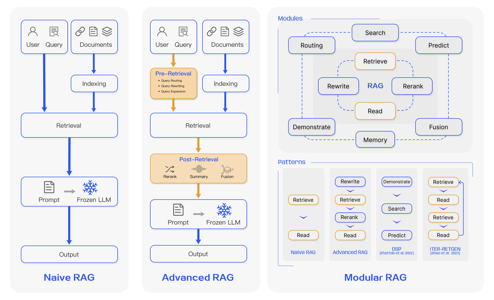

# WEEK054 - 基于 LlamaIndex 打造本地 RAG 系统

随着大模型技术的发展，基于大模型开发的应用也越来越多，比如类似 ChatGPT 的对话服务，将搜索引擎与大模型相结合的问答服务，等等。但在这些应用中，我们也面临着大量的问题，包括缺乏领域知识、无法获取实时信息以及生成虚假内容。**检索增强生成（Retrieval-Augmented Generation，简称 RAG）** 通过引入外部信息源，为这些问题提供了一种有效的缓解策略。

RAG 在生成式人工智能应用中被广泛采用，演变成了一门类似 **提示工程** 的学科，可以说它是 2023 年最受欢迎的基于大模型的开发架构。它的流行甚至推动了向量搜索领域的炒作，像 [Chroma](https://www.trychroma.com/)、[Weavaite](https://weaviate.io/) 和 [Pinecone](https://www.pinecone.io/) 这样的向量数据库初创公司都因此火了一把。

RAG 之所以如此流行，原因有几个：

1. 它利用了大模型的上下文学习的能力（In-Context Learning，ICL），增强了上下文理解，有助于减少幻觉；
2. 它提供了一种非梯度方法（Non-Gradient Approach，所谓梯度方法就是微调或训练等方法），允许自定义 Prompt 而无需对模型进行微调，这种方法也能更好地适应不同的模型；
3. 它提供了很好的可观察性和可检查性，可以对用户输入、检索的上下文和模型生成的回复进行比对，而微调过程是不透明的；
4. 它更容易维护，对知识库持续更新的过程比较简单，而不需要专业人员；

我们在之前的笔记中已经学习过不少和 RAG 相关的内容，比如在 [week042-doc-qa-using-embedding](../week042-doc-qa-using-embedding/README.md) 这篇笔记中，我们学习了如何打造一个针对本地文档的问答系统，在 [week047-structured-data-qa](../week047-structured-data-qa/README.md) 这篇笔记中，我们继续探索了如何针对结构化的数据进行问答。不过这些内容都比较简单，只是对 RAG 原理的入门级讲解，在这篇笔记中我们将学习 RAG 的高级技巧，并使用 LlamaIndex 对各个技巧一一进行实战。

## RAG 概述

RAG 的本质是搜索 + LLM 提示（Search + LLM prompting），根据用户的问题，通过一定的搜索算法找到相关的信息，将其注入到大模型的提示中，然后令大模型基于上下文来回答用户的问题。其工作流程如下图所示：

在这里，用户向大模型提出了一个近期新闻相关的问题，由于大模型依赖于预训练数据，无法提供最新的信息。RAG 通过从外部数据库中获取和整合知识来弥补这一信息差，它收集与用户查询相关的新闻文章，这些文章与原始问题结合起来，形成一个全面的提示，使大模型能够生成一个见解丰富的答案。

图中展示了 RAG 框架的四个基本组成部分：

* **输入（Input）**：即用户输入的问题，如果不使用 RAG，问题直接由大模型回答；
* **索引（Indexing）**：系统首先将相关的文档切分成段落，计算每个段落的 Embedding 向量并保存到向量库中；在进行查询时，用户问题也会以相似的方式计算 Embedding 向量；
* **检索（Retrieval）**：从向量库中找到和用户问题最相关的段落；
* **生成（Generation）**：将找到的文档段落与原始问题合并，作为大模型的上下文，令大模型生成回复，从而回答用户的问题；

### RAG 范式的演变和发展

RAG 近年来发展迅速，随着对 RAG 的研究不断深入，各种 RAG 技术被开发出来。Yunfan Gao 等人在 [Retrieval-Augmented Generation for Large Language Models: A Survey](https://arxiv.org/abs/2312.10997) 这篇论文中详细考察了 RAG 范式的演变和发展，将其分成三个阶段：朴素 RAG、高级 RAG 和模块化 RAG：

其中朴素 RAG 最早出现，在 ChatGPT 爆火后不久就开始受到关注，它包括索引、检索和生成三部分，参考上一节所介绍的基本流程。朴素 RAG 简单易懂，但是也面临着不少问题：

* 首先，在检索阶段，精确性和召回率往往是一个难题，既要避免选择无关片段，又要避免错过关键信息；
* 其次，如何将检索到的信息整合在一起也是一个挑战，面对复杂问题，单个检索可能不足以获取足够的上下文信息；对检索的结果，我们要确定段落的重要性和相关性，对段落进行排序，并对冗余段落进行处理；
* 最后，在生成回复时，模型可能会面临幻觉问题，即产生与检索到的上下文不符的内容；此外，模型可能会过度依赖上下文信息，导致只生成检索到的内容，而缺乏自己的见解；同时我们又要尽量避免模型输出不相关、有毒或有偏见的信息。

为了解决朴素 RAG 遗留的问题，高级 RAG 引入了一些改进措施，增加了 **预检索过程（Pre-Retrieval Process）** 和 **后检索过程（Post-Retrieval Process）** 两个阶段，提高检索质量：

* 在预检索过程这个阶段，主要关注的是 **索引优化（index optimization）** 和 **查询优化（query optimization）**；索引优化的目标是提高被索引内容的质量，常见的方法有：*提高数据粒度（enhancing data granularity）*、*优化索引结构（optimizing index structures）*、*添加元数据（adding metadata）*、*对齐优化（alignment optimization）* 和 *混合检索（mixed retrieval）*；而查询优化的目标是使用户的原始问题更清晰、更适合检索任务，常见的方法有：*查询重写（query rewriting）*、*查询转换（query transformation）*、*查询扩展（query expansion）* 等技术；
* 后检索过程关注的是，如何将检索到的上下文有效地与查询整合起来。直接将所有相关文档输入大模型可能会导致信息过载，使关键细节与无关内容混淆，为了减轻这种情况，后检索过程引入的方法包括：*重新排序块（rerank chunks）* 和 *上下文压缩（context compressing）* 等；

可以看出，尽管高级 RAG 在检索前和检索后提出了多种优化策略，但是它仍然遵循着和朴素 RAG 一样的链式结构，架构的灵活性仍然收到限制。模块化 RAG 的架构超越了前两种 RAG 范式，增强了其适应性和功能性，可以灵活地引入特定功能模块或替换现有模块，整个过程不仅限于顺序检索和生成，还包括迭代和自适应检索等方法。

关于这些 RAG 技术的细节，推荐研读 Yunfan Gao 等人的 [论文](https://arxiv.org/abs/2312.10997)，写的非常详细。

## RAG 技巧

* [从 RAG 到 Self-RAG —— LLM 的知识增强](https://zhuanlan.zhihu.com/p/661465330)
* [Self-Reflective RAG with LangGraph](https://blog.langchain.dev/agentic-rag-with-langgraph/)
* [Query Transformations](https://blog.langchain.dev/query-transformations/)

## LlamaIndex 实战

https://docs.llamaindex.ai/en/stable/

* [LLM 之 RAG 理论](https://mp.weixin.qq.com/mp/appmsgalbum?__biz=Mzg3NDIyMzI0Mw==&action=getalbum&album_id=3377843493502664707)
* [LLM 之 RAG 实战](https://mp.weixin.qq.com/mp/appmsgalbum?__biz=Mzg3NDIyMzI0Mw==&action=getalbum&album_id=3377833073308024836)

## 参考

* [Retrieval-Augmented Generation for Large Language Models: A Survey](https://arxiv.org/abs/2312.10997)
* [Advanced RAG Techniques: an Illustrated Overview](https://pub.towardsai.net/advanced-rag-techniques-an-illustrated-overview-04d193d8fec6)
* [Challenges In Adopting Retrieval-Augmented Generation Solutions](https://cobusgreyling.medium.com/challenges-in-adopting-retrieval-augmented-generation-solutions-eb30c07db398)
* [Deconstructing RAG](https://blog.langchain.dev/deconstructing-rag/)
* [Chatting With Your Data Ultimate Guide](https://medium.com/aimonks/chatting-with-your-data-ultimate-guide-a4e909591436)
* [Chat With Your Data Ultimate Guide | Part 2](https://medium.com/aimonks/chat-with-your-data-ultimate-guide-part-2-f72ab6dfa147)

## 更多

### 多模态 RAG

* [Multi-modal RAG on slide decks](https://blog.langchain.dev/multi-modal-rag-template/)
