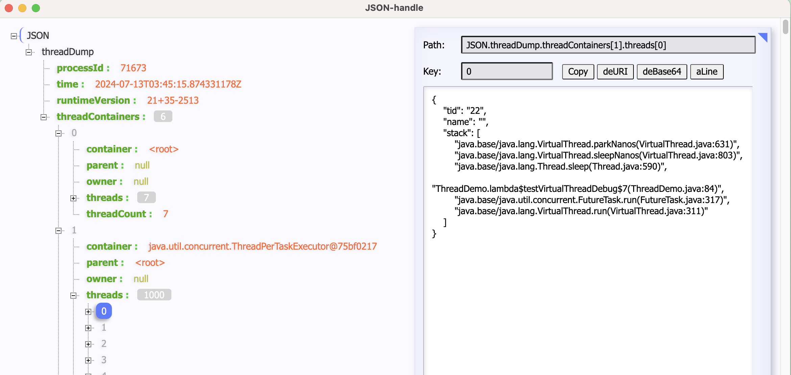

# WEEK055 - Java 21 初体验（二）

在 [上一篇笔记](../week050-java-21-notes/README.md) 中，我们学习了 Java 21 中前 5 个重要特性：

* 430: [String Templates (Preview)](https://openjdk.org/jeps/430)
* 431: [Sequenced Collections](https://openjdk.org/jeps/431)
* 439: [Generational ZGC](https://openjdk.org/jeps/439)
* 440: [Record Patterns](https://openjdk.org/jeps/440)
* 441: [Pattern Matching for `switch`](https://openjdk.org/jeps/441)

接下来，我们将继续学习后面的 5 个特性：

* 442: [Foreign Function & Memory API (Third Preview)](https://openjdk.org/jeps/442)
* 443: [Unnamed Patterns and Variables (Preview)](https://openjdk.org/jeps/443)
* 444: [Virtual Threads](https://openjdk.org/jeps/444)
* 445: [Unnamed Classes and Instance Main Methods (Preview)](https://openjdk.org/jeps/445)
* 446: [Scoped Values (Preview)](https://openjdk.org/jeps/446)

## 外部函数和内存 API（第三次预览版本）

**外部函数和内存 API（Foreign Function & Memory API，简称 FFM API）** 是 Java 17 中首次引入的一个重要特性，经过了 [JEP 412](https://openjdk.org/jeps/412) 和 [JEP 419](https://openjdk.org/jeps/419) 两个孵化版本，以及 [JEP 424](https://openjdk.org/jeps/424)  和 [JEP 434](https://openjdk.org/jeps/434) 两个预览版本，在 Java 21 中，这已经是第三个预览版本了。

> 在 [Java 22](https://openjdk.org/projects/jdk/22/) 中，这个特性终于退出了预览版本。

近年来，随着人工智能、数据科学、图像处理等领域的发展，我们在越来越多的场景下接触到原生代码：

* Off-CPU Computing (CUDA, OpenCL)
* Deep Learning (Blas, cuBlas, cuDNN, Tensorflow)
* Graphics Processing (OpenGL, Vulkan, DirectX)
* Others (CRIU, fuse, io_uring, OpenSSL, V8, ucx, ...)

这些代码不太可能用 Java 重写，也没有必要，Java 急需一种能与本地库进行交互的方案，这就是 FFM API 诞生的背景。FFM API 最初作为 [Panama 项目](https://openjdk.org/projects/panama/) 中的核心组件，旨在改善 Java 与本地代码的互操作性。FFM API 是 Java 现代化进程中的一个重要里程碑，标志着 Java 在与本地代码互操作性方面迈出了重要一步，它的引入也为 Java 在人工智能、数据科学等领域的应用提供了更多的可能性，有望加速 Java 在这些领域的发展和应用。

FFM API 由两大部分组成：**外部函数接口（Foreign Function Interface，简称 FFI）** 和 **内存 API（Memory API）**，FFI 用于实现 Java 代码和外部代码之间的相互操作，而 Memory API 则用于安全地管理堆外内存。

### 使用 JNI 调用外部函数

在引入外部函数之前，如果想要实现 Java 调用外部函数库，我们需要借助 **JNI (Java Native Interface)** 来实现。下面的代码是一个使用 JNI 调用外部函数的例子：

```
public class JNIDemo {
    static {
        System.loadLibrary("JNIDemo");
    }

    public static void main(String[] args) {
        new JNIDemo().sayHello();
    }

    private native void sayHello();
}
```

其中 `sayHello` 函数使用了 `native` 修饰符，表明这是一个本地方法，该方法的实现不在 Java 代码中。这个本地方法可以使用 C 语言来实现，我们首先需要生成这个本地方法对应的 C 语言头文件：

```
$ javac -h . JNIDemo.java
```

`javac` 命令不仅可以将 `.java` 文件编译成 `.class` 字节码文件，而且还可以生成本地方法的头文件，参数 `-h .` 表示将头文件生成到当前目录。这个命令执行成功后，当前目录应该会生成 `JNIDemo.class` 和 `JNIDemo.h` 两个文件，`JNIDemo.h` 文件内容如下：

```
/* DO NOT EDIT THIS FILE - it is machine generated */
#include <jni.h>
/* Header for class JNIDemo */

#ifndef _Included_JNIDemo
#define _Included_JNIDemo
#ifdef __cplusplus
extern "C" {
#endif
/*
 * Class:     JNIDemo
 * Method:    sayHello
 * Signature: ()V
 */
JNIEXPORT void JNICALL Java_JNIDemo_sayHello
  (JNIEnv *, jobject);

#ifdef __cplusplus
}
#endif
#endif
```

正如我们所看到的，在这个头文件中定义了一个名为 `Java_JNIDemo_sayHello` 的函数，这个名称是根据包名、类名和方法名自动生成的。有了这个自动生成的头文件，我们就可以在 C 语言里实现这个这个方法了，于是接着创建一个 `JNIDemo.c` 文件，编写代码：

```
#include "jni.h"
#include "JNIDemo.h"
#include <stdio.h>

JNIEXPORT void JNICALL Java_JNIDemo_sayHello(JNIEnv *env, jobject jobj) {
    printf("Hello World!\n");
}
```

这段代码很简单，直接调用标准库中的 `printf` 输出 `Hello World！`。

然后使用 gcc 将这个 C 文件编译成动态链接库：

```
$ gcc -I${JAVA_HOME}/include -I${JAVA_HOME}/include/darwin -dynamiclib JNIDemo.c -o libJNIDemo.dylib
```

这个命令会在当前目录下生成一个名为 `libJNIDemo.dylib` 的动态链接库文件，这个库文件正是我们在 Java 代码中通过 `System.loadLibrary("JNIDemo")` 加载的库文件。

> 注意这里我用的是 Mac 操作系统，动态链接库的名称必须以 `lib` 为前缀，以 `.dylib` 为扩展名，其他操作系统的命令略有区别。
>
> Linux 系统：
> ```
> $ gcc -I${JAVA_HOME}/include -I${JAVA_HOME}/include/linux -shared JNIDemo.c -o libJNIDemo.so
> ```
>
> Windows 系统：
> ```
> $ gcc -I${JAVA_HOME}/include -I${JAVA_HOME}/include/win32 -shared JNIDemo.c -o JNIDemo.dll
> ```

至此，我们就可以运行这个 Hello World 的本地实现了：

```
$ java -cp . -Djava.library.path=. JNIDemo
```

以上步骤演示了如何使用 JNI 调用外部函数，这只是 JNI 的一个简单示例，更多 JNI 的高级功能，比如实现带参数的函数，在 C 代码中访问 Java 对象或方法等，可以参考 [Baeldung 的这篇教程](https://www.baeldung.com/jni)。

### 外部函数接口（Foreign Function Interface）

从上面的过程可以看出，JNI 的使用非常繁琐，一个简单的 Hello World 都要费好大劲：首先要在 Java 代码中定义 `native` 方法，然后从 Java 代码派生 C 头文件，最后还要使用 C 语言对其进行实现。Java 开发人员必须跨多个工具链工作，当本地库快速演变时，这个工作就会变得尤为枯燥乏味。

除此之外，JNI 还有几个更为严重的问题：

* Java 语言最大的特性是跨平台，所谓 **一次编译，到处运行**，但是使用本地接口需要涉及 C 语言的编译和链接，这是平台相关的，所以丧失了 Java 语言的跨平台特性；
* JNI 桩代码非常难以编写和维护，首先，JNI 在类型处理上很糟糕，由于 Java 和 C 的类型系统不一致，比如聚合数据在 Java 中用对象表示，而在 C 中用结构体表示，因此，任何传递给 native 方法的 Java 对象都必须由本地代码费力地解包；另外，假设某个本地库包含 1000 个函数，那么意味着我们要生成 1000 个对应的 JNI 桩代码，这么大量的 JNI 桩代码非常难以维护；
* 由于本地代码不受 JVM 的安全机制管理，所以 JNI 本质上是不安全的，它在使用上非常危险和脆弱，JNI 错误可能导致 JVM 的崩溃；
* JNI 的性能也不行，一方面是由于 JNI 方法调用不能从 JIT 优化中受益，另一方面是由于通过 JNI 传递 Java 对象很慢；这就导致开发人员更愿意使用 Unsafe API 来分配堆外内存，并将其地址传递给 native 方法，这使得 Java 代码非常不安全！

多年来，已经出现了许多框架来解决 JNI 遗留下来的问题，包括 [JNA](https://github.com/java-native-access/jna)、[JNR](https://github.com/jnr/jnr-ffi) 和 [JavaCPP](https://github.com/bytedeco/javacpp)。这些框架通常比 JNI 有显著改进，但情况仍然不尽理想，尤其是与提供一流本地互操作性的语言相比。例如，Python 的 `ctypes` 包可以动态地包装本地库中的函数，而无需任何胶水代码，Rust 则提供了从 C/C++ 头文件自动生成本地包装器的工具。

FFI 综合参考了其他语言的实现，试图更加优雅地解决这些问题，它实现了对外部函数库的原生接口，提供了一种更高效更安全的方式来访问本地内存和函数，从而取代了传统的 JNI。

下面的代码是使用 FFI 实现和上面相同的 Hello World 的例子：

```
public class FFIDemo {
    public static void main(String[] args) throws Throwable {
        Linker linker = Linker.nativeLinker();
        SymbolLookup symbolLookup = linker.defaultLookup();
        MethodHandle printf = linker.downcallHandle(
            symbolLookup.find("printf").orElseThrow(), 
            FunctionDescriptor.of(ValueLayout.JAVA_LONG, ValueLayout.ADDRESS)
        );
        try (Arena arena = Arena.ofConfined()) {
            MemorySegment hello = arena.allocateUtf8String("Hello World!\n");
            printf.invoke(hello);
        }
    }
}
```

> 注意，Java 22 中取消了 `Arena::allocateUtf8String()` 方法，改成了 `Arena::allocateFrom()` 方法。

相比于 JNI 的实现，FFI 的代码要简洁优雅得多。这里的代码涉及三个 FFI 中的重要接口：

* `Linker`
* `SymbolLookup`
* `FunctionDescriptor`

其中 `SymbolLookup` 用于从已加载的本地库中查找外部函数的地址，`Linker` 用于链接 Java 代码与外部函数，它同时支持下行调用（从 Java 代码调用本地代码）和上行调用（从本地代码返回到 Java 代码），`FunctionDescriptor` 用于描述外部函数的返回类型和参数类型，这些类型在 FFM API 中可以由 `MemoryLayout` 对象描述，例如 `ValueLayout` 表示值类型，`GroupLayout` 表示结构类型。

通过 FFI 提供的接口，我们可以生成对应外部函数的方法句柄（`MethodHandle`），方法句柄是 Java 7 引入的一个抽象概念，可以实现对方法的动态调用，它提供了比反射更高的性能和更灵活的使用方式，这里复用了方法句柄的概念，通过方法句柄的 `invoke()` 方法就可以实现外部函数的调用。

这里我们不再需要编写 C 代码，也不再需要编译链接生成动态库，所以，也就不存在平台相关的问题了。另一方面，FFI 接口的设计大多数情况下是安全的，由于都是 Java 代码，因此也受到 Java 安全机制的约束，虽然也有一部分接口是不安全的，但是比 JNI 来说要好多了。

> OpenJDK 还提供了一个 [jextract](https://github.com/openjdk/jextract) 工具，用于从本地库自动生成 Java 代码，有兴趣的同学可以尝试一下。

### 使用 `ByteBuffer` 和 `Unsafe` 访问堆外内存

上面说过，FFM API 的另一个主要部分是 **内存 API（Memory API）**，用于安全地管理堆外内存。其实在 `FFIDemo` 的示例中我们已经见到内存 API 了，其中 `printf` 打印的 `Hello World!\n` 字符串，就是通过 `Arena` 这个内存 API 分配的。

但是在学习内存 API 之前，我们先来复习下 Java 在之前的版本中是如何处理堆外内存的。

内存的使用往往和程序性能挂钩，很多像 TensorFlow、Ignite、Netty 这样的类库，都对性能有很高的要求，为了避免垃圾收集器不可预测的行为以及额外的性能开销，这些类库一般倾向于使用 JVM 之外的内存来存储和管理数据，这就是我们常说的 **堆外内存（off-heap memory）**。

使用堆外内存有两个明显的好处：

* 使用堆外内存，也就意味着堆内内存较小，从而可以减少垃圾回收次数，以及垃圾回收停顿对于应用的影响；
* 在 I/O 通信过程中，通常会存在堆内内存和堆外内存之间的数据拷贝操作，频繁的内存拷贝是性能的主要障碍之一，为了极致的性能，一份数据应该只占一份内存空间，这就是所谓的 **零拷贝**，直接使用堆外内存可以提升程序 I/O 操作的性能。

`ByteBuffer` 是访问堆外内存最常用的方法：

```
private static void testDirect() {
    ByteBuffer bb = ByteBuffer.allocateDirect(10);
    bb.putInt(0);
    bb.putInt(1);
    bb.put((byte)0);
    bb.put((byte)1);

    bb.flip();

    System.out.println(bb.getInt());
    System.out.println(bb.getInt());
    System.out.println(bb.get());
    System.out.println(bb.get());
}
```

上面的代码使用 `ByteBuffer.allocateDirect(10)` 分配了 10 个字节的直接内存，然后通过 `put` 写内存，通过 `get` 读内存。

可以注意到这里的 `int` 是 4 个字节，`byte` 是 1 个字节，当写完 2 个 `int` 和 2 个 `byte` 后，如果再继续写，就会报 `java.nio.BufferOverflowException` 异常。

另外还有一点值得注意，我们并没有手动释放内存。虽然这个内存是直接从操作系统分配的，不受 JVM 的控制，但是创建 `DirectByteBuffer` 对象的同时也会创建一个 `Cleaner` 对象，它用于跟踪对象的垃圾回收，当 `DirectByteBuffer` 被垃圾回收时，分配的堆外内存也会一起被释放，所以我们不用手动释放内存。

`ByteBuffer` 是异步编程和非阻塞编程的核心类，从 `java.nio.ByteBuffer` 这个包名就可以看出这个类是为 NIO 而设计，可以说，几乎所有的 Java 异步模式或者非阻塞模式的代码，都要直接或者间接地使用 `ByteBuffer` 来管理数据。尽管如此，这个类仍然存在着一些无法摆脱的限制：

* 首先，它不支持手动释放内存，`ByteBuffer` 对应内存的释放，完全依赖于 JVM 的垃圾回收机制，这对于一些像 Netty 这样追求极致性能的类库来说并不满足，这些类库往往需要对内存进行精确的控制；
* 其次，`ByteBuffer` 使用了 Java 的整数来表示存储空间的大小，这就导致，它的存储空间最多只有 2G；在网络编程的环境下，这可能并不是一个问题，但是在处理超过 2G 的文件时就不行了，而且像 Memcahed 这样的分布式缓存系统，内存 2G 的限制明显是不够的。

为了突破这些限制，有些类库选择了访问堆外内存的另一条路，使用 `sun.misc.Unsafe` 类。这个类提供了一些低级别不安全的方法，可以直接访问系统内存资源，自主管理内存资源：

```
private static void testUnsafe() throws Exception {
    Field f = Unsafe.class.getDeclaredField("theUnsafe");
    f.setAccessible(true);
    Unsafe unsafe = (Unsafe) f.get(null);
    
    long address = unsafe.allocateMemory(10);
    unsafe.putInt(address, 0);
    unsafe.putInt(address+4, 1);
    unsafe.putByte(address+8, (byte)0);
    unsafe.putByte(address+9, (byte)1);
    System.out.println(unsafe.getInt(address));
    System.out.println(unsafe.getInt(address+4));
    System.out.println(unsafe.getByte(address+8));
    System.out.println(unsafe.getByte(address+9));
    unsafe.freeMemory(address);
}
```

`Unsafe` 的使用方法和 `ByteBuffer` 很像，我们使用 `unsafe.allocateMemory(10)` 分配了 10 个字节的直接内存，然后通过 `put` 写内存，通过 `get` 读内存，区别在于我们要手动调整内存地址。

使用 `Unsafe` 操作内存就像是使用 C 语言中的指针一样，效率虽然提高了不少，但是很显然，它增加了 Java 语言的不安全性，因为它实际上可以访问到任意位置的内存，不正确使用 `Unsafe` 类会使得程序出错的概率变大。

>注意，默认情况下，我们无法直接使用 `Unsafe` 类，直接使用的话会报下面这样的 `SecurityException` 异常：
>
>```
>Exception in thread "main" java.lang.SecurityException: Unsafe
>        at jdk.unsupported/sun.misc.Unsafe.getUnsafe(Unsafe.java:99)
>        at ByteBufferDemo.testUnsafe(ByteBufferDemo.java:33)
>        at ByteBufferDemo.main(ByteBufferDemo.java:10)
>```
>
>所以上面的代码通过反射的手段，使得我们可以使用 `Unsafe`。

说了这么多，总结一句话就是：`ByteBuffer` 安全但效率低，`Unsafe` 效率高但是不安全。此时，就轮到 **内存 API** 出场了。

### 内存 API（Memory API）

内存 API 基于前人的经验，使用了全新的接口设计，它的基本使用如下：

```
private static void testAllocate() {
    try (Arena offHeap = Arena.ofConfined()) {
        MemorySegment address = offHeap.allocate(8);
        address.setAtIndex(ValueLayout.JAVA_INT, 0, 1);
        address.setAtIndex(ValueLayout.JAVA_INT, 1, 0);
        System.out.println(address.getAtIndex(ValueLayout.JAVA_INT, 0));
        System.out.println(address.getAtIndex(ValueLayout.JAVA_INT, 1));
    }
}
```

这段代码使用 `Arena::allocate()` 分配了 8 个字节的外部内存，然后写入两个整型数字，最后再读取出来。下面是另一个示例，写入再读取字符串：

```
private static void testAllocateString() {
    try (Arena offHeap = Arena.ofConfined()) {
        MemorySegment str = offHeap.allocateUtf8String("hello");
        System.out.println(str.getUtf8String(0));
    }
}
```

这段代码使用 `Arena::allocateUtf8String()` 根据字符串的长度动态地分配外部内存，然后通过 `MemorySegment::getUtf8String()` 将其复制到 JVM 栈上并输出。

> 注意，Java 22 中取消了 `Arena::allocateUtf8String()` 和 `MemorySegment::getUtf8String()` 方法，改成了 `Arena::allocateFrom()` 和 `MemorySegment::getString()` 方法。

这两段代码中的 `Arena` 和 `MemorySegment` 是内存 API 的关键，`MemorySegment` 用于表示一段内存片段，既可以是堆内内存也可以是堆外内存；`Arena` 定义了内存资源的生命周期管理机制，它实现了 `AutoCloseable` 接口，所以可以使用 `try-with-resource` 语句及时地释放它管理的内存。

`Arena.ofConfined()` 表示定义一块受限区域，只有一个线程可以访问在受限区域中分配的内存段。除此之外，我们还可以定义其他类型的区域：

* `Arena.global()` - 全局区域，分配的区域永远不会释放，随时可以访问；
* `Arena.ofAuto()` - 自动区域，由垃圾收集器自动检测并释放；
* `Arena.ofShared()` - 共享区域，可以被多个线程同时访问；

`Arena` 接口的设计经过了多次调整，在最初的版本中被称为 `ResourceScope`，后来改成 `MemorySession`，再后来又拆成了 `Arena` 和 `SegmentScope` 两个类，现在基本上稳定使用 `Arena` 就可以了。

除 `Arena` 接口，内存 API 还包括了下面这些接口，主要可以分为两大类：

* `Arena`、`MemorySegment`、`SegmentAllocator` - 这几个接口用于控制外部内存的分配和释放
* `MemoryLayout`、`VarHandle` - 这几个接口用于操作和访问结构化的外部内存

内存 API 试图简化 Java 代码操作堆外内存的难度，通过它可以实现更高效的内存访问方式，同时可以保障一定的安全性，特别适用于下面这些场景：

* 大规模数据处理：在处理大规模数据集时，内存 API 的直接内存访问能力将显著提高程序的执行效率；
* 高性能计算：对于需要频繁进行数值计算的任务，内存 API 可以减少对象访问的开销，从而实现更高的计算性能；
* 与本地代码交互：内存 API 的使用可以使得 Java 代码更方便地与本地代码进行交互，结合外部函数接口，可以实现更灵活的数据传输和处理。

相信等内存 API 正式发布之后，之前使用 `ByteBuffer` 或 `Unsafe` 的很多类库估计都会考虑切换成使用内存 API 来获取性能的提升。

## 未命名模式和变量（预览版本）

未命名模式和变量也是一个预览特性，其主要目的是为了提高代码的可读性和可维护性。

在 Java 代码中，我们偶尔会遇到一些不需要使用的变量，比如下面这个例子中的异常 `e`：

```
try { 
    int i = Integer.parseInt(s);
    System.out.println("Good number: " + i);
} catch (NumberFormatException e) { 
    System.out.println("Bad number: " + s);
}
```

这时我们就可以使用这个特性，使用下划线 `_` 来表示不需要使用的变量：

```
try { 
    int i = Integer.parseInt(s);
    System.out.println("Good number: " + i);
} catch (NumberFormatException _) { 
    System.out.println("Bad number: " + s);
}
```

上面这个这被称为 **未命名变量（Unnamed Variables）**。

顾名思义，未命名模式和变量包含两个方面：**未命名模式（Unnamed Patterns）** 和 **未命名变量（Unnamed Variables）**。

### 未命名模式（Unnamed Patterns）

在 [上一篇笔记](../week050-java-21-notes/README.md) 中，我们学习了什么是 **记录模式（Record Pattern）** 以及 `instanceof` 和 `switch` 两种模式匹配。未命名模式允许在模式匹配中省略掉记录组件的类型和名称。下面的代码展示了如何在 `instanceof` 模式匹配中使用未命名模式这个特性：

```
if (obj instanceof Person(String name, _)) {
    System.out.println("Name: " + name);
}
```

其中 Person 记录的第二个参数 `Integer age` 在后续的代码中没用到，于是用下划线 `_` 把类型和名称都代替掉。我们也可以只代替 `age` 名称，这被称为 **未命名模式变量（Unnamed Pattern Variables）**：

```
if (obj instanceof Person(String name, Integer _)) {
    System.out.println("Name: " + name);
}
```

这个特性也可以在 `switch` 模式匹配中使用：

```
switch (b) {
    case Box(RedBall _), Box(BlueBall _) -> processBox(b);
    case Box(GreenBall _)                -> stopProcessing();
    case Box(_)                          -> pickAnotherBox();
}
```

这里前两个 `case` 是未命名模式变量，最后一个 `case` 是未命名模式。

### 未命名变量（Unnamed Variables）

未命名变量的使用场景更加丰富，除了上面在 `catch` 子句中使用的例子外，下面列举了一些其他的典型场景。

在 `for` 循环中使用：

```
int acc = 0;
for (Order _ : orders) {
    if (acc < LIMIT) { 
        ... acc++ ...
    }
}
```

在赋值语句中使用：

```
Queue<Integer> q = ... // x1, y1, z1, x2, y2, z2, ...
while (q.size() >= 3) {
   var x = q.remove();
   var y = q.remove();
   var _ = q.remove();
   ... new Point(x, y) ...
}
```

在 `try-with-resource` 语句中使用：

```
try (var _ = ScopedContext.acquire()) {
  // No use of acquired resource
}
```

在 lambda 表达式中使用：

```
stream.collect(
    Collectors.toMap(String::toUpperCase, _ -> "NODATA")
)
```

## 虚拟线程

**虚拟线程（Virtual Thread）** 是 Java 21 中最突出的特性之一，作为 [Loom](https://wiki.openjdk.org/display/loom) 项目的一部分，开发人员对这个特性可谓期待已久。它由预览特性变成正式特性经历了两个版本的迭代，第一次预览是 Java 19 的 [JEP 425](https://openjdk.org/jeps/425) ，第二次预览是 Java 20 的 [JEP 436](https://openjdk.org/jeps/436)，在 Java 21 中虚拟线程特性正式发布。 

### 虚拟线程 vs. 平台线程

在引入虚拟线程之前，我们常使用 `java.lang.Thread` 来创建 Java 线程，这个线程被称为 **平台线程（Platform Thread）**，它和操作系统的内核线程是一对一的关系，由内核线程调度器负责调度。


为了提高应用程序的性能和系统的吞吐量，我们将添加越来越多的 Java 线程，下面是一个模拟多线程的例子，我们创建 10 万个线程，每个线程模拟 I/O 操作等待 1 秒钟：

```
private static void testThread() {
    long l = System.currentTimeMillis();
    try(var executor = Executors.newCachedThreadPool()) {
        IntStream.range(0, 100000).forEach(i -> {
            executor.submit(() -> {
                Thread.sleep(Duration.ofSeconds(1));
                // System.out.println(i);
                return i;
            });
        });
    }
    System.out.printf("elapsed time：%d ms", System.currentTimeMillis() - l);
}
```

这里的 10 万个线程对应着 10 万个内核线程，这种通过大量的线程来提高系统性能是不现实的，因为内核线程成本高昂，不仅会占用大量资源来处理上下文切换，而且可用数量也很受限，一个线程大约消耗 1M~2M 的内存，当系统资源不足时就会报错：

```
$ java ThreadDemo.java
Exception in thread "pool-2-thread-427" java.lang.OutOfMemoryError: Java heap space
        at java.base/java.util.concurrent.SynchronousQueue$TransferStack.snode(SynchronousQueue.java:328)
        at java.base/java.util.concurrent.SynchronousQueue$TransferStack.transfer(SynchronousQueue.java:371)
        at java.base/java.util.concurrent.SynchronousQueue.poll(SynchronousQueue.java:903)
        at java.base/java.util.concurrent.ThreadPoolExecutor.getTask(ThreadPoolExecutor.java:1069)
        at java.base/java.util.concurrent.ThreadPoolExecutor.runWorker(ThreadPoolExecutor.java:1130)
        at java.base/java.util.concurrent.ThreadPoolExecutor$Worker.run(ThreadPoolExecutor.java:642)
        at java.base/java.lang.Thread.runWith(Thread.java:1596)
        at java.base/java.lang.Thread.run(Thread.java:1583)
```

于是人们又发明了各种线程池技术，最大程度地提高线程的复用性。下面我们使用一个固定大小为 200 的线程池来解决线程过多时报错的问题：

```
private static void testThreadPool() {
    long l = System.currentTimeMillis();
    try(var executor = Executors.newFixedThreadPool(200)) {
        IntStream.range(0, 100000).forEach(i -> {
            executor.submit(() -> {
                Thread.sleep(Duration.ofSeconds(1));
                // System.out.println(i);
                return i;
            });
        });
    }
    System.out.printf("elapsed time：%d ms", System.currentTimeMillis() - l);
}
```

在使用固定大小的线程池后，不会出现创建大量线程导致报错的问题，任务可以正常完成。但是这里的线程池却成了我们应用程序最大的性能瓶颈，程序运行花费了 50 秒的时间：

```
$ java ThreadDemo.java
elapsed time：50863 ms
```

按理说每个线程耗时 1 秒，无论是多少个线程并发，总耗时应该都是 1 秒，很显然这里并没有发挥出硬件应有的性能。

为了充分利用硬件，研究人员转而采用线程共享的方式，它的核心想法是这样的：我们并不需要在一个线程上从头到尾地处理一个请求，当执行到等待 I/O 操作时，可以将这个请求缓存到池中，以便线程可以处理其他请求，当 I/O 操作结束后会收到一个回调通知，再将请求从池中取出继续处理。这种细粒度的线程共享允许在高并发操作时不消耗大量线程，从而消除内核线程稀缺而导致的性能瓶颈。

这种方式使用了一种被称为 **异步编程（Asynchronous Programming）** 的风格，通过所谓的 **响应式框架（Reactive Frameworks）** 来实现，比如著名的 [Reactor](https://projectreactor.io/) 项目一直致力于通过响应式编程来提高 Java 性能。但是这种风格的代码难以理解、难以调试、难以使用，普通开发人员只能对其敬而远之，只有高阶开发人员才能玩得转，所以并没有得到普及。

所以 Java 一直在寻找一种既能有异步编程的性能，又能编写起来简单的方案，最终虚拟线程诞生。

虚拟线程由 [Loom](https://wiki.openjdk.org/display/loom) 项目提出，最初被称为 **纤程（Fibers）**，类似于 **协程（Coroutine）** 的概念，它由 JVM 而不是操作系统进行调度，可以让大量的虚拟线程在较少数量的平台线程上运行。我们将上面的代码改成虚拟线程非常简单，只需要将 `Executors.newFixedThreadPool(200)` 改成 `Executors.newVirtualThreadPerTaskExecutor()` 即可：

```
private static void testVirtualThread() {
    long l = System.currentTimeMillis();
    try(var executor = Executors.newVirtualThreadPerTaskExecutor()) {
        IntStream.range(0, 100000).forEach(i -> {
            executor.submit(() -> {
                Thread.sleep(Duration.ofSeconds(1));
                // System.out.println(i);
                return i;
            });
        });
    }
    System.out.printf("elapsed time：%d ms", System.currentTimeMillis() - l);
}
```

运行结果显示，虚拟线程使得程序的性能得到了非常显著的提升，10 万个线程全部运行只花费 1 秒多的时间：

```
$ java ThreadDemo.java
elapsed time：1592 ms
```

虚拟线程的数量可以远大于平台线程的数量，多个虚拟线程将由 JVM 调度在某个平台线程上执行，一个平台线程可以在不同的时间执行不同的虚拟线程，当虚拟线程被阻塞或等待时，平台线程可以切换到另一个虚拟线程执行。

虚拟线程、平台线程和系统内核线程的关系图如下所示：


值得注意的是，虚拟线程适用于 I/O 密集型任务，不适用于计算密集型任务，因为计算密集型任务始终需要 CPU 资源作为支持。如果测试程序中的任务不是等待 1 秒钟，而是执行一秒钟的计算（比如对一个巨大的数组进行排序），那么程序不会有明显的性能提升。因为虚拟线程不是更快的线程，它们运行代码的速度与平台线程相比并无优势。虚拟线程的存在是为了提供更高的吞吐量，而不是速度（更低的延迟）。

### 创建虚拟线程

为了降低虚拟线程的使用门槛，官方尽力复用原有的 `java.lang.Thread` 线程类，让我们的代码可以平滑地过渡到虚拟线程的使用。下面列举几种创建虚拟线程的方式：

1. 通过 `Thread.startVirtualThread()` 创建

```
Thread.startVirtualThread(() -> {
    System.out.println("Hello");
});
```

2. 使用 `Thread.ofVirtual()` 创建

```
Thread.ofVirtual().start(() -> {
    System.out.println("Hello");
});
```

上面的代码通过 `start()` 直接启动虚拟线程，也可以通过 `unstarted()` 创建一个未启动的虚拟线程，再在合适的时机启动：

```
Thread thread = Thread.ofVirtual().unstarted(() -> {
    System.out.println("Hello");
});
thread.start();
```

> 和 `Thread.ofVirtual()` 对应的是 `Thread.ofPlatform()`，用于创建平台线程。

3. 通过 `ThreadFactory` 创建

```
ThreadFactory factory = Thread.ofVirtual().factory();
Thread thread = factory.newThread(() -> {
    System.out.println("Hello");
});
thread.start();
```

4. 通过 `Executors.newVirtualThreadPerTaskExecutor()` 创建

```
try(var executor = Executors.newVirtualThreadPerTaskExecutor()) {
    executor.submit(() -> {
        System.out.println("Hello");
    });
}
```

这种方式和传统的创建线程池非常相似，只需要改一行代码就可以把之前的线程池切换到虚拟线程。

很有意思的一点是，这里我们并没有指定虚拟线程的数量，这是因为虚拟线程非常廉价非常轻量，使用后立即就被销毁了，所以根本不需要被重用或池化。

正是由于虚拟线程非常轻量，我们可以在单个平台线程中创建成百上千个虚拟线程，它们通过暂停和恢复来实现线程之间的切换，避免了上下文切换的额外耗费，兼顾了多线程的优点，简化了高并发程序的复杂，可以有效减少编写、维护和观察高吞吐量并发应用程序的工作量。

### 调试虚拟线程

JDK 长期以来一直提供调试、分析和监控线程的机制，这些机制对于故障排查、维护和优化是必不可少的，JDK 提供了很多工具来实现这点，这些工具现在对虚拟线程也提供了同样的支持。

比如 `jstack` 或 `jcmd` 是流行的线程转储工具，它们可以打印出应用程序的所有线程，这种扁平的列表结构对于几十或几百个平台线程来说还可以，但对于成千上万的虚拟线程来说已经不适合了，于是在 `jcmd` 中引入了一种新的线程转储方式，以 JSON 格式将虚拟线程与平台线程一起打印：

```
$ jcmd <pid> Thread.dump_to_file -format=json <file>
```

以下是这样的线程转储的示例：




## 未命名类和实例的 Main 方法（预览版本）

https://openjdk.org/jeps/445

## 作用域值（预览版本）

https://openjdk.org/jeps/446

## 参考

* [Guide to JNI (Java Native Interface)](https://www.baeldung.com/jni)
* [深入拆解 Java 虚拟机：32 JNI 的运行机制](https://learn.lianglianglee.com/%E4%B8%93%E6%A0%8F/%E6%B7%B1%E5%85%A5%E6%8B%86%E8%A7%A3Java%E8%99%9A%E6%8B%9F%E6%9C%BA/32%20%20JNI%E7%9A%84%E8%BF%90%E8%A1%8C%E6%9C%BA%E5%88%B6.md)
* [Java 9 - 21：新特性解读](https://www.didispace.com/java-features/)
* [Java 21 新特性概览](https://javaguide.cn/java/new-features/java21.html)
* [Hello, Java 21](https://spring.io/blog/2023/09/20/hello-java-21/)
* [浅析一下Java FFM API(Project Panama)](https://zhuanlan.zhihu.com/p/648108631)
* [Java21新特性教程](https://www.panziye.com/back/10563.html)
* [结构化并发 | 楚权的世界](http://chuquan.me/2023/03/11/structured-concurrency/)
* [聊一聊Java 21，虚拟线程、结构化并发和作用域值](https://cloud.tencent.com/developer/article/2355577)
* [千呼万唤始出来：Java终于发布了"协程"--虚拟线程!](https://www.yuanjava.cn/posts/virtual-thread/)
* [JNI的运行机制](https://learn.lianglianglee.com/%e4%b8%93%e6%a0%8f/%e6%b7%b1%e5%85%a5%e6%8b%86%e8%a7%a3Java%e8%99%9a%e6%8b%9f%e6%9c%ba/32%20%20JNI%e7%9a%84%e8%bf%90%e8%a1%8c%e6%9c%ba%e5%88%b6.md)
* [深入剖析Java新特性：12 外部内存接口：零拷贝的障碍还有多少？](https://learn.lianglianglee.com/%E4%B8%93%E6%A0%8F/%E6%B7%B1%E5%85%A5%E5%89%96%E6%9E%90Java%E6%96%B0%E7%89%B9%E6%80%A7/12%20%E5%A4%96%E9%83%A8%E5%86%85%E5%AD%98%E6%8E%A5%E5%8F%A3%EF%BC%9A%E9%9B%B6%E6%8B%B7%E8%B4%9D%E7%9A%84%E9%9A%9C%E7%A2%8D%E8%BF%98%E6%9C%89%E5%A4%9A%E5%B0%91%EF%BC%9F.md)
* [深入剖析Java新特性：13 外部函数接口，能不能取代Java本地接口？](https://learn.lianglianglee.com/%E4%B8%93%E6%A0%8F/%E6%B7%B1%E5%85%A5%E5%89%96%E6%9E%90Java%E6%96%B0%E7%89%B9%E6%80%A7/13%20%E5%A4%96%E9%83%A8%E5%87%BD%E6%95%B0%E6%8E%A5%E5%8F%A3%EF%BC%8C%E8%83%BD%E4%B8%8D%E8%83%BD%E5%8F%96%E4%BB%A3Java%E6%9C%AC%E5%9C%B0%E6%8E%A5%E5%8F%A3%EF%BC%9F.md)
* [Java魔法类：Unsafe应用解析](https://tech.meituan.com/2019/02/14/talk-about-java-magic-class-unsafe.html)
* [Java19 正式 GA！看虚拟线程如何大幅提高系统吞吐量](https://mp.weixin.qq.com/s/yyApBXxpXxVwttr01Hld6Q)
* [How to Use Java 19 Virtual Threads](https://medium.com/javarevisited/how-to-use-java-19-virtual-threads-c16a32bad5f7)

## 更多

### JDK Projects

* [Project Panama](https://openjdk.org/projects/panama/) - Interconnecting JVM and native code
* [Project Amber](https://openjdk.org/projects/amber/) - Explore and incubate smaller, productivity-oriented Java language features
* [Project Loom](https://wiki.openjdk.org/display/loom) - Supporting easy-to-use, high-throughput lightweight concurrency and new programming models on the Java platform.
