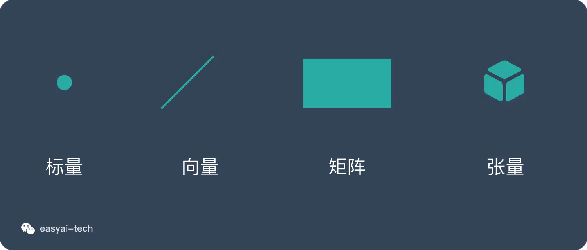
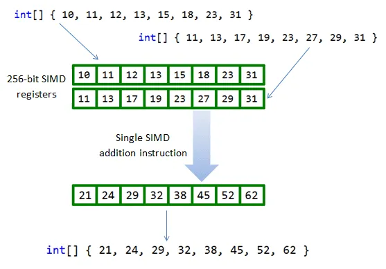
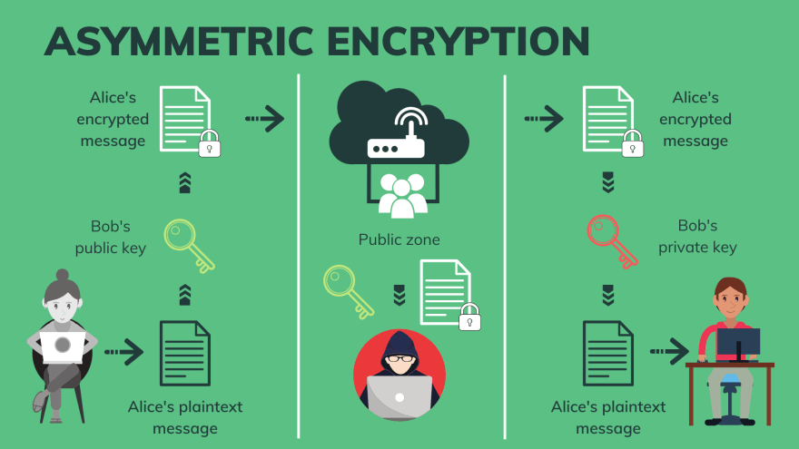
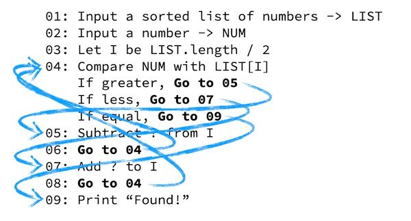
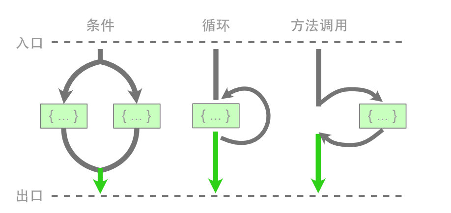

# WEEK056 - Java 21 初体验（三）

在 [上一篇笔记](../week055-java-21-notes-2/README.md) 和 [上上一篇笔记](../week050-java-21-notes/README.md) 中，我们学习了 Java 21 中前 10 个重要特性：

* 430: [String Templates (Preview)](https://openjdk.org/jeps/430)
* 431: [Sequenced Collections](https://openjdk.org/jeps/431)
* 439: [Generational ZGC](https://openjdk.org/jeps/439)
* 440: [Record Patterns](https://openjdk.org/jeps/440)
* 441: [Pattern Matching for `switch`](https://openjdk.org/jeps/441)
* 442: [Foreign Function & Memory API (Third Preview)](https://openjdk.org/jeps/442)
* 443: [Unnamed Patterns and Variables (Preview)](https://openjdk.org/jeps/443)
* 444: [Virtual Threads](https://openjdk.org/jeps/444)
* 445: [Unnamed Classes and Instance Main Methods (Preview)](https://openjdk.org/jeps/445)
* 446: [Scoped Values (Preview)](https://openjdk.org/jeps/446)

接下来，我们将继续学习最后 5 个特性：

* 448: [Vector API (Sixth Incubator)](https://openjdk.org/jeps/448)
* 449: [Deprecate the Windows 32-bit x86 Port for Removal](https://openjdk.org/jeps/449)
* 451: [Prepare to Disallow the Dynamic Loading of Agents](https://openjdk.org/jeps/451)
* 452: [Key Encapsulation Mechanism API](https://openjdk.org/jeps/452)
* 453: [Structured Concurrency (Preview)](https://openjdk.org/jeps/453)

## 向量 API（第六次孵化）

**向量 API** 最初由 [JEP 338](https://openjdk.java.net/jeps/338) 提出，并作为孵化 API 集成到 Java 16 中，在 Java 17 到 20 中，又经过了 [JEP 414](https://openjdk.java.net/jeps/414)、[JEP 417](https://openjdk.java.net/jeps/417)、[JEP 426](https://openjdk.java.net/jeps/426)、[JEP 438](https://openjdk.org/jeps/438) 四次的孵化，这次在 Java 21 中，已经是第六次孵化了。

**向量 API** 又被称为 **Vector API**，要注意，这里讲的并不是 Java 中的 [Vector 集合类](https://docs.oracle.com/javase/8/docs/api/java/util/Vector.html)，而是一种专门用于向量计算的全新 API。尽管这个 API 还在孵化期，并没有正式发布，但是这项技术很值得我们提前学习和了解，因为这项技术代表了 Java 语言发展的一个重要方向，在未来一定会有着重要的影响。随着生成式人工智能的发展，Embedding 技术也如日中天，它将各种类型的数据（如文本、图像、声音等）转换为高维数值向量，从而实现对数据特征和语义信息的表示。Embedding 技术在个性化推荐、多模态检索和自然语言处理等领域中发挥着重要作用，而这些场景都离不开向量计算。

### 什么是向量？

向量是数学和物理学中的一个基本概念，具有大小和方向两个属性，比如物理学中的力就是向量。向量可以有多种不同的表示方式：

* 在代数中，一般印刷用黑体的小写英文字母来表示（比如 **a**、**b**、**c** 等），手写用在 a、b、c 等字母上加一箭头（→）表示；
* 在几何中，向量可以形象化地表示为带箭头的线段，箭头所指的方向代表向量的方向，线段长度则代表向量的大小；
* 在坐标系中，向量可以用点的坐标位置来表示，比如平面直角坐标系中的向量可以记为 `(x, y)`，空间直角坐标系中的向量可以记为 `(x, y, z)`，多维空间以此类推；此外，向量也可以使用矩阵来表示；
* 在计算机科学中，向量可以被理解为一个数字列表或数组，这在编程语言中尤为常见。

和向量这个概念相对应的，还有标量、矩阵、张量等概念，这几个概念可以代表不同的维度，一般用点线面体来类比：

* 点——标量（scalar）
* 线——向量（vector）
* 面——矩阵（matrix）
* 体——张量（tensor）



### 标量计算 vs. 向量计算

标量就是一个数字，在 Java 中通常可以表示为一个整数或浮点数等，我们所熟知的算术运算基本上都是作用于标量之上的，比如下面的代码对 `a` 和 `b` 两个标量求和：

```
int a = 1;
int b = 1;
int c = a + b;
```

如果将 `a` 和 `b` 换成向量，也就是数组，该如何求和呢？最简单的方法是使用 `for` 循环依次相加数组中对应的元素：

```
int[] a = new int[] {1, 2, 3, 4};
int[] b = new int[] {1, 2, 3, 4};
int[] c = new int[4];
for (int i = 0; i < a.length; i++) {
    c[i] = a[i] + b[i];
}
```

很显然这不是什么高明的做法，仔细观察上面的代码就会发现，对于数组中每个元素的相加是互不影响的，那么我们能不能并行计算呢？一种有效的解决方法是使用 **并行流（Parallel Stream）**：

```
IntStream.range(0, a.length)
    .parallel()
    .forEach(i -> c[i] = a[i] + b[i]);
```

另一种解决方法就是我们将要学习的 **向量 API（Vector API）**：

```
IntVector aVector = IntVector.fromArray(IntVector.SPECIES_128, a, 0);
IntVector bVector = IntVector.fromArray(IntVector.SPECIES_128, b, 0);
IntVector cVector = aVector.add(bVector);
```

> 注意，由于向量 API 并没有正式发布，运行时需要手动加上 `jdk.incubator.vector` 模块：
> 
> ```
> $ java --add-modules jdk.incubator.vector VectorDemo.java
> ```

向量 API 定义了专门的向量类，比如这里的 `IntVector`，并提供了 `fromArray` 方法方便我们将数组转换为向量，然后再通过 `aVector.add(bVector)` 执行两个向量的加法运算。

除了加法运算，向量 API 还提供了一组方法来执行各种其他的向量计算：

* 算术运算（Arithmetic Operations）
    * 加法：`vector1.add(vector2)`
    * 减法：`vector1.sub(vector2)`
    * 乘法：`vector1.mul(vector2)`
    * 除法：`vector1.div(vector2)`
* 逐元素操作（Element-Wise Operations）
    * 绝对值：`vector.abs()`
    * 负数：`vector.neg()`
    * 平方根：`vector.sqrt()`
    * 指数：`vector.exp()`
    * 对数：`vector.log()`
* 规约运算（Reductions）
    * 元素之和：`vector.reduce(VectorOperators.ADD)`
    * 最小元素：`vector.reduce(VectorOperators.MIN)`
    * 最大元素：`vector.reduce(VectorOperators.MAX)`
    * 平均值：`vector.reduce(VectorOperators.ADD).mul(1.0 / vector.length())`
* 逻辑运算（Logical Operations）
    * 与：`vector1.and(vector2)`
    * 或：`vector1.or(vector2)`
    * 非：`vector.not()`
* 比较操作（Comparisons）
    * 等于：`vector1.eq(vector2)`
    * 小于：`vector1.lt(vector2)`
    * 大于：`vector1.compare(VectorOperators.GT, vector2)`

### 单指令多数据（SIMD）

使用向量 API 来执行向量计算，不仅代码精简，容易理解，而且它还有另一个好处，那就是性能提升。尽管使用并行流也能提升一定的性能，但是并行流和向量 API 是两种完全不同的优化技术，前者使用多线程在不同的 CPU 核上并行计算，而后者通过 SIMD 技术，在单个 CPU 周期内对多个数据同时执行相同操作，从而达到并行计算的目的。

**SIMD（Single Instruction, Multiple Data，单指令多数据）** 是一种并行处理技术，它的核心思想是将一个控制器与多个处理单元结合在一起，使得这些处理单元可以针对不同的数据同时执行相同的操作，简单来说就是一个指令能够同时处理多个数据。这与传统的 **SISD（Single Instruction, Single Data，单指令单数据）** 形成对比，在后者中，一个指令只能处理一个数据。

在上面那个向量求和的例子中，我们先是使用 `for` 循环实现：

```
for (int i = 0; i < a.length; i++) {
    c[i] = a[i] + b[i];
}
```

数组中的每个元素将使用（大致）1 个 CPU 指令进行计算，这意味着我们需要 4 个指令或 4 个 CPU 周期才能完成计算，这就是典型的 SISD。而使用向量 API 可以将向量的计算编译为对应 CPU 架构上的 SIMD 指令集，只要 1 个指令即可完成向量计算：



在实际应用中，许多现代处理器都支持 SIMD 指令集，如 Intel 的 **MMX**、**SSE** 和 **AVX**，ARM 的 **NEON** 和 **SVE** 等，这些指令集能够显著提升程序的执行效率，特别是在需要大量数值计算的场景下。不过使用这些指令集的门槛并不低，通常涉及到汇编语言或一些特殊的函数库，比如 Intel 的跨平台函数库 [IPP（Integrated Performance Primitives）](https://en.wikipedia.org/wiki/Integrated_Performance_Primitives) 或使用 [内置函数 (Intrinsic function)](https://en.wikipedia.org/wiki/Intrinsic_function) 等。

相比于传统的手写 SIMD 代码，Java 的向量 API 提供了更高的可读性和维护性，开发者可以使用熟悉的 Java 语法和类型系统，无需处理底层寄存器和指令，编写出简洁明了的、平台无关的、高性能的向量计算代码。

> 其实，在向量 API 提出之前，Java 已经在 SIMD 上探索了很长一段时间了，比如 HotSpot 的 [自动向量化（Auto-Vectorization）](https://cr.openjdk.org/~vlivanov/talks/2017_Vectorization_in_HotSpot_JVM.pdf) 功能，它将标量操作转换为 **超字操作（SuperWord Operations）**，然后再映射到 SIMD 指令。然而，这个过程完全依赖 JIT，并没有什么可靠的方法来保证编写的代码一定可以使用 SIMD 指令优化，有些代码甚至根本无法进行优化，开发人员必须深入了解 HotSpot 的自动向量化算法及其限制，才能实现可靠的性能提升。向量 API 使得这个过程完全由开发人员自己控制，因此可以写出更加可预测、更加稳健的代码。

> 我们可以通过 `-XX:-UseSuperWord` 参数关闭 HotSpot 的自动向量化功能。

### 使用向量 API

在学习了向量的基础知识之后，接下来我们将继续深入学习向量 API 的使用。

上面介绍向量计算时，我们已经学习了向量 API 的基本用法，使用 `IntVector` 实现两个向量相加。这个示例为了易于理解，做了简单处理，并没有考虑在实际使用时的边界情况，假设我们将 `a` 和 `b` 两个数组改成 10 个数字：

```
int[] a = new int[] {1, 2, 3, 4, 5, 6, 7, 8, 9, 10};
int[] b = new int[] {1, 2, 3, 4, 5, 6, 7, 8, 9, 10};
IntVector aVector = IntVector.fromArray(IntVector.SPECIES_128, a, 0);
IntVector bVector = IntVector.fromArray(IntVector.SPECIES_128, b, 0);
IntVector cVector = aVector.add(bVector);
```

运行后得到的结果 `c` 仍然是 `[2, 4, 6, 8]`，后面新加的数字并没有计算。这是因为每个向量的存储空间有限，并不能一次存下所有的数据。这里涉及向量 API 的一个重要概念：**向量种类（Vector Species）**，它是 **数据类型（Data Types）** 和 **向量形状（Vector Shapes）** 的组合；所谓数据类型就是 Java 的基础类型，比如 byte、short、int、long 这些整数类型和 float、double 浮点类型，而所谓向量形状就是向量的位大小或位数；比如这里的向量种类为 `IntVector.SPECIES_128`，它代表数据类型为 int，向量形状为 128 位；而我们知道，一般情况下 int 值的大小为 32 位，所以这个向量一次只能存储 `128/32 = 4` 个 int 值，这也被形象地称为 **通道（Lanes）**，表示向量一次可以处理的数据个数。

知道这一点后，我们就可以写出更加通用的向量计算代码了。首先我们需要将数据按通道数分组，然后一组一组的进行处理：

```
int[] a = new int[] {1, 2, 3, 4, 5, 6, 7, 8, 9, 10};
int[] b = new int[] {1, 2, 3, 4, 5, 6, 7, 8, 9, 10};
int[] c = new int[10];
int lanes = IntVector.SPECIES_128.length();
int loopBound = IntVector.SPECIES_128.loopBound(a.length);
for (int i = 0; i < loopBound; i += lanes) {
    IntVector aVector = IntVector.fromArray(IntVector.SPECIES_128, a, i);
    IntVector bVector = IntVector.fromArray(IntVector.SPECIES_128, b, i);
    IntVector cVector = aVector.add(bVector);
    cVector.intoArray(c, i);
}
for (int i = loopBound; i < a.length; i++) {
    c[i] = a[i] + b[i];
}
IntStream.of(c).forEach(x -> System.out.println(x));
```

我们可以注意到，在遍历时 i 每次增加 `lanes`，它的值等于 `IntVector.SPECIES_128.length()`，也就是通道数，一般来说该值等于 4，所以我们是按 4 个一组进行处理的。但是要注意数据不一定能被通道数完全整除，比如这里 10 个数字，前 8 个可以分为两组处理掉，还剩下 2 个怎么办呢？这时我们只能使用最原始的标量计算来处理了。

此外，在实际编码时向量种类不建议写死，可以使用 `IntVector.SPECIES_PREFERRED` 替代，它会根据平台自动选择最合适的向量种类：

```
static final VectorSpecies<Integer> SPECIES = IntVector.SPECIES_PREFERRED;
```

可以看出尽管向量 API 的使用有不少好处，但是我们也需要谨慎对待：

* 首先，在使用向量 API 时，数据对齐是一个重要的考虑因素，不对齐的数据访问可能会导致性能下降。开发者需要确保数据在内存中的对齐方式，以充分发挥 SIMD 指令的优势；
* 另外，向量 API 有硬件依赖性，它依赖于底层硬件支持的 SIMD 指令集，许多功能可能在其他平台和架构上不可用，性能也可能会有所不同。开发者需要了解目标平台的特性，并进行适当的性能优化。

## 弃用 Windows 32-bit x86 移植，为删除做准备

这个特性比较简单。随着 64 位架构的普及，32 位操作系统逐渐被淘汰，比如微软从 Windows 10 开始就只提供 64 位版本了，Windows 10 将是最后一个支持 32 位的 Windows 操作系统，而且 [2025 年 10 月后将不再支持](https://learn.microsoft.com/zh-cn/lifecycle/products/windows-10-home-and-pro)。

64 位架构相比于 32 位，在性能和安全方面都有巨大的提升。比如 64 位架构可以提供更大的内存地址空间，从而提高应用程序的性能和扩展性，同时它也引入了更多的保护机制，提高了应用程序的安全性。

但由于架构的差异，同时兼容 32 位和 64 位需要不少的维护成本，很多 Java 的新特性已经不支持 32 位系统了，比如虚拟线程，所以弃用 32 位势在必行。

在 Windows 32-bit x86 系统下构建 Java 21 的源码将报如下错误：

```
$ bash ./configure
...
checking compilation type... native
configure: error: The Windows 32-bit x86 port is deprecated and may be removed in a future release. \
Use --enable-deprecated-ports=yes to suppress this error.
configure exiting with result code 1
$
```

暂时可以通过 `--enable-deprecated-ports=yes` 参数来解决：

```
$ bash ./configure --enable-deprecated-ports=yes
```

## 准备禁用代理的动态加载

Java Agent 通常被直译为 Java 代理，它是一个 jar 包，这个 jar 包很特别，不能独立运行，而是要依附到我们的目标 JVM 进程中。它利用 JVM 提供的 [Instrumentation API](https://docs.oracle.com/en/java/javase/21/docs/api/java.instrument/java/lang/instrument/Instrumentation.html) 来修改已加载到 JVM 中的字节码，从而实现很多高级功能，比如：

* Eclipse、IntelliJ 等 IDE 的调试功能；
* [JRebel](https://www.jrebel.com/products/jrebel)、[spring-loaded](https://github.com/spring-projects/spring-loaded) 等工具的热加载功能；
* [Arthas](https://arthas.aliyun.com/)、[Btrace](https://github.com/btraceio/btrace)、[Greys](https://github.com/oldmanpushcart/greys-anatomy) 等工具的线上诊断功能；
* [Visual VM](https://visualvm.github.io/)、[JConsole](https://openjdk.org/tools/svc/jconsole/) 等工具的性能分析功能；
* 此外，[SkyWalking](https://skywalking.apache.org/)、[Pinpoint](https://github.com/pinpoint-apm/pinpoint) 等 APM 系统也是基于 Java Agent 实现的；

### Java Agent 简单示例

为了对 Java Agent 的概念有一个更直观的认识，我们从一个简单的示例入手，从零开始实现一个 Java Agent。先创建如下目录结构：

```
├── pom.xml
└── src
    └── main
        ├── java
        │   └── com
        │       └── example
        │           └── AgentDemo.java
        └── resources
            └── META-INF
                └── MANIFEST.MF
```

包含三个主要文件：

* `pom.xml` - Maven 项目的配置文件
* `AgentDemo.java` - Java Agent 的入口类
* `MANIFEST.MF` - 元数据文件，用于描述打包的 JAR 文件中的各种属性和信息

Java Agent 的入口类定义如下：

```
package com.example;

import java.lang.instrument.Instrumentation;

public class AgentDemo {

    public static void premain(String agentArgs, Instrumentation inst) {
        System.out.println("premain");
    }
}
```

我们知道，常规 Java 程序的入口方法是 `main` 函数，而 Java Agent 的入口方法是 `premain` 函数。其中，`String agentArgs` 是传递给 Agent 的参数，比如当我们运行 `java -javaagent:agent-demo.jar=some-args app.jar` 命名时，参数 `agentArgs` 的值就是字符串 `some-args`；另一个参数 `Instrumentation inst` 是 JVM 提供的修改字节码的接口，我们可以通过这个接口定位到希望修改的类并做出修改。

> **Instrumentation API** 是 Java Agent 的核心，它可以在加载 class 文件之前做拦截，对字节码做修改（`addTransformer`），也可以在运行时对已经加载的类的字节码做变更（`retransformClasses` 或 `redefineClasses`）；Instrumentation 的英文释义是插桩或植入，所以这个操作又被称为 **字节码插桩**，由于这个操作非常的底层，一般会配合一些字节码修改的库，比如 [ASM](https://asm.ow2.io/)、[Javassist](https://www.javassist.org/)、[Byte Buddy](https://bytebuddy.net/) 等。关于 Instrumentation API 是一个较为艰深复杂的话题，本文为简单起见，没有深入展开，感兴趣的同学可以自行查找相关资料。

有了 Java Agent 的入口类之后，我们还需要告诉 JVM 这个入口类的位置，可以在 `MANIFEST.MF` 元数据文件中通过 `Premain-Class` 参数来描述：

```
Premain-Class: com.example.AgentDemo
```

打包的时候，要注意将 `MANIFEST.MF` 文件一起打到 jar 包里，这可以通过打包插件 `maven-assembly-plugin` 来实现：

```
<plugin>
    <groupId>org.apache.maven.plugins</groupId>
    <artifactId>maven-assembly-plugin</artifactId>
    <version>3.6.0</version>
    <configuration>
        <descriptorRefs>
            <descriptorRef>jar-with-dependencies</descriptorRef>
        </descriptorRefs>
        <archive>
            <manifestFile>src/main/resources/META-INF/MANIFEST.MF</manifestFile>
        </archive>
    </configuration>
    <executions>
        <execution>
            <phase>package</phase>
            <goals>
                <goal>single</goal>
            </goals>
        </execution>
    </executions>
</plugin>
```

最后，执行 `mvn clean package` 打包命令，生成 `target/agent-demo-1.0-SNAPSHOT-jar-with-dependencies.jar` 文件，我们就得到了一个最简单的 Java Agent 了。

### Java Agent 的两种加载方式

Java Agent 最常见的使用方式是在运行 `java` 命令时通过 `-javaagent` 参数指定要加载的 Agent 文件：

```
$ java -javaagent:agent-demo-1.0-SNAPSHOT-jar-with-dependencies.jar Hello.java
```

这种方式被称为 **静态加载（static loading）**。在这种情况下，Java Agent 和应用程序一起启动，并在运行主程序的 `main` 方法之前先调用 Java Agent 的 `premain` 方法，下面是程序的运行结果：

```
premain
Hello
```

既然有静态加载，自然就有动态加载。**动态加载（dynamic loading）** 指的是将 Java Agent 动态地加载到已运行的 JVM 进程中，当我们不希望中断生产环境中已经运行的应用程序时，这个特性非常有用。

我们先正常启动一个 Java 应用程序：

```
$ java Hello.java
Hello
```

通过 `jps` 得到该程序的 PID，然后使用 Java 的 [Attach API](https://docs.oracle.com/en/java/javase/21/docs/api/jdk.attach/com/sun/tools/attach/VirtualMachine.html) **附加（attach）** 到该程序上：

```
String pidOfOtherJVM = "3378";
VirtualMachine vm = VirtualMachine.attach(pidOfOtherJVM);
```

附加成功后得到 `VirtualMachine` 实例，`VirtualMachine` 提供了一个 `loadAgent()` 方法用于动态加载 Java Agent：

```
File agentJar = new File("/com.docker.devenvironments.code/agent-demo-1.0-SNAPSHOT-jar-with-dependencies.jar");
vm.loadAgent(agentJar.getAbsolutePath());

// do other works

vm.detach();
```

查看应用程序的日志，可以发现如下报错：

```
Failed to find Agent-Class manifest attribute from /com.docker.devenvironments.code/agent-demo.jar
```

这是因为目前我们这个 Java Agent 还不支持动态加载，动态加载的入口并不是 `premain` 函数，而是 `agentmain` 函数，我们在 `AgentDemo` 类中新增代码如下：

```
...
    public static void agentmain(String agentArgs, Instrumentation inst) {
        System.out.println("agentmain");
    }
...
```

并在 `MANIFEST.MF` 文件中新增 `Agent-Class` 参数：

```
Agent-Class: com.example.AgentDemo
```

重新打包，并再次动态加载，可以在应用程序中看到日志如下：

```
WARNING: A Java agent has been loaded dynamically (/com.docker.devenvironments.code/agent-demo-1.0-SNAPSHOT-jar-with-dependencies.jar)
WARNING: If a serviceability tool is in use, please run with -XX:+EnableDynamicAgentLoading to hide this warning
WARNING: If a serviceability tool is not in use, please run with -Djdk.instrument.traceUsage for more information
WARNING: Dynamic loading of agents will be disallowed by default in a future release
agentmain
```

可以看到 `agentmain` 函数被成功执行，动态加载生效了。

### 禁用 Java Agent 的动态加载

在上面的应用程序日志中，我们可以看到几行 WARNING 提示，这其实就是 Java 21 引入的新内容了，当 JVM 检测到有 Java Agent 被动态加载，就会打印这几行警告信息，告知用户动态加载机制将在未来的版本中默认禁用。如果不想看到这样的日志，可以在启动应用程序时加上 `-XX:+EnableDynamicAgentLoading` 选项：

```
$ java -XX:+EnableDynamicAgentLoading Hello.java
```

那么 Java 21 为什么要禁用 Java Agent 的动态加载呢？这就要提到 Java 所追求的 [Integrity by Default](https://openjdk.org/jeps/8305968) 原则了。Integrity 一般被翻译为 **完整性**，片面的理解就是要保证我们程序中的任何内容，包括数据或代码都是完整的、没有被篡改的。而 Instrumentation API 通过修改已加载到 JVM 中的字节码来改变现有应用程序，在不更改源代码的情况下改变应用程序的行为。当我们静态加载 Java Agent 时，这并不是什么大问题，因为这是用户明确且有意的使用；然而，动态加载则是间接的，它超出了用户的控制范围，可能对用户的应用程序造成严重破坏，很显然并不符合完整性原则。

因此，作为应用程序的所有者，必须有意识地、明确地决定允许和加载哪些 Java Agent：要么使用静态加载，要么通过 `-XX:+EnableDynamicAgentLoading` 选项允许动态加载。

## 密钥封装机制 API

**密钥封装（Key Encapsulation）** 是一种现代加密技术，它使用非对称或公钥加密来保护对称密钥。传统的做法是使用公钥加密随机生成的对称密钥，但这需要 *填充（Paddings）* 并且难以证明安全，**密钥封装机制（Key Encapsulation Mechanism，KEM）** 另辟蹊径，使用公钥的属性来推导相关的对称密钥，不需要填充。

KEM 的概念是由 Crammer 和 Shoup 在 [Design and Analysis of Practical Public-Key Encryption Schemes Secure against Adaptive Chosen Ciphertext Attack](https://eprint.iacr.org/2001/108.pdf) 这篇论文中提出的，后来 Shoup 将其提议为 ISO 标准，并于 2006 年 5 月接受并发布为 [ISO 18033-2](https://www.iso.org/standard/37971.html)。

经过多年的发展，KEM 已经在多个密码学领域有所应用：

* 在 [混合公钥加密（Hybrid Public Key Encryption，HPKE）](https://www.rfc-editor.org/rfc/rfc9180) 中，KEM 是基本的构建模块，比如 DH 密钥封装机制（DHKEM）、RSA 密钥封装机制（RSA-KEM）、椭圆曲线集成加密方案（ECIES）等；
* 可以使用 KEM 替换传统的密钥交换协议，比如 [TLS 1.3 中的 Diffie-Hellman 密钥交换步骤](https://www.rfc-editor.org/rfc/rfc8446#section-4.1) 可以建模为 KEM，也就是 Diffie-Hellman KEM (DHKEM)；
* 在 [NIST 后量子密码（Post-Quantum Cryptography，PQC）标准化过程](https://csrc.nist.gov/News/2022/pqc-candidates-to-be-standardized-and-round-4) 中，明确要求对 KEM 和数字签名算法进行评估，作为下一代标准公钥密码算法的候选；KEM 将成为抵御量子攻击的重要工具；

Java 平台中现有的加密 API 都无法以自然的方式表示 KEM，第三方安全提供商的实施者已经表达了对标准 KEM API 的需求。于是，Java 21 引入了一种新的 KEM API，使应用程序能够自然且方便地使用 KEM 算法。

### 对称加密

上面对 KEM 的描述中涉及大量现代密码学的概念，为了对 KEM 有一个更直观的认识，我们不妨快速浏览一遍密码学的发展历史。

我们经常会在各种讲述一二战的谍战片中看到破译电报的片段，当时使用的密码算法在现在看来是非常简单的，几乎所有的密码系统使用的都是 **对称加密（Symmetric Cryptography）** 算法，也就是说使用相同的密钥进行消息的加密与解密，因为这个特性，我们也称这个密钥为 **共享密钥（Shared Secret Key）**。


常见的对称加密算法有：[DES](https://zh.wikipedia.org/wiki/%E8%B3%87%E6%96%99%E5%8A%A0%E5%AF%86%E6%A8%99%E6%BA%96)、[3DES](https://zh.wikipedia.org/wiki/3DES)、[AES](https://zh.wikipedia.org/wiki/%E9%AB%98%E7%BA%A7%E5%8A%A0%E5%AF%86%E6%A0%87%E5%87%86)、[Salsa20 / ChaCha20](https://zh.wikipedia.org/wiki/Salsa20)、[Blowfish](https://zh.wikipedia.org/wiki/Blowfish)、[RC6](https://zh.wikipedia.org/wiki/RC6)、[Camelia](https://zh.wikipedia.org/wiki/Camellia) 等。

其中绝大多数都是 **块密码算法（Block Cipher）** 或者叫 **分组密码算法**，这种算法一次只能加密固定大小的块（例如 128 位）；少部分是 **流密码算法（Stream Cipher）**，流密码算法将数据逐字节地加密为密文流。为了实现加密任意长度的数据，我们通常需要将分组密码算法转换为流密码算法，这被称为 **分组密码的工作模式**，常用的工作模式有：ECB（电子密码本）、CBC（密码块链接）、CTR（计数器）、CFB（密文反馈模式）、OFB（输出反馈模式）、GCM（伽罗瓦/计数器模式）） 等。

分组密码的工作模式其背后的主要思想是把明文分成多个长度固定的组，再在这些分组上重复应用分组密码算法，以实现安全地加密或解密任意长度的数据。某些分组模式（如 CBC）要求将输入拆分为分组，并使用填充算法（例如添加特殊填充字符）将最末尾的分组填充到块大小，也有些分组模式（如 CTR、CFB、OFB、CCM、EAX 和 GCM）根本不需要填充，因为它们在每个步骤中，都直接在明文部分和内部密码状态之间执行异或（XOR）运算。

因此我们在使用对称加密时，往往要指定 *工作模式（Modes）* 和 *填充模式（Paddings）* 这两个参数，下面是使用 Java 标准库提供的接口实现 AES 加密和解密的示例：

```
private static void testAES() throws Exception {

    // 1. 生成对称密钥
    KeyGenerator keyGenerator = KeyGenerator.getInstance("AES");
    keyGenerator.init(new SecureRandom());
    Key secretKey =  keyGenerator.generateKey();

    // 1. 使用固定密钥：128 位密钥 = 16 字节
    // SecretKey secretKey = new SecretKeySpec("1234567890abcdef".getBytes(), "AES");

    // 2. 加密
    Cipher cipher = Cipher.getInstance("AES/ECB/PKCS5Padding");
    cipher.init(Cipher.ENCRYPT_MODE, secretKey);
    byte[] encrypted = cipher.doFinal("hello".getBytes());

    // 3. 解密
    cipher.init(Cipher.DECRYPT_MODE, secretKey);
    byte[] decrypted = cipher.doFinal(encrypted);
    System.out.println(new String(decrypted));
}
```

我们首先通过 `KeyGenerator` 生成一个对称密钥（也可以直接使用 `SecretKeySpec` 来定义一个固定的密钥，但是要注意密钥的长度），然后通过 `算法名称/工作模式/填充模式` 来获取一个 `Cipher` 实例，这里使用的是 AES 算法，ECB 分组模式以及 PKCS5Padding 填充模式，关于其他算法和模式可参考 [Java Security Standard Algorithm Names](https://docs.oracle.com/en/java/javase/21/docs/specs/security/standard-names.html)。得到 `Cipher` 实例后，就可以对数据进行加密和解密，可以看到，这里加密和解密使用的是同一个密钥。

对称加密算法的问题有两点：

* 需要安全的通道进行密钥交换，早期最常见的是面对面交换密钥，一旦密钥泄露，数据将完全暴露；
* 每个点对点通信都需要使用不同的密钥，密钥的管理会变得很困难，如果你需要跟 100 个朋友安全通信，你就要维护 100 个不同的对称密钥；

综上，对称加密会导致巨大的 **密钥交换** 跟 **密钥保存与管理** 的成本。

### 密钥交换协议

为了解决对称加密存在的两大问题，密码学家们前仆后继，想出了各种各样的算法，其中最关键的一个是 Whitfield Diffie 和 Martin Hellman [在 1976 年公开发表的一种算法](https://ee.stanford.edu/%7Ehellman/publications/24.pdf)，也就是现在广为人知的 **Diffie–Hellman 密钥交换（Diffie–Hellman Key Exchange，DHKE）** 算法。


上图是经典 DHKE 协议的整个过程，其基本原理涉及到数学中的 **模幂（Modular Exponentiations）** 和 **离散对数（Discrete Logarithms）** 的知识。

模幂是指求 `g` 的 `a` 次幂模 `p` 的值，其中 `g` `a` `p` 均为整数，公式如下：

```
A = (g^a) mod p
```

而离散对数是指在已知 `g` `p` 和模幂值 `A` 的情况下，求幂指数 `a` 的逆过程。

我们通过将 `p` 设置为一个非常大的质数，使用计算机计算上述模幂的值是非常快的，但是求离散对数却非常困难，这也就是所谓的 **离散对数难题（Discrete Logarithm Problem，DLP）**。

在 DHKE 协议中，Alice 和 Bob 首先约定好两个常数 `g` 和 `p`，这两个数所有人都可见。然后他们分别生成各自的私钥 `a` 和 `b`，这两个值各自保存，不对外公开。他们再分别使用各自的私钥计算出模幂 `A` 和 `B`，这两个值就是他们的公钥：

```
A = (g^a) mod p
B = (g^b) mod p
```

接着，Alice 将 `A` 发送给 Bob，Bob 将 `B` 发送给 Alice，接受到彼此的公钥之后，他们使用自己的私钥来计算模幂：

```
S1 = (B^a) mod p
S2 = (A^b) mod p
```

根据模幂的数学性质，我们可以得知 `S1` 和 `S2` 是相等的！

```
S1 = (B^a) mod p = (g^b)^a mod p = ( g^(b*a) ) mod p
S2 = (A^b) mod p = (g^a)^b mod p = ( g^(a*b) ) mod p
```

至此 Alice 和 Bob 就协商出了一个共享密钥，这个密钥可以在后续的通讯中作为对称密钥来加密通讯内容。可以看到，尽管整个密钥交换过程是公开的，但是任何窃听者都无法根据公开信息推算出密钥，这就是密钥交换协议的巧妙之处。

下面的代码演示了如何在 Java 中实现标准的 DHKE 协议：

```
private static void testKeyAgreement() throws Exception {

    // 1. Alice 和 Bob 分别生成各自的密钥对
    KeyPairGenerator keyPairGen = KeyPairGenerator.getInstance("DH");
    keyPairGen.initialize(512);
    KeyPair keyPairAlice = keyPairGen.generateKeyPair();
    KeyPair keyPairBob = keyPairGen.generateKeyPair();

    // 2. Alice 根据 Bob 的公钥协商出对称密钥
    KeyAgreement keyAgreement = KeyAgreement.getInstance("DH");
    keyAgreement.init(keyPairAlice.getPrivate());
    keyAgreement.doPhase(keyPairBob.getPublic(), true);
    byte[] secretKey1 = keyAgreement.generateSecret();

    // 3. Bob 根据 Alice 的公钥协商出对称密钥
    keyAgreement.init(keyPairBob.getPrivate());
    keyAgreement.doPhase(keyPairAlice.getPublic(), true);
    byte[] secretKey2 = keyAgreement.generateSecret();

    // 4. 比较双方的密钥是否一致
    System.out.println("Alice Secret key: " + HexFormat.of().formatHex(secretKey1));
    System.out.println("Bob Secret key: " + HexFormat.of().formatHex(secretKey2));
}
```

这里首先通过 `KeyPairGenerator` 为 Alice 和 Bob 分别生成密钥对（密钥对中包含了一个私钥和一个公钥，也就是上文中的 `a/b` 和 `A/B`），然后使用 `KeyAgreement.getInstance("DH")` 获取一个 `KeyAgreement` 实例，用于密钥协商，Alice 根据 Bob 的公钥协商出对称密钥 `S1`，Bob 根据 Alice 的公钥协商出对称密钥 `S2`，根据输出结果可以看到 `S1` 和 `S2` 是相等的。

### 非对称加密

从第一次世界大战、第二次世界大战到 1976 年这段时期密码的发展阶段，被称为 **近代密码阶段**。1976 年是密码学的一个分水岭，在 Whitfield Diffie 和 Martin Hellman [这篇论文](https://ee.stanford.edu/%7Ehellman/publications/24.pdf) 中，他们不仅提出了 DHKE 算法，还提出了 **公钥密码学（Public- Key Cryptography）** 的概念。

公钥密码学中最核心的部分是 **非对称加密（Asymmetric Encryption）** 算法，和 DHKE 算法类似，它也是基于两个不同的密钥来实现加密和解密，一个称为公钥，另一个称为私钥，其中公钥可以公开，任何人都能访问；但和 DHKE 不同的是，DHKE 中的公钥只是用于协商出一个对称密钥，用于后续通讯的加解密，而在非对称加密中，不需要密钥协商，消息的发送者可以直接使用接受者的公钥对数据进行加密，而加密后的数据只有私钥的持有者才能将其解密。



非对称加密算法的这种神奇特性，使得通讯双发不需要预先协商密钥，因此非常适合在多方通信中使用；也使得公钥密码学的概念很快就深入人心，它极大地推动了现代密码学的发展，为 **数字签名** 和 **数字证书** 提供了理论基础，特别是 **公钥基础设施（PKI）** 体系的建立，实现安全的身份验证和数据保护。

可以说，非对称加密是密码学领域一项划时代的发明，它宣告了近代密码阶段的终结，是现代密码学的起点。

---

最著名的非对称加密算法非 RSA 莫属，它是 1977 年由三位美国数学家 Ron Rivest、Adi Shamir 和 Leonard Adleman 共同设计的，这种算法以他们名字的首字母命名。RSA 算法涉及不少数论中的基础概念和定理，比如 **互质**、**欧拉函数**、**模反元素**、**中国余数定理**、**费马小定理** 等，网上有大量的文章介绍 RSA 算法原理，感兴趣的同学可以查阅相关的资料。

不过对于初学者来说，这些原理可能显得晦涩难懂，不妨玩一玩下面这个数学小魔术：

> 首先，让 A 任意想一个 3 位数，并把这个数乘以 `91`，然后将积的末三位告诉 B，B 就可以猜出 A 想的是什么数字。比如 A 想的是 `123`，那么他就计算出 `123 * 91 = 11193`，并把结果的末三位 `193` 告诉 B。那么 B 要怎么猜出对方的数字呢？其实很简单，只需要把对方说的数字再乘以 `11`，乘积的末三位就是 A 刚开始想的数了。可以验证一下，`193 * 11 = 2123`，末三位正是对方所想的秘密数字！

这个小魔术的道理其实很简单，由于 `91 * 11 = 1001`，而任何一个三位数乘以 `1001` 后，末三位显然都不变，例如 `123 * 1001 = 123123`。

这个例子直观地展示了非对称加密算法的工作流程：A 和 B 可以看做消息的发送方和接受方，其中 `91` 是 B 的公钥，`123` 是 A 要发送的消息，`123 * 91` 就好比使用公钥加密，`193` 就是加密后的密文；而 `11` 是 `B` 的私钥，`193 * 11` 就是使用私钥解密。

RSA 算法的本质就是上面这套思想，只不过它不是简单的乘法计算，而是换成了更加复杂的指数和取模运算。

下面继续使用 Java 代码来实现 RSA 的加密和解密：

```
private static void testRSA() throws Exception {

    // 1. Bob 生成密钥对
    KeyPairGenerator keyPairGen = KeyPairGenerator.getInstance("RSA");
    keyPairGen.initialize(2048);
    KeyPair keyPairBob = keyPairGen.generateKeyPair();

    // 2. Alice 使用 Bob 的公钥加密数据
    Cipher cipher1 = Cipher.getInstance("RSA");
    cipher1.init(Cipher.ENCRYPT_MODE, keyPairBob.getPublic());
    byte[] encrypted = cipher1.doFinal("hello".getBytes());

    // 3. Bob 使用自己的私钥解密数据
    Cipher cipher2 = Cipher.getInstance("RSA");
    cipher2.init(Cipher.DECRYPT_MODE, keyPairBob.getPrivate());
    byte[] decrypted = cipher2.doFinal(encrypted);

    System.out.println(new String(decrypted));
}
```

这里的代码和对称加密如出一辙，都是先通过 `Cipher.getInstance()` 获取一个 `Cipher` 实例，然后再通过它对数据进行加密和解密；和对称加密不同的是，这里加密用的是 Bob 的公钥，而解密用的是 Bob 的私钥。

其实，根据非对称加密的性质，我们不仅可以 **公钥加密，私钥解密**，而且也可以 **私钥加密，公钥解密**，不过用私钥加密的信息所有人都能够用公钥解密，这看起来貌似没啥用，但是密码学家们却发现它大有用处，由于私钥加密的信息只能用公钥解密，也就意味着这个消息只能是私钥持有者发出的，其他人是不能伪造或篡改的，所以我们可以把它用作 **数字签名**，数字签名在数字证书等应用中。

除了 RSA 算法，还有一些其他重要的非对称加密算法，比如 [Rabin 密码](https://en.wikipedia.org/wiki/Rabin_cryptosystem)、[ElGamal 密码](https://zh.wikipedia.org/wiki/ElGamal%E5%8A%A0%E5%AF%86%E7%AE%97%E6%B3%95) 以及基于椭圆曲线的 [ECC 密码（Elliptic Curve Cryptography）](https://zh.wikipedia.org/wiki/%E6%A4%AD%E5%9C%86%E6%9B%B2%E7%BA%BF%E5%AF%86%E7%A0%81%E5%AD%A6) 等。

### 后量子密码学

非对称加密算法的安全性，基本上都是由不同的数学难题保障的，比如：

* RSA 算法 - [IFP（整数分解问题）](https://zh.wikipedia.org/wiki/%E6%95%B4%E6%95%B0%E5%88%86%E8%A7%A3)
* DH 算法 - [DLP（离散对数问题）](https://zh.wikipedia.org/wiki/%E7%A6%BB%E6%95%A3%E5%AF%B9%E6%95%B0)
* ECC 算法 - [ECDLP（椭圆曲线离散对数问题）](https://zh.wikipedia.org/wiki/%E6%A4%AD%E5%9C%86%E6%9B%B2%E7%BA%BF%E5%AF%86%E7%A0%81%E5%AD%A6)

这些数学难题暂时都没有好方法解决，所以这些非对称加密算法暂时仍然被认为是安全的；一旦这些数学难题被破解，那么这些加密算法就不再安全了。

近年来，随着 [量子计算机](https://zh.wikipedia.org/wiki/%E9%87%8F%E5%AD%90%E8%AE%A1%E7%AE%97%E6%9C%BA) 的不断发展，很多运行于量子计算机的量子算法被提出来，其中最著名的是数学家彼得·秀尔于 1994 年提出的 [秀尔算法](https://zh.wikipedia.org/wiki/%E7%A7%80%E7%88%BE%E6%BC%94%E7%AE%97%E6%B3%95)，可以在多项式时间内解决整数分解问题。

这也就意味着，如果攻击者拥有大型量子计算机，那么他可以使用秀尔算法解决整数分解问题，从而破解 RSA 算法。不仅如此，后来人们还发现，使用秀尔算法也可以破解离散对数和椭圆曲线等问题，这导致目前流行的公钥密码系统都是 **量子不安全（quantum-unsafe）** 的。如果人类进入量子时代，这些密码算法都将被淘汰。

密码学家们估算认为，破解 2048 位的 RSA 需要 4098 个量子比特与 5.2 万亿个托佛利门，目前还不存在建造如此大型量子计算机的科学技术，因此现有的公钥密码系统至少在未来十年（或更久）依然是安全的。尽管如此，密码学家已经积极展开了后量子时代的密码学研究，也就是 **后量子密码学（Post-quantum Cryptography，PQC）**。

目前已经有一些量子安全的公钥密码系统问世，但是由于它们需要更长的密钥、更长的签名等原因，并没有被广泛使用。这些量子安全的公钥密码算法包括：[NewHope](https://en.wikipedia.org/wiki/NewHope)、[NTRU](https://en.wikipedia.org/wiki/NTRU)、[BLISS](https://en.wikipedia.org/wiki/BLISS_signature_scheme)、[Kyber](https://en.wikipedia.org/wiki/Kyber) 等，有兴趣的同学可以自行查阅相关文档。

### 混合密码系统

非对称加密好处多多，既可以用来加密和解密，也可以用来签名和验证，而且还大大降低了密钥管理的成本。不过非对称加密也有不少缺点：

* 使用密钥对进行加解密，算法要比对称加密更复杂；而且一些非对称密码系统（如 ECC）不直接提供加密能力，需要结合使用更复杂的方案才能实现加解密；
* 只能加解密很短的消息；
* 加解密非常缓慢，比如 RSA 加密比 AES 慢 1000 倍；

为了解决这些问题，现代密码学提出了 **混合密码系统（Hybrid Cryptosystem）** 或 **混合公钥加密（Hybrid Public Key Encryption，HPKE）** 的概念，将对称加密和非对称加密的优势相结合，好比同时装备电动机和发动机两种动力系统的混合动力汽车。发送者首先生成一个对称密码，使用这个对称密码来加密消息，然后使用接受者的公钥来加密对称密码；接受者首先使用自己的私钥解密出对称密码，然后再用对称密码解密消息。这里的对称密码也被称为 **会话密钥（Session Key）**。

下面的代码演示了 Alice 是如何利用 Bob 的公钥将一个 AES 对称密钥发送给 Bob 的：

```
private static void testRSA_AES() throws Exception {

    // 1. Bob 生成密钥对
    KeyPairGenerator keyPairGen = KeyPairGenerator.getInstance("RSA");
    keyPairGen.initialize(2048);
    KeyPair keyPair = keyPairGen.generateKeyPair();

    // 2. Alice 生成一个对称密钥
    KeyGenerator keyGen = KeyGenerator.getInstance("AES");
    keyGen.init(256);
    SecretKey secretKey = keyGen.generateKey();

    // 3. Alice 使用 Bob 的公钥加密对称密钥
    Cipher cipher1 = Cipher.getInstance("RSA");
    cipher1.init(Cipher.ENCRYPT_MODE, keyPair.getPublic());
    byte[] secretKeyEncrypted = cipher1.doFinal(secretKey.getEncoded());

    // 4. Bob 使用自己的私钥解密出对称密钥
    Cipher cipher2 = Cipher.getInstance("RSA");
    cipher2.init(Cipher.DECRYPT_MODE, keyPair.getPrivate());
    byte[] secretKeyDecrypted = cipher2.doFinal(secretKeyEncrypted);

    // 5. 比较双方的密钥是否一致
    System.out.println("Alice Secret key: " + HexFormat.of().formatHex(secretKey.getEncoded()));
    System.out.println("Bob Secret key: " + HexFormat.of().formatHex(secretKeyDecrypted));
}
```

可以看出，在混合密码系统中，非对称加密算法的作用和上文中的 DHKE 一样，只是用于密钥交换，并不用于加密消息，这和 DHKE 的工作原理几乎是一样的，所以严格来说，DHKE 也算是一种混合密码系统，只是两种密钥交换的实现不一样罢了。如何将会话密钥加密并发送给对方，就是 **密钥封装机制（Key Encapsulation Mechanisms，KEM）** 要解决的问题。

### 密钥封装机制

综上所述，密钥封装机制就是一种基于非对称加密的密钥交换技术，其主要目的是在不直接暴露私钥的情况下安全地传输会话密钥。

在 KEM 中，发起方运行一个封装算法产生一个会话密钥以及与之对应的 **密钥封装消息（key encapsulation message）**，这个消息在 ISO 18033-2 中被称为 **密文（ciphertext）**，随后发起方将密钥封装消息发送给接收方，接收方收到后，使用自己的私钥进行解封，从而获得相同的会话密钥。一个 KEM 由三部分组成：

* 密钥对生成函数：由接收方调用，用于生成密钥对，包含公钥和私钥；
* 密钥封装函数：由发送方调用，根据接收方的公钥产生一个会话密钥和密钥封装消息，然后发送方将密钥封装消息发送给接收方；
* 密钥解封函数：由接收方调用，根据自己的私钥和接受到的密钥封装消息，计算出会话密钥。

其中第一步可以由现有的 `KeyPairGenerator` API 完成，但是后两步 Java 中暂时没有合适的 API 来自然的表示，这就是 [JEP 452](https://openjdk.org/jeps/452) 被提出的初衷。通过 **密钥封装机制 API（KEM API）** 可以方便的实现密钥封装和解封：

```
private static void testKEM() throws Exception {

    // 1. Bob 生成密钥对
    KeyPairGenerator keyPairGen = KeyPairGenerator.getInstance("X25519");
    KeyPair keyPair = keyPairGen.generateKeyPair();

    // 2. Alice 根据 Bob 的公钥生成一个 Encapsulated 对象，这个对象里包含了：
    //    * 共享密钥 shared secret
    //    * 密钥封装消息 key encapsulation message
    //    * 可选参数 optional parameters
    //    然后 Alice 将密钥封装消息发送给 Bob
    KEM kem1 = KEM.getInstance("DHKEM");
    Encapsulator sender = kem1.newEncapsulator(keyPair.getPublic());
    Encapsulated encapsulated = sender.encapsulate();
    SecretKey k1 = encapsulated.key();

    // 3. Bob 根据自己的私钥和 Alice 发过来的密钥封装消息，计算出共享密钥
    KEM kem2 = KEM.getInstance("DHKEM");
    Decapsulator receiver = kem2.newDecapsulator(keyPair.getPrivate());
    SecretKey k2 = receiver.decapsulate(encapsulated.encapsulation());

    // 4. 比较双方的密钥是否一致
    System.out.println(Base64.getEncoder().encodeToString(k1.getEncoded()));
    System.out.println(Base64.getEncoder().encodeToString(k2.getEncoded()));
}
```

从代码可以看出密钥封装机制和混合密码系统有点像，但是看起来要更简单一点，省去了使用 `KeyGenerator.generateKey()` 生成对称密钥的步骤，而是使用密钥封装算法直接给出，至于这个密钥封装算法可以抽象成任意的实现，可以是密钥生成算法，也可以是随机数算法。

从 [Java 文档](https://docs.oracle.com/en/java/javase/21/docs/specs/security/standard-names.html#kem-algorithms) 中可以看到 KEM 算法暂时只支持 DHKEM 这一种。但是 KEM API 提供了 **服务提供商接口（Service Provider Interface，SPI）**，允许安全提供商在 Java 代码或本地代码中实现自己的 KEM 算法，比如 RSA-KEM、ECIES-KEM、PSEC-KEM、PQC-KEM 等。

## 结构化并发（预览版本）

**结构化并发（Structured Concurrency）** 最初由 [JEP 428](https://openjdk.org/jeps/428) 提出，并在 JDK 19 中作为孵化 API 发布，接着又在 JDK 20 中通过 [JEP 437](https://openjdk.org/jeps/437) 再次孵化，现在该特性进入预览版本了。结构化并发是一种多线程编程方法，它将在不同线程中运行的相关任务组视为单个工作单元，从而简化错误处理和取消操作，提高程序的可靠性和可观察性。

结构化并发和虚拟线程、作用域值一样，都是由 [Loom](https://wiki.openjdk.org/display/loom) 项目发展而来。

那么到底什么是结构化并发呢？我们不妨从结构化编程的概念开始聊起。

### 结构化编程（Structured Programming）

计算机发展的早期，程序员必须使用很低级的编程语言去写程序，比如汇编语言，通过一条条的硬件指令去操作计算机，这种编程方式非常痛苦；于是一些计算机界大佬便开始着手重新设计编程语言，使用类似英语的语句来表达操作，这就诞生了一批比汇编语言稍微高级一点的编程语言，如 FORTRAN、FLOW-MATIC、COBOL 等。

这些语言和现在我们所使用的 Java 或者 C 等高级语言还是有一些差距的，没有函数代码块，没有条件或循环控制语句，这些现在看来稀松平常的特性当时还没有被发明出来。设想一下如果程序只能从上往下顺序执行，那么我们就不能复用之前已经编写过的逻辑，想要重新执行一遍之前的逻辑，就得把前面的代码重写一遍，很显然这是非常麻烦的，所以一些设计者在语言中加入了 `GOTO` 语句，可以让程序在执行时跳转到指定位置，从而实现代码复用。

`GOTO` 语句的发明使得编程语言变得更加强大，但是这种跳转执行的逻辑使得程序充满了不确定性，一旦程序中大量使用了 `GOTO` 语句，整个代码就会变得一团糟：



这种代码如同面条一般，所以被形象地戏称为 **面条式代码（Spaghetti Code）**。

1968 年 3 月，荷兰计算机科学家 [Edsger W. Dijkstra](https://en.wikipedia.org/wiki/Edsger_W._Dijkstra) 发表了著名论文 [Goto Statement Considered Harmful](https://homepages.cwi.nl/~storm/teaching/reader/Dijkstra68.pdf)，首次提出了 GOTO 有害论；后来，他又编写了一部札记 [Notes on Structured Programming](https://www.cs.utexas.edu/~EWD/ewd02xx/EWD249.PDF)，通过大量的篇幅详细阐述了他理想中的编程范式，并提出了 **结构化编程（Structured Programming）** 的概念。



结构化编程的核心思想是 **基于块语句，实现代码逻辑的抽象与封装，从而保证控制流拥有单一的入口与出口**，现代编程语言中的条件语句、循环语句、方法调用都是结构化编程的体现，我们基于现代编程语言所编写的程序，基本上都是结构化的。

相比 `GOTO` 语句，结构化编程使代码逻辑变得更加清晰，思维模型变得更加简单；如今，大部分现代编程语言都已经禁用 `GOTO` 语句，尽管 `break` 和 `continue` 语句仍然可以实现跳转逻辑，但是他们还是遵循结构化的基本原则：控制流拥有单一的入口与出口。

> 少部分编程语言仍然支持 `GOTO`，但是它们大都遵循高德纳所提出的前进分支和后退分支不得交叉的理论。

### 结构化并发（Structured Concurrency）

### 使用 `StructuredTaskScope` 实现结构化并发

### 结构化并发策略

## 参考

* [Java 9 - 21：新特性解读](https://www.didispace.com/java-features/)
* [Java 21 新特性概览](https://javaguide.cn/java/new-features/java21.html)
* [深入剖析Java新特性](https://learn.lianglianglee.com/%E4%B8%93%E6%A0%8F/%E6%B7%B1%E5%85%A5%E5%89%96%E6%9E%90Java%E6%96%B0%E7%89%B9%E6%80%A7/)
* [Java21新特性教程](https://www.panziye.com/back/10563.html)
* [写给开发人员的实用密码学（五）—— 密钥交换 DHKE 与完美前向保密 PFS](https://thiscute.world/posts/practical-cryptography-basics-5-key-exchange/)
* [写给开发人员的实用密码学（六）—— 对称密钥加密算法](https://thiscute.world/posts/practical-cryptography-basics-6-symmetric-key-ciphers/)
* [写给开发人员的实用密码学（七）—— 非对称密钥加密算法 RSA/ECC](https://thiscute.world/posts/practical-cryptography-basics-7-asymmetric-key-ciphers/)
* [A complete overview of SSL/TLS and its cryptographic system](https://dev.to/techschoolguru/a-complete-overview-of-ssl-tls-and-its-cryptographic-system-36pd)
* [RSA算法背后的数学原理](https://luyuhuang.tech/2019/10/24/mathematics-principle-of-rsa-algorithm.html)
* [RSA算法原理（一）](https://www.ruanyifeng.com/blog/2013/06/rsa_algorithm_part_one.html)
* [RSA算法原理（二）](https://www.ruanyifeng.com/blog/2013/07/rsa_algorithm_part_two.html)
* [如何用通俗易懂的话来解释非对称加密?](https://www.zhihu.com/question/33645891)
* [格子密码（Lattice-based Cryptography）简介及其数学原理](https://zhuanlan.zhihu.com/p/439089338)
* [加密与安全 - Java教程 - 廖雪峰的官方网站](https://liaoxuefeng.com/books/java/security/index.html)
* [Java实现7种常见密码算法](https://www.cnblogs.com/codelogs/p/16815708.html)
* [密钥封装机制和一个公钥加密方案有什么本质的区别？](https://www.zhihu.com/question/443779639)
* [一文看懂向量（基本概念+3种表达方式+与标量、矩阵、张量的关系）](https://easyai.tech/ai-definition/vector/)
* [SIMD简介](https://zhuanlan.zhihu.com/p/55327037)
* [SuperWord (Auto-Vectorization) - An Introduction](https://eme64.github.io/blog/2023/02/23/SuperWord-Introduction.html)
* [Vectorization in HotSpot JVM](https://cr.openjdk.org/~vlivanov/talks/2017_Vectorization_in_HotSpot_JVM.pdf)
* [矢量运算：Java的机器学习要来了吗？](https://learn.lianglianglee.com/%E4%B8%93%E6%A0%8F/%E6%B7%B1%E5%85%A5%E5%89%96%E6%9E%90Java%E6%96%B0%E7%89%B9%E6%80%A7/11%20%E7%9F%A2%E9%87%8F%E8%BF%90%E7%AE%97%EF%BC%9AJava%E7%9A%84%E6%9C%BA%E5%99%A8%E5%AD%A6%E4%B9%A0%E8%A6%81%E6%9D%A5%E4%BA%86%E5%90%97%EF%BC%9F.md)
* [Java’s new Vector API: How fast is it? — Part 1](https://medium.com/@tomerr90/javas-new-vector-api-how-fast-is-it-part-1-1b4c2b573610)
* [Java’s new Vector API: How fast is it? — Part 2](https://medium.com/@tomerr90/javas-new-vector-api-how-fast-is-it-part-2-2fc22e344e5)
* [【新Java 18】Vector API 第三孵化版：性能提升的新方法](https://blog.csdn.net/weixin_52938153/article/details/139756493)
* [The Vector API in Java 19](https://www.baeldung.com/java-vector-api)
* [Java 17 更新（11）：支持矢量运算，利好科学计算？](https://www.bennyhuo.com/2021/10/02/Java17-Updates-11-vector/)
* [Harnessing the Power of SIMD With Java Vector API](https://dzone.com/articles/power-of-simd-with-java-vector-api)
* [The Vector API in Java 19](https://examples.javacodegeeks.com/the-vector-api-in-java-19/)
* [Java Agent 入门教程](https://lotabout.me/2024/Java-Agent-101/)
* [Java Agent 使用详解](https://github.com/bigcoder84/study-notes/blob/master/%E5%9F%BA%E7%A1%80%E7%AC%94%E8%AE%B0/%E7%9F%A5%E8%AF%86%E7%82%B9%E8%A1%A5%E5%85%85/subfile/_34JavaAgent%E8%AF%A6%E8%A7%A3.md)
* [Guide to Java Instrumentation](https://www.baeldung.com/java-instrumentation)
* [Looking at Java 21: Feature Deprecations](https://belief-driven-design.com/looking-at-java-21-feature-deprecations-03fff/)
* [JDK 21: How Java is Boosting System Integrity in Stealth Mode](https://saltmarch.com/insight/jdk-21-how-java-is-boosting-system-integrity-in-stealth-mode)
* [结构化并发 | 楚权的世界](http://chuquan.me/2023/03/11/structured-concurrency/)
* [聊一聊Java 21，虚拟线程、结构化并发和作用域值](https://cloud.tencent.com/developer/article/2355577)
* [Structured Concurrency in Java with StructuredTaskScope](https://www.happycoders.eu/java/structured-concurrency-structuredtaskscope/)
