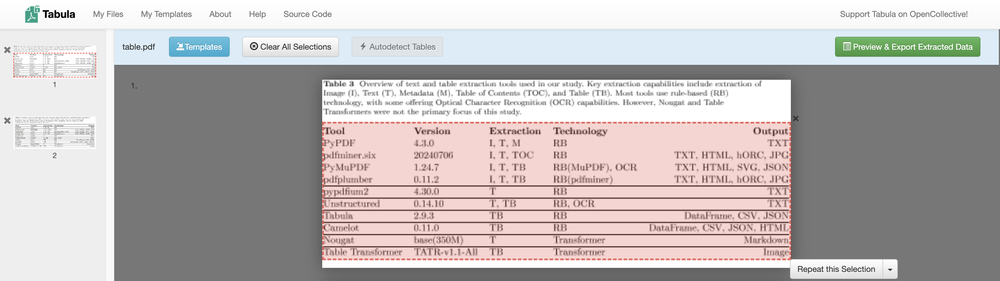
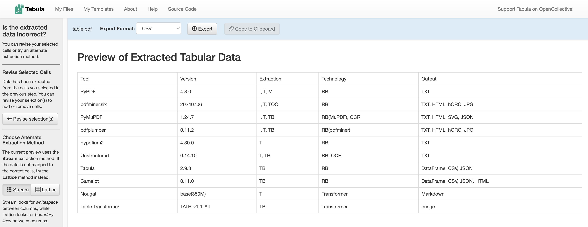
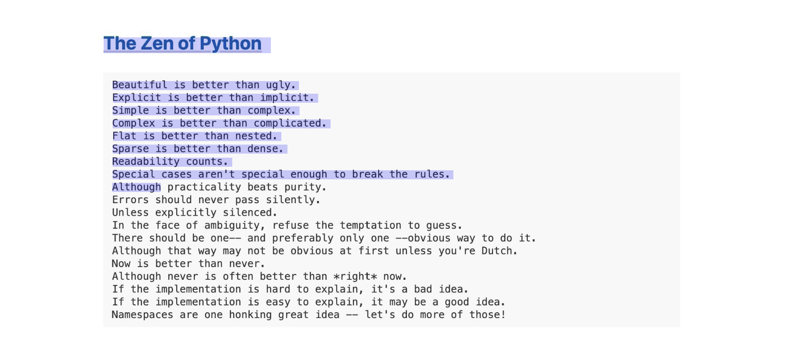
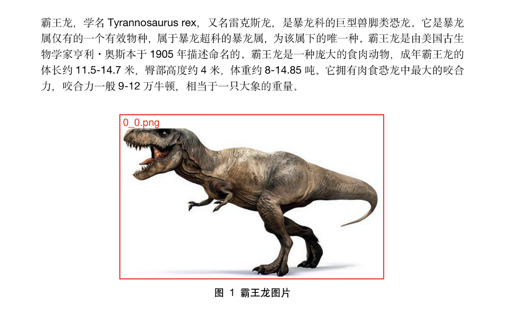

# WEEK059 - 盘点 Python 中那些 PDF 解析库

使用 RAG 实现企业私域知识问答是目前最流行也是最前沿的大模型技术之一，在 [week054-advanced-rag-notes](../week054-advanced-rag-notes/README.md) 这篇笔记中，我介绍了很多种不同的高级 RAG 技术，其关注点更多的是如何检索私域知识以及如何将检索结果灌输到大模型中，并没有深入如何获得这些私域知识。

现实中，绝大数企业私域知识都是非结构化的，散落在各种网页、文档或邮件附件里，如果能将这些内容解析出来，对企业来说无疑是巨大的价值。而在这些非结构化的文档中，PDF 文档占比很高，使得 PDF 解析对 RAG 至关重要。

PDF 全称 **Portable Document Format（可移植文档格式）**，于 1993 年由 Adobe 公司开发，鉴于其跨平台性、高安全性、开放标准、可搜索性和可访问性等优势，已经成为全球范围内广泛使用的文件格式。Python 中有着大量的 PDF 解析库，这篇笔记对常用的 PDF 解析库做一个盘点，方便自己后期技术选型时做参考。

## pypdf

[pypdf](https://github.com/py-pdf/pypdf) 是一个免费且开源的纯 Python PDF 库，能够分割、合并、裁剪和转换 PDF 文件的页面，可以向 PDF 文件添加自定义数据，对 PDF 文件进行加密和解密。当然，pypdf 还可以从 PDF 中提取文本、图片、附件、批注和元数据等。

```
from pypdf import PdfReader

reader = PdfReader("./pdfs/example.pdf")
number_of_pages = len(reader.pages)
print('Total %d pages.' % (number_of_pages))
for i in range(number_of_pages):
    print('----- Page %d -----' % (i+1))
    page = reader.pages[i]
    text = page.extract_text()
    print(text)

    for count, image_file_object in enumerate(page.images):
        with open(str(count) + image_file_object.name, "wb") as fp:
            fp.write(image_file_object.data)
```

可以看出 pypdf 的用法较为简单，我们只能拿到每一页的文本和图片内容，拿不到更多的详细信息，比如文本字体和大小，块位置等，这些信息在处理复杂场景时是必不可少的。所以 pypdf 只适合 PDF 的内容比较规整的场景。

## pdfminer.six

[pdfminer.six](https://github.com/pdfminer/pdfminer.six) 也是一个纯 Python 编写的 PDF 库，专注于获取和分析文本数据。

[pdfminer 最初由 Euske 开发](https://github.com/euske/pdfminer)，但是只支持 Python 2，不支持 Python 3，于是社区在他的基础上引入了 [six](https://github.com/benjaminp/six)，这是一个无需修改代码，就可以同时兼容 Python 2 和 3 的库，所以叫做 `pdfminer.six`。

使用 `extract_text` 方法实现类似 pypdf 的效果，直接返回文本：

```
from pdfminer.high_level import extract_text

text = extract_text("./pdfs/example.pdf")
print(text)
```

或者使用 `extract_pages` 方法提取元素的详细信息，包括文本的精确位置、字体、大小或颜色：

```
from pdfminer.high_level import extract_pages

for page in extract_pages("./pdfs/example.pdf"):
    for element in page:
        print(element)
```

这里的元素可能是 `LTTextBox`、`LTFigure`、`LTLine`、`LTRect` 或 `LTImage`，它们的层次结构如下所示：


其中 `LTTextBox` 还可以继续遍历得到 `LTTextLine`，`LTTextLine` 再继续遍历得到 `LTChar`：

```
from pdfminer.high_level import extract_pages
from pdfminer.layout import LTTextContainer, LTChar

for page in extract_pages("./pdfs/example.pdf"):
    for element in page:
        if isinstance(element, LTTextContainer):
            for text_line in element:
                for character in text_line:
                    if isinstance(character, LTChar):
                        print(character.get_text())
                        print(character.fontname)
                        print(character.size)
        else:
            print(element)
```

### 布局分析

PDF 文件和 `.txt` 或 Word 在格式上有着很大的不同，它不包含任何类似于段落、句子甚至单词的内容。它由一系列对象及其结构信息组成，这些对象共同描述一个或多个页面的外观，可能还附带有其他交互元素和更高级别的应用程序数据。这使得从 PDF 文件中提取有意义的文本片段变得困难，组成段落的字符与组成表格、页面底部或图表描述的字符没有任何区别。

上一节我们知道，通过 pdfminer.six 可以拿到元素的位置信息，通过这些位置信息我们可以重建句子或段落的布局。布局分析由三个不同阶段组成：将字符分组为单词和行，然后将行分组为框，最后以层次结构方式将文本框分组。这是一种最经典的基于规则的 **布局分析算法（Layout analysis algorithm）**。

布局分析依赖于几个重要参数，比如字符间距、行间距、行重叠等，这些参数都是 [LAParams 类](https://pdfminersix.readthedocs.io/en/latest/reference/composable.html#laparams) 的一部分。

更多说明请参考 [Converting a PDF file to text](https://pdfminersix.readthedocs.io/en/latest/topic/converting_pdf_to_text.html) 这篇文档。

## pypdfium2

[PDFium](https://pdfium.googlesource.com/pdfium/+/refs/heads/main) 被认为是开源世界中最高质量的 PDF 渲染引擎之一，它最初是基于福昕软件（Foxit Software）的 PDF SDK 开发的，在 2014 年被 Google 开源。PDFium 支持多种操作系统，包括 Windows、macOS、Linux 等，它还被编译到 iOS、Android 等移动平台上，支持跨平台应用；除了基本的 PDF 渲染功能，PDFium 还支持生成、编辑、文本提取、搜索、注解、表单填充等高级功能。PDFium 是一个高效、可靠的 PDF 渲染引擎，广泛应用于 Chrome 浏览器和其他第三方项目中。其开源性质和丰富的功能使其成为处理 PDF 文档的理想选择，由于基于 C++ 开发，处理大文件速度优于纯 Python 库。

[pypdfium2](https://github.com/pypdfium2-team/pypdfium2) 是 PDFium 库的 Python 3 绑定，它提供了一些辅助方法简化 PDFium 库的使用，同时原始的 PDFium/ctypes API 仍然可访问。下面的示例代码演示了如何通过 pypdfium2 的 `get_text_bounded()` 方法将 PDF 中的文本提取出来：

```
import pypdfium2 as pdfium

pdf = pdfium.PdfDocument("./pdfs/example.pdf")
for i in range(len(pdf)):
    print('----- Page %d -----' % (i+1))
    page = pdf[i]
    textpage = page.get_textpage()
    text_all = textpage.get_text_bounded()
    print(text_all)
```

和 pdfminer.six 一样，我们也可以通过 `get_rect()` 获取每个文本块的位置：

```
textpage = page.get_textpage()
rect_count = textpage.count_rects()
print(rect_count)
for i in range(rect_count):
    rect = textpage.get_rect(i)
    print(rect)
    text = textpage.get_text_bounded(rect[0], rect[1], rect[2], rect[3])
    print(text)
```

得到文本块的位置后，就可以使用布局分析算法对版面进行分析，比如行检测（通过 Y 坐标差异判断是否在同一行）、列检测（通过 X 坐标差异判断是否属于同一列）或表格边界检测等等。

此外，PDFium 还提供了一个 `render()` 方法，可以方便地将 PDF 转换为图片：

```
bitmap = page.render(
    scale = 1,    # 72dpi resolution
    rotation = 0, # no additional rotation
)
pil_image = bitmap.to_pil()
pil_image.save('x.png')
```

## pdfplumber

[pdfplumber](https://github.com/jsvine/pdfplumber) 是另一个用于解析 PDF 的 Python 库，它基于 pdfminer.six 构建，但提供了更简洁的 API 和对复杂布局（尤其是表格）的更好支持。它的核心功能如下：

* 文本提取：提取 PDF 中的文本（包括位置、字体等元数据），支持按页面、按区域或按特定条件提取；
* 表格提取：自动检测和提取 PDF 中的表格数据（支持合并单元格、多行文本等复杂结构）；
* 页面操作：获取页面尺寸、裁剪页面区域，提取页面内的图像、线条、矩形等可视化元素；
* 可视化调试：支持绘制页面中的文本、线条、表格框等元素，帮助用户调试提取逻辑。

pdfplumber 的基本用法如下：

```
import pdfplumber

path = "./pdfs/example.pdf"
with pdfplumber.open(path) as pdf:
    for i in range(len(pdf.pages)):
        print('----- Page %d -----' % (i+1))
        page = pdf.pages[i]
        text = page.extract_text()
        print(text)
```

pdfplumber 中有很多借鉴 pdfminer.six 的概念，比如通过 `page.chars` 可以访问页面中所有的文本字符，获取字体，大小，位置等信息：

```
page = pdf.pages[1]
for char in page.chars:
    print(char['text'], char['fontname'], char['size'], char['x0'], char['y0'], char['x1'], char['y1'])
```

除此之外，通过 `page` 还能访问很多其他对象，比如 `.lines` 代表线，`.rects` 代表矩形框，`.curves` 代表曲线（无法识别成线或矩形的连接点），`.images` 代表图像，`.annots` 代表 PDF 批注，`.hyperlinks` 代表链接等。

### 布局分析

pdfplumber 基于 pdfminer.six 构建，所以也具备 pdfminer.six 布局分析的功能，打开 PDF 时传入 laparams 参数即可：

```
laparams = {
    "line_overlap": 0.5,
    "char_margin": 2.0,
    "line_margin": 0.5,
    "word_margin": 0.1,
}
with pdfplumber.open(path, laparams=laparams) as pdf:
    pass
```

### 表格提取

pdfplumber 的一大亮点是它的表格提取功能，可以处理比较复杂布局的表格。它的基本用法如下：

```
page = pdf.pages[2]
tables = page.extract_tables()
for table in tables:
    print(table)
```

得到的表格是一个二维数组，类似下面这样：

```
[
    ['姓名', '学号', '学科', '成绩'], 
    ['小明', '001', '语文', '98'], 
    ['小明', '001', '数学', '97'], 
    ['小华', '002', '语文', '94'], 
    ['小华', '002', '数学', '99'], 
    ['小红', '003', '语文', '100'], 
    ['小红', '003', '数学', '95']
]
```

可以直接加载到 pandas 的 `DataFrame` 中对表格数据进行处理：

```
import pandas as pd
df = pd.DataFrame(table[1:], columns=table[0])
print(df)
```

pdfplumber 的表格提取算法参考了 Anssi Nurminen 的这篇论文 [《Algorithmic Extraction of Data in Tables in PDF Documents》](http://dspace.cc.tut.fi/dpub/bitstream/handle/123456789/21520/Nurminen.pdf?sequence=3)，大概的思路如下：

1. 首先查找页面中明确定义的行，或者根据单词对齐找到隐含的行；
2. 合并重叠或接近重叠的线条；
3. 找出这些线条的交点；
4. 找到使用这些交点作为顶点的最细粒度的矩形，即单元格；
5. 将连续单元格分组到表中。

和布局分析类似，这种基于规则的算法必然也提供了大量的规则参数，可以通过 `table_settings` 传入：

```
table_settings = {
    "vertical_strategy": "lines",
    "horizontal_strategy": "lines",
    "snap_tolerance": 3,
    "join_tolerance": 3
}
tables = page.extract_tables(table_settings=table_settings)
for table in tables:
    print(table)
```

官方仓库里提供了几个示例可供参考，其中 [extract-table-ca-warn-report.ipynb](https://github.com/hbh112233abc/pdfplumber/blob/stable/examples/notebooks/extract-table-ca-warn-report.ipynb) 演示了表格提取的基本操作，[extract-table-nics.ipynb](https://github.com/hbh112233abc/pdfplumber/blob/stable/examples/notebooks/extract-table-nics.ipynb) 演示如何使用可视化调试查找最佳的表提取设置。

### 可视化调试

pdfplumber 的另一大亮点是它可以将页面转换为 `PageImage` 对象（有趣的是，这一步是通过 pypdfium2 实现的），然后在 `PageImage` 将 chars、lines、rects 绘制出来，通过可视化页面，可以更直观地理解页面的布局结构。

绘制文本解析结果：

```
im = page.to_image()
im.draw_rects(page.extract_words()).save('extract_words.png')
```


绘制表格解析结果：

```
im = page.to_image()
im.debug_tablefinder(table_settings={}).save('debug_tablefinder.png')
```


## PyMuPDF

[MuPDF](https://mupdf.com/) 是由 [Artifex Software](https://artifex.com/) 公司开发的一个专注于 PDF 文档处理和渲染的开源库和工具集，具有轻量级、高性能的特点，适合嵌入式系统、移动设备和桌面应用集成。MuPDF 提供了多种语言接口，可以在 [JavaScript](https://github.com/ArtifexSoftware/mupdf.js)、[Java](https://github.com/ArtifexSoftware/mupdf/tree/master/platform/java)、[.NET](https://github.com/ArtifexSoftware/MuPDF.NET) 和 [Python](https://github.com/pymupdf/PyMuPDF) 等语言中调用，[PyMuPDF](https://github.com/pymupdf/PyMuPDF) 就是 MuPDF 的 Python 绑定。

> 注意，MuPDF 采用 AGPL 许可证，商业用途需联系 Artifex 获取商业授权。

如果安装 PyMuPDF 时遇到编译错误，可以考虑如下方式安装：

```
$ pip install --only-binary=pymupdf pymupdf
```

下面是 PyMuPDF 的基本用法：

```
import pymupdf

doc = pymupdf.open("./pdfs/example.pdf")
number_of_pages = len(doc)
print('Total %d pages.' % (number_of_pages))
for i in range(number_of_pages):
    print('----- Page %d -----' % (i+1))
    page = doc[i]
    text = page.get_text()
    print(text)
```

其中，`get_text()` 用于从页面中提取文本，默认是以纯文本格式输出，还支持很多 [其他的输出格式](https://pymupdf.readthedocs.io/en/latest/tutorial.html#extracting-text-and-images)，比如以 HTML 格式输出：

```
html = page.get_text('html')
```

或以 JSON 格式输出，当我们想对 PDF 结构进一步分析时非常有用：

```
json = page.get_text('json')
```

PyMuPDF 的功能非常丰富，除了 PDF，它还支持大量其他的文件格式，包括 XPS、EPUB、MOBI 等电子书格式，以及 DOCX、XLSX、PPTX 等 Office 文档（Pro 版），[这里](https://pymupdf.readthedocs.io/en/latest/about.html) 有一个表格列举了它的所有特性，并和其他几个 PDF 库进行对比。

### 表格提取

PyMuPDF 支持提取 PDF 中的表格数据：

```
from pprint import pprint
page = doc[2]
for t in page.find_tables():
    table = t.extract()
    pprint(table)
```

和 pdfplumber 一样，得到的表格是一个二维数组，可以直接加载到 pandas 的 `DataFrame` 中对表格数据进行处理。

### Markdown 提取

在 RAG 中，为了实现文档内容的切片，文档版式分析的准确性显得至关重要，Markdown 作为一种语法简单、段落清晰的文本格式，在 LLM 和 RAG 场景下经常被使用。PyMuPDF 支持将 PDF 文件转换为 Markdown 格式，方便在 LLM 和 RAG 场景下使用，这需要安装 `PyMuPDF4LLM` 扩展库，它的功能特性如下：

* 支持保留 PDF 中的大多数格式，比如表格、图片、链接、标题、段落、粗体、斜体、列表、代码块等都以 Markdown 语法保留下来；
* 支持多列页面；
* 支持图像和矢量图形提取，在 Markdown 文件中以图片语法；
* 支持按页面分块输出；
* 支持将输出作为 [LlamaIndex Documents](https://docs.llamaindex.ai/en/stable/module_guides/loading/documents_and_nodes/usage_documents/)，方便在 LlamaIndex 中快速开发 RAG 应用；

`PyMuPDF4LLM` 扩展库的安装很简单：

```
$ pip install pymupdf4llm
```

使用也很简单：

```
import pymupdf4llm
md_text = pymupdf4llm.to_markdown("./pdfs/example.pdf", write_images=True)
print(md_text)
```

官方提供了 [一些示例](https://pymupdf.readthedocs.io/en/latest/rag.html)，可以实现 Chat PDF 的功能。

### OCR 识别

PyMuPDF 集成了对 OCR 的支持，可以使用 OCR 对图片或文档页面进行识别，要使用该功能，需要先安装 Tesseract-OCR：

```
$ apt update
$ apt install tesseract-ocr
```

> 默认 Tesseract-OCR 只能识别英文，为了支持中文识别，还需要下载中文的训练数据，可以从 [tesseract-ocr/tessdata](https://github.com/tesseract-ocr/tessdata) 仓库下载 `chi_sim.traineddata` 文件，并将文件放在 `/usr/share/tesseract-ocr/5/tessdata/` 这个目录下。

PyMuPDF 支持两种 OCR 策略，第一种是识别整个页面，第二种是提取页面中的图片进行识别。由于 OCR 非常缓慢，所以建议在处理 PDF 时每页只进行一次 OCR，当出现下面这些情况时可以使用第一种策略：

* 页面完全被图片覆盖；
* 页面上不存在文本；
* 页面上有数千个小矢量图形；

示例代码如下：

```
page = doc[3]
textpage = page.get_textpage_ocr()
text = textpage.extractText()
print(text)
```

这里通过 `page.get_textpage_ocr()` 方法将 `Page` 转换为 [TextPage](https://pymupdf.readthedocs.io/en/latest/textpage.html) 从而方便后续我们提取文本。

第二种策略是识别单独的图片，我们先从页面中将图片提取出来：

```
page = doc[3]
for img in page.get_images():
    xref = img[0]
    data = doc.extract_image(xref)['image']
    pix = pymupdf.Pixmap(data)
```

这里先通过 `page.get_images()` 获取页面中的所有图片，注意返回的是图片的 `xref` 引用信息，需要通过 `doc.extract_image()` 提取出图片的原始数据，最后再转换为 `Pixmap` 格式，只有这种格式才能 OCR 识别。得到 `Pixmap` 之后，我们可以将其保存成本地文件：

```
    pix.save('x.png')
```

也可以对其进行 OCR 识别：

```
    pix.pdfocr_save('x.pdf', language='eng')
```

这个方法将 `Pixmap` 保存为 1 页的 PDF 文件，该页面看起来像原始图片，具有相同的宽度和高度，但是它包含了一个被 Tesseract 识别的文本层，可以使用常规文本提取和搜索方法进行提取和搜索。当然这样做比较繁琐，会生成大量的临时文件，我们也可以直接在内存中进行读取：

```
    bytes = pix.pdfocr_tobytes()
    imgdoc = pymupdf.open("pdf", bytes)
    page = imgdoc[0]
    text = page.get_text()
    print(text)
```

还有另一种方式可以将 `Page` 转换成 `Pixmap`：

```
page = doc[0]
pix = page.get_pixmap(dpi=300)
pix.save('x.png')
pix.pdfocr_save('x.pdf', language='chi_sim')
```

注意这里的 `dpi=300` 参数，可以保证生成的图片足够清晰，模糊的图片可能导致 Tesseract 识别失败。

## Tabula vs. Camelot

上面提到 pdfplumber 和 PyMuPDF 都具备表格提取功能，关于表格提取，还有两个库不得不提，那就是 [Tabula](https://github.com/tabulapdf/tabula) 和 [Camelot](https://github.com/camelot-dev/camelot)。

Tabula 是一款专门用于提取 PDF 中表格的工具，它本身是一个基于 Java 开发的本地 Web 应用。首先上传 PDF 文件，手动选择或自动检测表格区域：



然后将选择的表格区域提取成结构化的数据：



Tabula 实现了两种表格提取算法：一种叫 **Stream 模式**（参考 [BasicExtractionAlgorithm](https://github.com/tabulapdf/tabula-java/blob/master/src/main/java/technology/tabula/extractors/BasicExtractionAlgorithm.java) 和 [NurminenDetectionAlgorithm](https://github.com/tabulapdf/tabula-java/blob/master/src/main/java/technology/tabula/detectors/NurminenDetectionAlgorithm.java)，实际上也是借鉴了 Anssi Nurminen 那篇论文中的思路），另一种叫 **Lattice 模式**（参考 [SpreadsheetExtractionAlgorithm](https://github.com/tabulapdf/tabula-java/blob/master/src/main/java/technology/tabula/extractors/SpreadsheetExtractionAlgorithm.java)）；Stream 模式通过查找列之间的空白来确定表格，而 Lattice 模式则是查找列之间的边界线，如果单元格之间有明确的边界线，建议选择 Lattice 模式，当其中一种算法无法提取表格数据时，可以切换到另一种尝试。

同时，Tabula 也开源了对应的 SDK 方便其他开发者集成，核心仓库是 [tabula-java](https://github.com/tabulapdf/tabula-java/)，也有社区维护的 Python 绑定 [tabula-py](https://github.com/chezou/tabula-py)，基本用法如下：

```
import tabula

dfs = tabula.read_pdf(
    "./pdfs/table.pdf",
    pages = '1'
)
print(dfs[0])
```

> 注意：由于 Tabula 是基于 Java 实现的，所以要安装 JVM 环境。

Camelot 是另一款 PDF 表格提取工具和库，和 Tabula 非常类似，它是纯 Python 实现，不用依赖 JVM 环境。而且相比于 Tabula 它提供了更多的 [高级选项](https://camelot-py.readthedocs.io/en/latest/user/advanced.html)，能应付更多更复杂的场景。[这里](https://github.com/camelot-dev/camelot/wiki/Comparison-with-other-PDF-Table-Extraction-libraries-and-tools) 有一份 Camelot 和 Tabula 的详细对比，根据对比结果，Camelot 在多个场景下效果都比 Tabula 要好。

Camelot 用起来和 Tabula 也很像，如下：

```
import camelot

tables = camelot.read_pdf(
    './pdfs/table.pdf',
    pages = "1",
    flavor = "stream"
)
print(tables[0].df)
```

其中 `flavor = "stream"` 表示使用 **Stream 模式**，同样的，Camelot 也支持 **Lattice 模式**，不过它的实现有些不同（参考 [lattice.py](https://github.com/camelot-dev/camelot/blob/master/camelot/parsers/lattice.py)），它首先通过 Ghostscript 或 Pdfium 将 PDF 页面转换为图像，然后使用 OpenCV 的图像学算法，获取水平和垂直线段；推荐阅读 Camelot 的官方文档 [How It Works](https://camelot-py.readthedocs.io/en/master/user/how-it-works.html)，这篇文档带我们详细了解 Lattice 是如何一步一步地处理 PDF 页面的。此外，这篇文档还介绍了 Camelot 的另两种模式：**Network 模式** 和 **Hybrid 模式**，此处不再赘述。

> 除了 Camelot 和 Tabula，还有很多类似的库也用于表格提取，比如 [pdftables](https://github.com/drj11/pdftables) 和 [pdf-table-extract](https://github.com/ashima/pdf-table-extract) 等。


## pikepdf

[pikepdf](https://github.com/pikepdf/pikepdf) 是另一个 Python PDF 解析库，帮助开发者读取、写入和修改 PDF 文件。这个库的取名很有意思：

```
Python + qpdf = "py" + "qpdf" = "pyqpdf"
```

可以看出 pikepdf 基于 [qpdf](https://github.com/qpdf/qpdf) 开发，而 qpdf 是一个使用 C++ 编写的功能强大的 PDF 操作和修复库。

使用 pikepdf 解析 PDF 不是一件容易的事，因为它使用了一些比较低级的概念，比如 [对象模型](https://pikepdf.readthedocs.io/en/latest/topics/objects.html) 和 [流](https://pikepdf.readthedocs.io/en/latest/topics/streams.html)，这种设计使得用户需要对 PDF 的内部结构和规范有一定的了解，才能高效地使用该库。

当我们准备上手 pikepdf 的入门示例时，我们会发现它甚至都 [没有提取文本的能力](https://pikepdf.readthedocs.io/en/latest/topics/content_streams.html#extracting-text-from-pdfs)，只能访问页面中的 **内容流（Content Streams）**：

```
import pikepdf

with pikepdf.open('./pdfs/example.pdf') as pdf:
    page = pdf.pages[0]
    instructions = pikepdf.parse_content_stream(page)
    data = pikepdf.unparse_content_stream(instructions)
    print(data.decode())
    
```

解析出来的结果类似于下面这样的被称为 **指令（Instructions）** 的特殊字符串：

```
q
1 0 0 -1 0 841.9 cm
q
0 0 595.3 841.9 re
W*
n
0.12 w
2 M
2 J
2 j
0 0 0 RG
```

> 对 PDF 底层数据结构感兴趣的同学可以看看 [《PDF Explained》](https://zxyle.github.io/PDF-Explained/) 这本电子书。

强烈不推荐从内容流中解析文本，因为这意味着你需要手动处理字体、字号、编码等一系列问题，这只适合部分硬核玩家，我们不如直接使用其他现成的 PDF 解析库。不过我们可以使用 pikepdf [处理图片](https://pikepdf.readthedocs.io/en/latest/topics/images.html)，比如提取、替换、删除等，下面是提取图片的一个示例：

```
    page = pdf.pages[3]
    for key in page.images:
        rawimage = page.images[key]
        pdfimage = pikepdf.PdfImage(rawimage)
        pdfimage.extract_to(fileprefix='x')
```

## OCRmyPDF

[OCRmyPDF](https://github.com/ocrmypdf/OCRmyPDF) 的特点是通过 OCR 识别图像中包含的文本，并为 PDF 中的图像添加一个文本层，使得图像 PDF 也可以被搜索。它的工作流程大致如下：

* 首先通过 pikepdf 处理 PDF，修复 PDF 中可能存在的语法错误，并将 PDF 拆分成单页；
* 然后使用 [Ghostscript](https://ghostscript.com/) 以 `-dSAFER` 模式对 PDF 的每一页进行光栅化；光栅图也叫做位图、点阵图、像素图，可以方便的进行 OCR 识别；
* 接着使用 Tesseract 对光栅化的图像执行 OCR 识别；
* 最后将识别的结果和原始的 PDF 进行合成，生成一个新的 PDF 文件。

> 默认情况下，OCRmyPDF 生成的文件是 `PDF/A` 格式，这是 PDF 规范的子集，旨在用于归档（“A” 代表归档）。PDF/A 与 PDF 的主要区别在于去掉了很多复杂的功能，例如嵌入式 Javascript、视频、音频和对外部字体的引用，因此它可能更安全。

OCRmyPDF 可以通过命令行工具使用，也可以通过 API 集成在 Python 代码中：

```
import ocrmypdf

ocrmypdf.ocr('./pdfs/example.pdf', 'output.pdf', skip_text=True)
```

正如前文所述，OCRmyPDF 依赖于 Ghostscript 处理页面，所以我们需要先安装 Ghostscript，不过当前使用 `apt install ghostscript` 命令安装的是 10.0.0 版本，是个有问题的版本，无法在 OCRmyPDF 中直接使用。如果你也遇到和我一样的问题，可以通过下面的步骤手动编译源码来安装：

```
$ wget https://github.com/ArtifexSoftware/ghostpdl-downloads/releases/download/gs10040/ghostscript-10.04.0.tar.gz
$ tar zxvf ghostscript-10.04.0.tar.gz
$ cd ghostscript-10.04.0
$ ./configure
$ make install
```

上面的 `skip_text=True` 参数表示跳过有文本的页面，只处理有图片的页面。要注意的是，如果页面既有文本又有图片，也会跳过，可以设置 `force_ocr=True` 参数强制识别所有页面：

```
ocrmypdf.ocr('./pdfs/example.pdf', 'output.pdf', force_ocr=True)
```

详细的参数说明可以参考官网的[使用手册](https://ocrmypdf.readthedocs.io/en/latest/cookbook.html)。

打开生成的 PDF 文件，如果一切正常，可以发现图片上的文字不仅可以搜索，也可以用鼠标框选复制（而且框选的位置和图片中文字的位置非常吻合，一点违和感都没有）：



此外，OCRmyPDF 通过 [pluggy](https://github.com/pytest-dev/pluggy) 实现了插件机制，我们可以基于插件机制实现如下功能：

* 添加新的命令行参数；
* 执行 OCR 之前增加自己的判断逻辑；
* 在 OCR 识别或 PDF 生成之前对图片进行修改；
* 用其他 OCR 引擎替换 Tesseract OCR；
* 用其他光栅化或 PDF/A 生成器替换 Ghostscript；

感兴趣的同学可以参考官网的[插件文档](https://ocrmypdf.readthedocs.io/en/latest/plugins.html)。

## markitdown

[markitdown](https://github.com/microsoft/markitdown) 是微软开源的一款 Python 库，旨在将各种文件格式转换为 Markdown。该库的一大特色是支持大量的文件格式，包括：Word、PPT、Excel、PDF、HTML、JSON、XML、CSV、ZIP、图像、音频、URL，等等等等，因此人气非常高，目前在 Github 上收获了超过 39k 的 Star。

使用 markitdown 非常简单，只需要 4 行代码：

```
from markitdown import MarkItDown
md = MarkItDown()
result = md.convert("./pdfs/example.docx")
print(result.text_content)
```

上面的代码将 Word 文档转换为 Markdown 格式，支持保留标题、表格、图片等 Markdown 语法，对 LLM 和 RAG 场景非常友好。深入研究 markitdown 的源码可以发现，它集众家之所长，使用了大量其他流行的开源库，比如：

* 通过 [mammoth](https://github.com/mwilliamson/python-mammoth) 将 Word 文件转换为 HTML 格式；
* 通过 [pandos](https://github.com/pandas-dev/pandas) 和 [openpyxl](https://openpyxl.readthedocs.io/en/stable/) 将 Excel 文件转换为 HTML 格式；
* 通过 [pptx](https://github.com/scanny/python-pptx) 解析 PPT 文件；
* 通过 [markdownify](https://github.com/matthewwithanm/python-markdownify) 将 HTML 转换为 Markdown；
* 通过 [pdfminer.six](https://github.com/pdfminer/pdfminer.six) 解析 PDF 文件；
* 通过 [speech_recognition](https://github.com/Uberi/speech_recognition) 对音频文件进行转译；

尽管 markitdown 支持这么多的文件格式，但是它对 PDF 的解析效果并不好，它是直接使用 `pdfminer.high_level.extract_text()` 提取 PDF 中的文本的，所以标题、表格、图片等格式都丢失了，期待 markitdown 能稍微加强下对 PDF 的支持，能做到和 pymupdf4llm 一样的效果就完美了。

markitdown 的另一大特色是对图片的处理，不同于其他库喜欢用 Tesseract 做 OCR 识别，它通过多模态大模型（比如 `gpt-4o`、`Qwen-VL` 等）为图片生成详细描述：

```
from openai import Client
client = Client()
md = MarkItDown(llm_client=client, llm_model="gpt-4o")
result = md.convert("./pdfs/example.jpg")
print(result.text_content)
```

## gptpdf

[gptpdf](https://github.com/CosmosShadow/gptpdf) 是另一个使用多模态大模型来解析 PDF 的库，它的核心思想非常简单：将 PDF 文件的每一页转换为图片，然后丢给大模型，让它将图片中识别到的文字转换为 Markdown 格式输出。它的 [核心代码](https://github.com/CosmosShadow/gptpdf/blob/main/gptpdf/parse.py) 不过 300 行，但几乎可以完美地解析排版、数学公式、表格、图片、图表等。

内置的 Prompt 也很简单：

```
使用markdown语法，将图片中识别到的文字转换为markdown格式输出。你必须做到：
1. 输出和使用识别到的图片的相同的语言，例如，识别到英语的字段，输出的内容必须是英语。
2. 不要解释和输出无关的文字，直接输出图片中的内容。例如，严禁输出 “以下是我根据图片内容生成的markdown文本：”这样的例子，而是应该直接输出markdown。
3. 内容不要包含在```markdown ```中、段落公式使用 $$ $$ 的形式、行内公式使用 $ $ 的形式、忽略掉长直线、忽略掉页码。
再次强调，不要解释和输出无关的文字，直接输出图片中的内容。
```

gptpdf 使用了作者自己开发的 [GeneralAgent](https://github.com/CosmosShadow/GeneralAgent) 库来调用大模型，支持 [GPT-4o](https://platform.openai.com/docs/guides/vision)、[Qwen-VL](https://github.com/QwenLM/Qwen-VL)、[GLM-4V](https://github.com/THUDM/GLM-4)、[Yi-VL](https://github.com/01-ai/Yi) 等：

```
from gptpdf import parse_pdf

content, image_paths = parse_pdf(
    pdf_path = "./pdfs/text+image.pdf", 
    output_dir = "./out",
    model = "gpt-4o",
)
print(content)
```

上面的代码运行成功后，会将输出结果写入到 out 目录下的 `output.md` 文件。

如果 PDF 中含有图片，gptpdf 的处理方式稍微有些不一样，它会首先使用 PyMuPDF 将图片区域用一个红色的框标记出来，像下面这样：



然后将这个区域裁剪成子图保存起来，并让大模型在识别到这个图片时使用 Markdown 的图片语法 `` 替换该位置，内置的 Prompt 会加上如下内容：

```
图片中用红色框和名称(%s)标注出了一些区域。如果区域是表格或者图片，使用  的形式插入到输出内容中，否则直接输出文字内容。
0_0.png, 0_1.png
```

## 参考

* [pypdf's documentation](https://pypdf.readthedocs.io/)
* [pdfminer.six’s documentation](https://pdfminersix.readthedocs.io/)
* [pypdfium2's documentation](https://pypdfium2.readthedocs.io/)
* [PyMuPDF's documentation](https://pymupdf.readthedocs.io/)
* [Tabula: Extract Tables from PDFs](https://tabula.technology/)
* [Camelot: PDF Table Extraction for Humans](https://camelot-py.readthedocs.io/)
* [pikepdf's documentation](https://pikepdf.readthedocs.io/)
* [OCRmyPDF's documentation](https://ocrmypdf.readthedocs.io/)
* [文档处理之10种PDF解析工具测评](https://mp.weixin.qq.com/s/HaHnWb5LCJM6kuSphgKykQ)
* [MarkItDown深入研究](http://www.hubwiz.com/blog/markitdown-a-deep-dive/)
