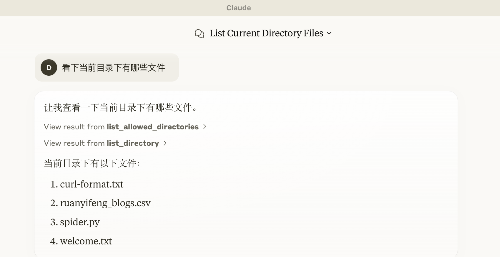
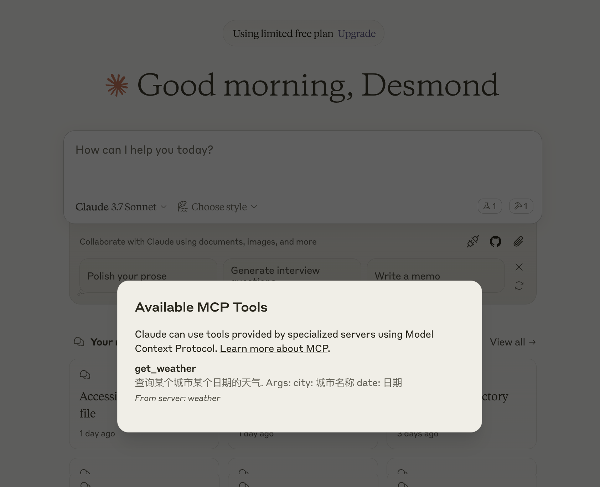

# WEEK060 - 实战 Model Context Protocol

[2024 年 11 月 25 日](https://www.anthropic.com/news/model-context-protocol)，Anthropic，就是 Claude 背后的那家公司，推出了一个名为 MCP 的开放协议，它的全称为 [Model Context Protocol](https://modelcontextprotocol.io/introduction)（模型上下文协议），用于标准化大模型与各类外部工具和数据源之间的交互。

这个协议自推出以来，在 AI 圈一直不温不火，很多人认为 MCP 只是套壳的 API，并没有什么特别之处。但是近期，随着 [Manus](https://manus.im) 的爆火，MCP 的概念在社区中又逐渐流行开来，使用 MCP 打造一款本地的 Manus 成了大家乐此不疲的话题。

## MCP 架构

为了搞清楚什么是 MCP，让我们先来了解下它的基本架构。下面这张图非常形象地展示了 MCP 的基本架构（[图片来源](https://norahsakal.com/blog/mcp-vs-api-model-context-protocol-explained/)）：


可以看到 MCP 采用了非常经典的 C/S 架构（客户端/服务器），主要包括三个部分：

* **主机（Host）**： 一般是基于大模型的 AI 应用，比如 Claude Desktop、ChatGPT Desktop、Cursor 等桌面应用，需要访问外部数据或工具；
* **客户端（Client）**：内置在应用中，与 MCP 服务器建立一对一的连接；
* **服务器（Server）**：连接本地或远程的数据源，提供特定功能；
    * 本地数据源：文件或数据库；
    * 远程服务：外部 API 或互联网服务；

MCP 协议将所有的外部数据或工具以一种统一的方式接入 AI 应用，这就好比 USB-C 接口，将各种不同的电子设备统一成一种接口，从而让用户不再为准备各种各样不同的线缆插头而烦恼。简单说，MCP 就像一座桥梁，它本身不处理复杂逻辑，只负责协调 AI 应用与外部资源之间的信息流动。

### MCP 和 API 的区别

在推出 MCP 之前，AI 应用如果要对接外部工具，通常需要单独整合多个不同的 API，每个 API 的接口可能都各不相同，认证方式和错误处理也可能不同，极大地增加了开发复杂度和维护成本。

所以说，传统 API 就像不同的门，每扇门都有一把不同的钥匙，而 MCP 像一把万能钥匙，AI 应用开发者只要集成了这个万能钥匙，就可以打开任意的门。下面是 MCP 和传统 API 的对比：


## MCP 初体验

接下来，让我们在 Claude Desktop 中体验下 MCP 是如何工作的。

首先，下载并安装 [Claude for Desktop](https://claude.ai/download)，注册并登录账号后，确保 Claude 能正常对话：


然后，打开 `Settings` -> `Developer` 配置页面：


点击 `Edit Config` 按钮，进入 Claude 配置文件所在目录，打开 `claude_desktop_config.json` 配置文件，输入如下内容：

```
{
    "mcpServers": {
        "filesystem": {
            "command": "npx",
            "args": [
                "-y",
                "@modelcontextprotocol/server-filesystem",
                "/Users/aneasystone/Downloads/demo"
            ]
        }
    }
}
```

这是官方开发的 [Filesystem MCP Server](https://github.com/modelcontextprotocol/servers/tree/main/src/filesystem)，用于操作你的本地文件，比如读取、编辑、搜索等。最后一个参数是文件路径，表示只允许 Claude 访问这个目录，可以添加一个或多个。

> 注意这里通过 `npx` 命令启动 MCP Server，所以需要提前安装 [Node.js](https://nodejs.org/)，使用 `node --version` 确认你的电脑上是否具备 Node.js 环境。

配置好 Filesystem MCP Server 之后，重启 Claude Desktop 应用，Claude Desktop 在启动时会自动加载所有的 MCP Server（其实就是为每个 Server 启动一个独立的进程，运行配置文件中的命令）。加载成功后，在对话框右下角会看到一个小锤子的图标：


点击小图标，可以看到 Filesystem MCP Server 自带的所有工具列表：


这时我们就可以在对话时让 Claude 调用这些工具了：



Claude 在调用工具之前会提醒用户，只有当用户确认允许后才会真正执行相应操作。

> 运行 `npx` 默认是从 Node.js 官方仓库下载包，有时会非常慢，导致 Claude 加载 MCP Server 失败，可以通过环境变量将仓库地址改为国内的源：
> ```
> {
>     "mcpServers": {
>         "filesystem": {
>             "command": "npx",
>             "args": ...
>             "env": {
>                 "NPM_CONFIG_REGISTRY": "https://mirrors.huaweicloud.com/repository/npm/"
>             }
>         }
>     }
> }
> ```

## MCP 开发者指南

上一节我们从用户视角体验了一把 MCP，直观的感受了 MCP 是如何将外部资源集成到 AI 应用的。接下来，我们将从开发者视角，介绍如何开发自己的 MCP Server 以及如何将 MCP 集成到自己的 AI 应用中。

### 开发 MCP Server

这一节我们将通过 MCP 官方提供的 SDK 实现一个简单的天气查询 MCP Server。

> 官方目前提供了 [Python](https://github.com/modelcontextprotocol/python-sdk)、[TypeScript](https://github.com/modelcontextprotocol/typescript-sdk)、[Java](https://github.com/modelcontextprotocol/java-sdk) 和 [Kotlin](https://github.com/modelcontextprotocol/kotlin-sdk) 四种 SDK 供开发者选择，这里我们使用 Pyhon SDK。

MCP Server 可以提供三种主要类型的能力：

* [资源（Resources）](https://modelcontextprotocol.io/docs/concepts/resources)：客户端可以读取的类似文件的数据，如 API 响应或文件内容；
* [工具（Tools）](https://modelcontextprotocol.io/docs/concepts/tools)：可以被 AI 调用的能力，调用之前会经过用户批准；
* [提示（Prompts）](https://modelcontextprotocol.io/docs/concepts/prompts)：预先编写好的指令模板，帮助用户完成特定任务；

这里我们暂时只关注工具。

首先，安装 `mcp[cli]` 依赖：

```
$ pip install --index-url https://pypi.tuna.tsinghua.edu.cn/simple/ mcp[cli]
```

然后，创建 `mcp-server-weather.py` 文件：

```
from mcp.server.fastmcp import FastMCP

mcp = FastMCP("weather")

@mcp.tool()
async def get_weather(city: str, date: str) -> str:
    """查询某个城市某个日期的天气.

    Args:
        city: 城市名称
        date: 日期
    """
    return '天气晴，气温25摄氏度'

if __name__ == "__main__":
    mcp.run(transport='stdio')
```

上面的代码可以说非常简单，先通过 `FastMCP` 初始化 MCP Server，然后通过 `@mcp.tool()` 注解定义工具，最后通过 `mcp.run()` 启动 MCP Server。

其中 `transport` 参数表示传输协议的类型，决定了客户端如何和 MCP Server 通信，MCP [默认支持两种传输协议](https://modelcontextprotocol.io/docs/concepts/transports#built-in-transport-types)：

* **标准输入和输出 (stdio)**：通过标准输入和输出流进行通信，这对本地集成和命令行工具特别有用；
* **服务器发送事件 (SSE)**：通过 HTTP POST 请求支持客户端与服务器之间的流式通信；

这里 `transport='stdio'` 表示使用标准输入和输出流进行通信，至此，一个简单的 MCP Server 就开发好了。

接下来，打开 Claude 的配置文件 `claude_desktop_config.json`，添加 MCP Server 配置如下：

```
{
    "mcpServers": {
        "weather": {
            "command": "python3",
            "args": [
                "/path/to/mcp-server-weather.py"
            ]
        }
    }
}
```

重启 Claude for Desktop，在对话框右下角可以看到我们的工具已成功加载：



测试下效果：


### 探索 MCP Server

除了上面介绍的 Filesystem MCP Server 和自己开发之外，网上还有大量的 MCP Server 开箱即用，可以用于文件处理、数据分析、软件开发、浏览器自动化、沟通提效等等，这些官网提供的 [例子](https://modelcontextprotocol.io/examples) 可以作为很好的入门。

此外，社区也有不少人将各种 MCP Server 收集在一起，比如 [Awesome MCP Servers](https://github.com/punkpeye/awesome-mcp-servers)、[MCP.so](https://mcp.so/) 和 [Smithery](https://smithery.ai/)，感兴趣的同学可以逛逛看。

### 开发 MCP Client

https://modelcontextprotocol.io/quickstart/client

https://modelcontextprotocol.io/clients

### 深入 MCP 原理

https://spec.modelcontextprotocol.io/specification/2024-11-05/basic/lifecycle/

## 参考

* [Get started with the Model Context Protocol (MCP)](https://modelcontextprotocol.io/introduction)
* [Model Context Protocol · GitHub](https://github.com/modelcontextprotocol)
* [How to debug the Claude Model Context Protocol?](https://pcarion.com/blog/claude_mcp/)
* [Using LangChain With Model Context Protocol (MCP)](https://cobusgreyling.medium.com/using-langchain-with-model-context-protocol-mcp-e89b87ee3c4c)
* [Model Context Protocol (MCP). I would like to make a point regarding…](https://cobusgreyling.medium.com/model-context-protocol-mcp-da3e0f912bbc)
* [为 AI 模型赋予「三头六臂」：MCP 服务实用指南](https://sspai.com/prime/story/mcp-tutorial)
* [Claude 的 MCP (模型上下文协议）有啥用？](https://sspai.com/post/94360)
* [什么是模型上下文协议（MCP）？它如何比传统API更简单地集成AI？](https://baoyu.io/translations/mcp-vs-api-model-context-protocol-explained)
* [通俗易懂说清楚MCP的原理](https://mp.weixin.qq.com/s/v06i4dRTp6K7X2c0T0lslg)
* [通俗易懂说清楚什么是MCP](https://mp.weixin.qq.com/s/MU3I9PETpVDOdw12XkJSOg)
* [深入浅出理解MCP：从技术原理到实战落地](https://mp.weixin.qq.com/s/7QlMWCceHldt_B0TSDijbA)

### 更多

#### Spring AI + MCP

* [Exploring Model Context Protocol (MCP) With Spring AI](https://www.baeldung.com/spring-ai-model-context-protocol-mcp)
* [Introducing the Model Context Protocol Java SDK](https://spring.io/blog/2025/02/14/mcp-java-sdk-released-2/)
* [Spring AI 再进化，支持 MCP 协议](https://my.oschina.net/giegie/blog/17113995)
* [Chat2DB 实现：Spring AI MCP 直连数据库](https://my.oschina.net/giegie/blog/17138364)
