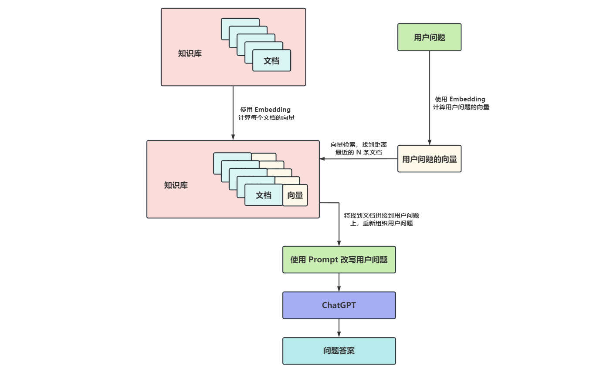
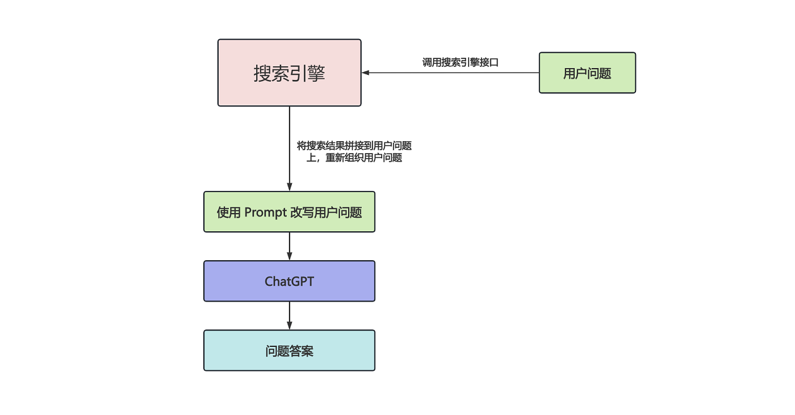
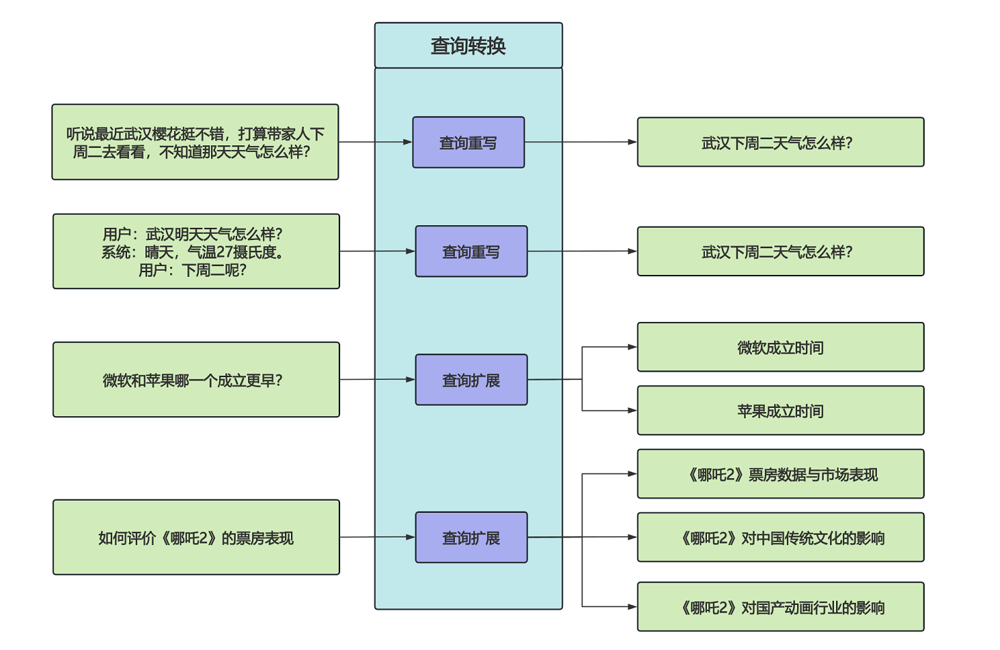
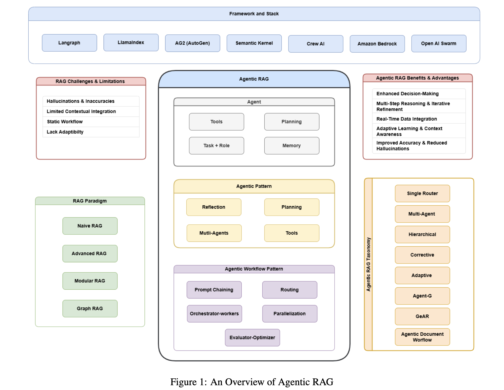
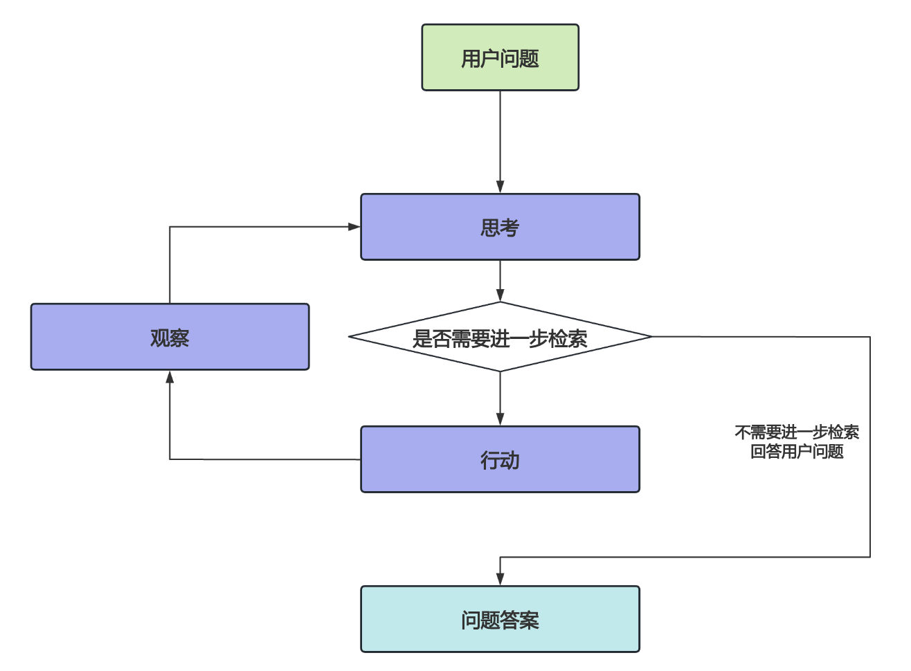

# WEEK061 - 聊聊 Deep Search 和 Deep Research

[2022 年 11 月 30 日](https://openai.com/index/chatgpt/)，OpenAI 正式发布 ChatGPT 产品，仅两个月后，其月活用户就突破了 1 个亿，成为历史上增长最快的消费类应用之一。一时之间，生成式 AI 技术遍地开花，国内外科技大厂紧锣密鼓纷纷入场，各种大模型和 AI 产品以星火燎原之势涌现出来。

ChatGPT 的发布对传统搜索（如 Google）和问答社区（如 StackOverflow）造成了强烈的冲击。用户对传统搜索的不满早已不是秘密，搜索结果中大量的广告和低质的 SEO 内容导致用户体验很差，而 ChatGPT 通过自然语言以对话的方式为用户直接提供答案，省去了用户在海量的搜索页面之间反复跳转和搜集信息的麻烦。谷歌拥有 DeepMind 和 Google Brain 两大顶尖 AI 实验室，原本有机会站在这波生成式 AI 浪潮的最顶端，但是管理层安于现状，不忍放弃广告业务的利润，最终被 ChatGPT 抢占先机。为了应对 ChatGPT 的冲击，谷歌很快开始了反击，公司在内部发布 **红色代码（Red Code）** 预警，进入战备状态，创始人布林甚至亲自下场为聊天机器人 Bard 写代码。

生成式 AI 和传统搜索之间的战争就此拉开了序幕。

## AI + 搜索

不过很快人们就发现了 ChatGPT 的不足，尽管 ChatGPT 能以简洁的交互给出即时答案，但是它的答案中充斥了大量的事实性错误，幻觉问题和静态知识是大模型天生的两大局限，导致其答案准确性达不到搜索引擎的要求。一开始，大家只是作为谈资一笑了之，但是随着大模型在商业化应用中的落地，人们的抱怨声也就越来越多，在某些场景下，比如医疗建议，错误的回复可能导致灾难性后果。

为了解决这些问题，又一项新技术应运而生，那就是 **RAG（Retrieval-Augmented Generation，检索增强生成）**，通过引入外部信息源，包括搜索引擎、企业私域知识、个人笔记等一切能查询的信息，可以有效的缓解大模型的幻觉问题，在生成答案时还可以标注信息来源以提升可信度。

[2024 年 10 月](https://openai.com/index/introducing-chatgpt-search/)，ChatGPT 推出搜索功能：


国内外产商也纷纷跟进，比如 [DeepSeek](https://chat.deepseek.com/) 的：


[Qwen Chat](https://chat.qwen.ai/) 的：


[Kimi](https://kimi.moonshot.cn/) 的：


[前不久](https://www.anthropic.com/news/web-search)，Claude 也集成了搜索功能：


如今 **AI + 搜索** 已经是各家大模型产品的标配。

与此同时，**搜索 + AI** 也不甘示弱，比如 Google 面向美国用户推出的 [AI Overviews](https://blog.google/products/search/ai-overviews-search-october-2024/) 功能，在搜索结果顶部提供自然语言生成的答案摘要；百度在搜索顶部也加入了 AI+ 功能：


还有一些比较小众的搜索服务和开源项目，比如 [YOU.COM](https://you.com/)、[iAsk](https://iask.ai/)、[Lepton Search](https://search.lepton.run/) 等，感兴趣的也可以尝试下。

### 技术原理

**AI + 搜索** 的本质是 **朴素 RAG**，我曾在 [week042-doc-qa-using-embedding](../week042-doc-qa-using-embedding/README.md) 这篇笔记中简单介绍过 RAG 的基本流程，如下图所示：



可以看出它的实现非常简单，唯一的难点是知识库文档和用户问题的向量化以及向量检索，而 **AI + 搜索** 则更简单，直接拿着用户问题去调搜索引擎的接口就行了：



关于如何组织搜索结果和用户问题，可以参考 [DeepSeek 公开的 Prompt](https://github.com/deepseek-ai/DeepSeek-R1#official-prompts)：

```
# 以下内容是基于用户发送的消息的搜索结果:
{search_results}
在我给你的搜索结果中，每个结果都是[webpage X begin]...[webpage X end]格式的，X代表每篇文章的数字索引。请在适当的情况下在句子末尾引用上下文。
请按照引用编号[citation:X]的格式在答案中对应部分引用上下文。如果一句话源自多个上下文，请列出所有相关的引用编号，例如[citation:3][citation:5]，
切记不要将引用集中在最后返回引用编号，而是在答案对应部分列出。
在回答时，请注意以下几点：
- 今天是{cur_date}。
- 并非搜索结果的所有内容都与用户的问题密切相关，你需要结合问题，对搜索结果进行甄别、筛选。
- 对于列举类的问题（如列举所有航班信息），尽量将答案控制在10个要点以内，并告诉用户可以查看搜索来源、获得完整信息。优先提供信息完整、最相关的列举项；
如非必要，不要主动告诉用户搜索结果未提供的内容。
- 对于创作类的问题（如写论文），请务必在正文的段落中引用对应的参考编号，例如[citation:3][citation:5]，不能只在文章末尾引用。
你需要解读并概括用户的题目要求，选择合适的格式，充分利用搜索结果并抽取重要信息，生成符合用户要求、极具思想深度、富有创造力与专业性的答案。
你的创作篇幅需要尽可能延长，对于每一个要点的论述要推测用户的意图，给出尽可能多角度的回答要点，且务必信息量大、论述详尽。
- 如果回答很长，请尽量结构化、分段落总结。如果需要分点作答，尽量控制在5个点以内，并合并相关的内容。
- 对于客观类的问答，如果问题的答案非常简短，可以适当补充一到两句相关信息，以丰富内容。
- 你需要根据用户要求和回答内容选择合适、美观的回答格式，确保可读性强。
- 你的回答应该综合多个相关网页来回答，不能重复引用一个网页。
- 除非用户要求，否则你回答的语言需要和用户提问的语言保持一致。

# 用户消息为：
{question}
```

这里最大的难点可能不是技术问题，而是去哪里找免费的搜索引擎接口？下面是我搜集的一些常用的搜索服务：

* [Bing Web Search API](https://www.microsoft.com/en-us/bing/apis/bing-web-search-api) - 每月 1000 次免费调用
* [Google Programmable Search Engine](https://developers.google.com/custom-search) - Google 的自定义搜索
* [SearchApi Google Search API](https://www.searchapi.io/) - 注册送 100 次调用
* [Serper API](https://serper.dev/) - 注册送 2500 次调用
* [Serp API](https://serpapi.com/) - 每月 100 次免费调用
* [Brave Search API](https://brave.com/search/api/) - 每月 2000 次免费调用
* [Exa API](https://exa.ai/exa-api) - 注册送 $10 额度
* [YOU API](https://api.you.com/) - 60 天免费使用
* [Tavily](https://tavily.com/) - 每月 1000 次免费调用
* [博查搜索 API](https://open.bochaai.com/) - 国内不错的搜索服务，不免费，但确实便宜，一次调用 3 分钱

除了这些通用搜索服务，还有一些领域类搜索，比如学术搜索可以用 [Google Scholar API](https://serpapi.com/google-scholar-api)、[arXiv API](https://info.arxiv.org/help/api/index.html) 等；本地商业搜索可以用 [Yelp Fusion API](https://docs.developer.yelp.com/docs/fusion-intro)、[高德地图 API](https://lbs.amap.com/product/search) 等。

此外还可以使用诸如 [Meilisearch](https://www.meilisearch.com/) 这样的开源项目，自建本地搜索引擎，完全免费，这非常适用于用户自有数据。

## AI + 深度搜索（Deep Search）

**朴素 RAG** 的弊端很快便浮现了出来：**RAG 中最核心的问题是 R，也就是检索**，在面对模糊问题时，检索结果的精确性往往不高，面对复杂问题时，单次检索又不足以获取足够的上下文信息；为了解决这些问题，人们又提出了 **高级 RAG** 和 **模块化 RAG** 等概念，通过 **查询重写（Query Rewriting）**、**查询扩展（Query Expansion）** 等方法将用户的原始问题转换成更清晰、更适合检索的任务，这种方法也被称为 **查询转换（Query Transformation）**：



在过去的一年里，RAG 技术日新月异，感兴趣的可以参见我之前写的 [week054-advanced-rag-notes](../week054-advanced-rag-notes/README.md) 这篇笔记。

### Graph RAG

尽管如此，传统 RAG 在面对更复杂的问题时仍然是捉襟见肘，这些问题往往需要更深入搜索和推理，具体包括：

* **全局性问题理解**：传统 RAG 主要依赖向量检索，擅长回答局部的、具体的问题，但难以处理需要跨文档推理的全局性问题；
    * 近五年人工智能领域的论文中，哪些研究方向的热度增长最快？
* **复杂语义关系问答**：传统 RAG 忽略了实体间的语义关系，导致回答缺乏逻辑连贯性；
    * 《哪吒2》是哪个公司发行的，这个公司还发行过哪些票房超10亿的电影？
* **多跳推理问题**：传统 RAG 无法处理需要多步推理的问题，因为向量检索仅返回单篇文档片段；
    * 《哪吒2》中哪吒配音的老家天气怎么样？
* **复杂条件筛选**：依赖关键词匹配可能漏检，无法处理复合逻辑条件；
    * 找出所有总部在加州、员工超过1万人，且创始人毕业于斯坦福的科技公司。

2024 年上半年，微软公开了 **Graph RAG** 的论文 [From Local to Global: A Graph RAG Approach to Query-Focused Summarization](https://arxiv.org/abs/2404.16130)，将知识图谱的概念引入 RAG 中，通过结构化信息提升大模型生成内容的准确性、相关性和可解释性。在年中的时候，[Graph RAG](https://github.com/microsoft/graphrag) 正式开源，在社区引起了相当的热度，在很短时间内就超过了上万星标。


### Agentic RAG

上面这些 RAG 的流程基本上都是线性的，遵循着 **检索-生成-结束** 这样的固定流程。后来，随着智能体的兴起，又出现了 [Agentic RAG](https://arxiv.org/pdf/2501.09136) 的概念，这是传统 RAG 的进阶范式，将智能体的任务规划、工具使用、反思重试等机制引入 RAG 流程中。



智能体的核心是 **思考-行动-观察** 循环，这三个组件在一个持续的循环中协同工作，从而实现智能体的自主性、交互性和决策能力。将智能体引入 RAG 系统，可以让其具备更动态、更灵活的检索与生成能力；最直观的表现就是反复的检索，比如切换不同的数据源（工具使用），切换不同的检索词（子任务拆解、反思），直到用户问题解决为止。



Agentic RAG 的典型能力如下：

* **动态检索**：根据生成内容的中间结果，决定是否需要二次检索，发现答案不完整时自动触发新搜索；或者根据问题类型主动选择检索源，比如优先查数据库还是通用搜索引擎；
* **任务分解**：将复杂问题拆解为子任务，比如用户的问题是 “对比 A 和 B”，那么需要先检索 A 的特性，再检索 B 的特性，最后综合比较；
* **工具调用**：让 RAG 不仅仅局限于检索，也可以调用外部工具获取实时信息，比如查询股票价格和天气情况；又或者执行计算或生成代码，比如通过 Python 代码分析数据，再生成结论；
* **反思与修正**：对生成结果自我评估，发现不足时重新检索或调整生成策略，比如在生成报告时发现缺少某部分数据时能自动补充；
* **多轮交互**：在对话中主动追问用户以澄清需求，比如用户的要求是 “帮我找一些关于人工智能的论文”，可以追问要找的是什么领域，是 NLP 还是计算机视觉。

有很多关于 Agentic RAG 的开源实现，比如 [LlamaIndex](https://www.llamaindex.ai/blog/agentic-rag-with-llamaindex-2721b8a49ff6)、[LangGraph](https://langchain-ai.github.io/langgraph/tutorials/rag/langgraph_agentic_rag/)、[smolagents](https://huggingface.co/learn/cookbook/agent_rag) 等教程。

### Deep Search

## AI + 深度研究（Deep Research）

