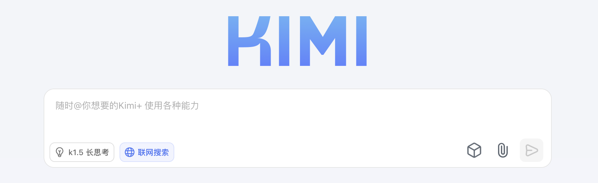

# WEEK061 - 聊聊 Deep Search 和 Deep Research

[2022 年 11 月 30 日](https://openai.com/index/chatgpt/)，OpenAI 正式发布 ChatGPT 产品，仅两个月后，其月活用户就突破了 1 个亿，成为历史上增长最快的消费类应用之一。一时之间，生成式 AI 技术遍地开花，国内外科技大厂紧锣密鼓纷纷入场，各种大模型和 AI 产品以野火燎原之势涌现出来。

ChatGPT 的发布对传统搜索（如 Google）和问答社区（如 StackOverflow）造成了强烈的冲击。用户对传统搜索的不满早已不是秘密，搜索结果中大量的广告和低质的 SEO 内容导致用户体验很差，而 ChatGPT 通过自然语言以对话的方式为用户直接提供答案，省去了用户在海量的搜索页面之间反复跳转和搜集信息的麻烦。谷歌拥有 DeepMind 和 Google Brain 两大顶尖 AI 实验室，原本有机会站在这波生成式 AI 浪潮的最顶端，但是管理层安于现状，不忍放弃广告业务的利润，最终被 ChatGPT 抢占先机。为了应对 ChatGPT 的冲击，谷歌很快开始了反击，公司在内部发布 **红色代码（Red Code）** 预警，进入战备状态，创始人布林甚至亲自下场为聊天机器人 Bard 写代码。

生成式 AI 和传统搜索之间的战争就此拉开了序幕。

## AI + 搜索

不过很快人们就发现了 ChatGPT 的不足，尽管 ChatGPT 能以简洁的交互给出即时答案，但是它的答案中充斥了大量的事实性错误，幻觉问题和静态知识是大模型天生的两大局限，导致其答案准确性达不到搜索引擎的要求。一开始，大家只是作为谈资一笑了之，但是随着大模型在商业化应用中的落地，人们的抱怨声也就越来越多，在某些场景下，比如医疗建议，错误回复可能导致灾难性后果。

为了解决这些问题，又一项新技术应运而生，那就是 **RAG（Retrieval-Augmented Generation，检索增强生成）**，通过引入外部信息源，包括搜索引擎、企业私域知识、个人笔记等一切能查询的信息，可以有效的缓解大模型的幻觉问题，在生成答案时还可以标注信息来源以提升可信度。

[2024 年 10 月](https://openai.com/index/introducing-chatgpt-search/)，ChatGPT 推出搜索功能：

国内外产商也纷纷跟进，比如 DeepSeek 的：

千问的：

Kimi 的：

[前不久](https://www.anthropic.com/news/web-search)，Claude 也集成了搜索功能：

如今 **AI + 搜索** 已经是各家大模型产品的标配。

与此同时，**搜索 + AI** 也不甘示弱，比如 Google 面向美国用户推出的 [AI Overviews](https://blog.google/products/search/ai-overviews-search-october-2024/) 功能，在搜索结果顶部提供自然语言生成的答案摘要；百度在搜索顶部也加入了 AI+ 功能：

### AI + 深度搜索（Deep Search）

### AI + 深度研究（Deep Research）

