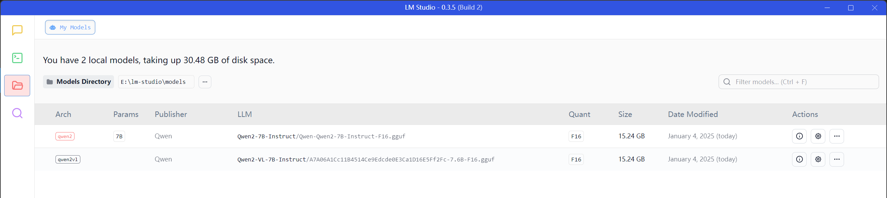
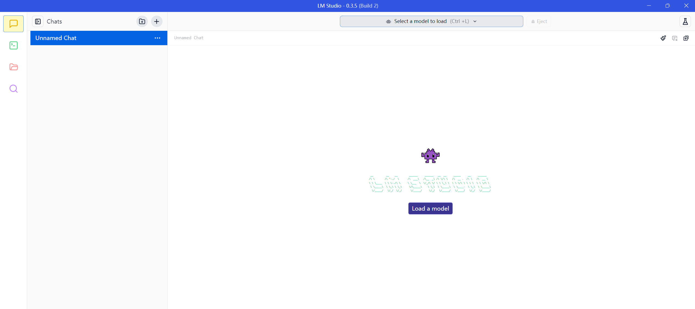
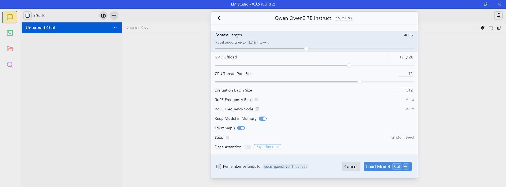
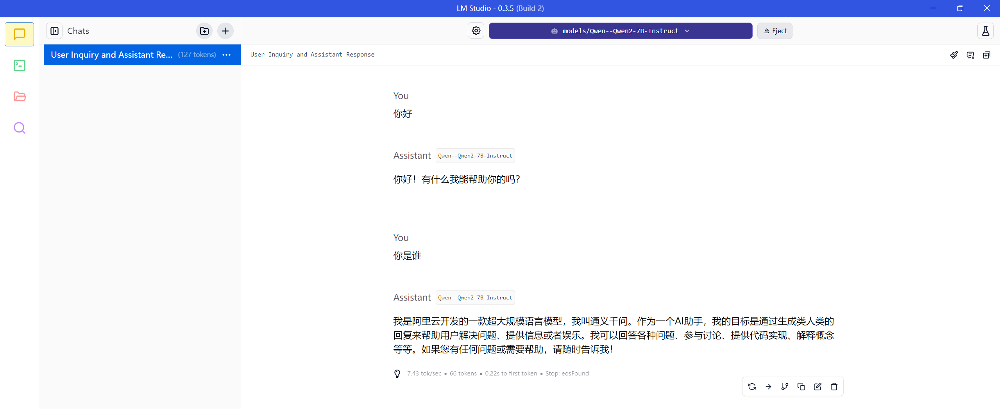
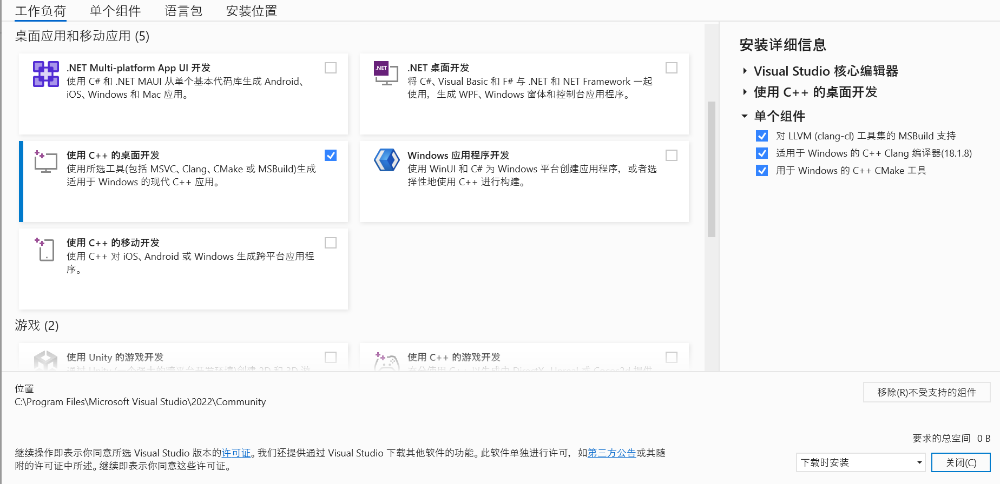

# LM Studio - Discover, download, and run local LLMs

* GitHub: https://github.com/lmstudio-ai
* HomePage: https://lmstudio.ai/

## 下载模型

### 安装 `huggingface-cli`

```
$ pip install -U huggingface_hub
```

### 下载模型

```
$ huggingface-cli download --resume-download Qwen/Qwen2-7B-Instruct --local-dir E:\lm-studio\models\Qwen--Qwen2-7B-Instruct
```

## 使用 `llama.cpp` 转换格式

下载的官方模型为 safetensors 格式，需要将其转换为 GGUF 格式。

### 下载 `llama.cpp` 源码

```
$ git clone https://github.com/ggerganov/llama.cpp
$ cd llama.cpp
```

### 转换为 GGUF 格式

```
$ python .\convert_hf_to_gguf.py E:\lm-studio\models\Qwen--Qwen2-7B-Instruct
```

> Hugging Face 上有很多 GGUF 格式的模型，我们也可以直接下载使用，比如 [MaziyarPanahi/Qwen2-7B-Instruct-GGUF](https://huggingface.co/MaziyarPanahi/Qwen2-7B-Instruct-GGUF)。

## 使用 LM Studio

下载安装后，运行程序，进入 My Models 配置页面，将 Models Directory 修改为刚刚下载的模型位置：



然后进入 Chat 页面：



点击 Load a model，选择刚刚转换的 GGUF 模型：



加载完毕后，就可以正常对话了：



## 参考

* [如何快速下载huggingface大模型 – padeoe的小站](https://padeoe.com/huggingface-large-models-downloader/)

### 在 Windows 下编译 `llama.cpp`

首先安装 [Visual Studio Community](https://visualstudio.microsoft.com/de/vs/community/)，然后选择以下选项：

* 工作负荷：使用 C++ 的桌面开发
* 单个组件
    * 对 LLVM 工具集的 MSBuild 支持
    * 适用于 Windows 的 C++ Clang 编译器
    * 用于 Windows 的 C++ CMake 工具



执行一下命令编译：

```
$ cmake -B build
$ cmake --build build --config Release
```

编译后生成 `llama-cli.exe` 可执行文件，运行之：

```
$ .\build\bin\Release\llama-cli.exe -m E:\lm-studio\models\Qwen--Qwen2-7B-Instruct\Qwen-Qwen2-7B-Instruct-F16.gguf -p "hello" -n 128
```
